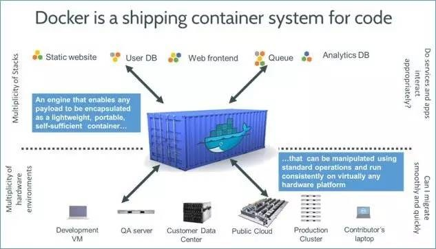
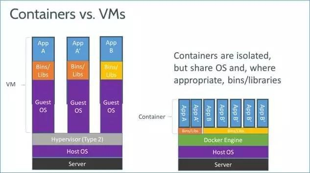
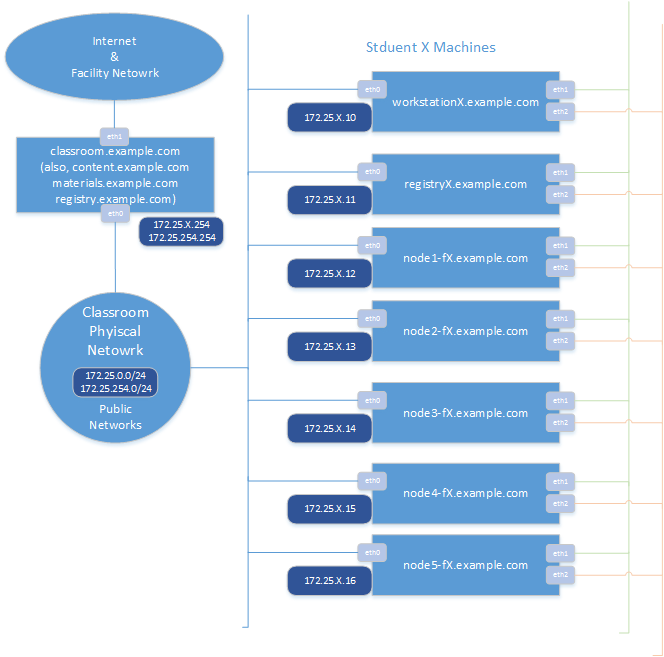
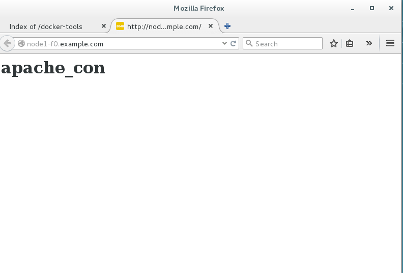

# Docker 基础课程
###### Kevin Zou (kissingwolf@gmail.com)

[TOC]

## Docker 是什么？

Docker 是 Docker.Inc 公司开源的一个基于 LXC 技术之上构建的 Container 容器引擎，基于 Go 语言并遵从 Apache2.0 协议开源。



Docker 就是一个应用程序执行容器，类似虚拟机的概念。但是与虚拟化技术的不同点在于下面几点：

* 虚拟化技术依赖物理CPU和内存，是硬件级别的；而 docker 构建在操作系统上，利用操作系统的**容器（containerization）**技术，所以 docker 也可以运行在虚拟机上，目前大多数公司都是这么干的。

* 虚拟化系统一般都是指完整的操作系统镜像，拥有全套类库、内核、驱动和文件系统，称为**系统**；而 docker 开源而且轻量，与宿主机共享内核、驱动、文件系统和基础设备，称为**容器**，单个容器部署单独应用，容器与容器之间环境独立互不干扰，比如一个容器运行基于 java 7 的 Tomcat ，另一个容器运行基于 java 8 的 Jboss，类库之间不会有任何干扰和冲突。

* 传统的虚拟化技术使用快照来保存状态，空间占用大且利用率不高；而docker在保存状态上不仅更加轻便且低成本，在引入了类似源代码管理机制后容器的快照历史版本可以方便的记录和迭代，同时切换成本也相对较低。

* 传统的虚拟化技术在构建系统的时候较为复杂，编配和构造消耗精力巨大，需要考虑硬件、系统、网络环境等等因素；而docker可以通过Dockfile来构建整个容器，重启和构建速度很快。更重要的是Dockfile可以手动编写，这样应用程序开发人员可以通过发布Dockfile来指导系统环境和依赖，对于持续交付更加有利。



Docker的主要特性如下：

* 文件系统隔离：每个进程容器运行在完全独立的根文件系统里。

* 资源隔离：可以使用 cgroup 为每个进程容器分配不同的系统资源，例如 CPU 和内存。

* 网络隔离：每个进程容器运行在自己的网络命名空间里，拥有自己的虚拟接口和 IP 地址。

* 写时复制：采用写时复制方式创建根文件系统，这让部署变得极其快捷，并且节省内存和硬盘空间。

* 日志记录：Docker 将会收集和记录每个进程容器的标准流（stdout/stderr/stdin），用于实时检索或批量检索。

* 变更管理：容器文件系统的变更可以提交到新的映像中，并可重复使用以创建更多的容器。无需使用模板或手动配置。

* 交互式Shell：Docker可以分配一个虚拟终端并关联到任何容器的标准输入上，例如运行一个一次性交互shell。


## Docker基础概念

Docker分为两个部分：本地开源容器虚拟平台和统一管理、存储和下载的注册平台。

* Docker 客户端和本地管理后台服务器

* Docker 共享、管理和保存镜像的Docker Registry平台

Docker 使用客户端-服务器 (C/S) 架构模式，Docker 客户端会与 Docker 守护进程通过本地socket或是网络RESTful API 进行通信。Docker 守护进程会处理复杂繁重的任务，例如建立、运行、发布你的 Docker 容器和镜像。Docker 客户端和守护进程可以运行在同一个系统上，当然你也可以使用 Docker 客户端去连接一个远程的 Docker 守护进程，Docker 1.12后分离了客户端程序（docker）和后台守护进程程序（dockerd）。

### Docker 镜像

>简单的说，镜像是指文件系统快照或tar包。

Docker 镜像是 Docker 容器运行时的只读模板，每一个镜像由一系列的层 (layers) 组成。Docker 使用 UnionFS 来将这些层联合到单独的镜像中。UnionFS 允许独立文件系统中的文件和文件夹(称之为分支)被透明覆盖，形成一个单独连贯的文件系统，保证了Docker镜像的轻量级。当你改变了一个 Docker 镜像，比如升级到某个程序到新的版本，一个新的层会被创建。因此，不用替换整个原先的镜像或者重新建立(在使用虚拟机的时候你可能会这么做)，只是一个新的层被添加或升级了。现在你不用重新发布整个镜像，只需要升级，层使得分发 Docker 镜像变得简单和快速。


### Docker 容器

> 容器就是指镜像的运行态

Docker 容器和文件夹很类似，一个 Docker 容器包含了所有的某个应用运行所需要的环境。每一个 Docker 容器都是从 Docker 镜像创建的。Docker 容器可以运行、开始、停止、移动和删除。每一个 Docker 容器都是独立和安全的应用平台，Docker 容器是 Docker 的运行部分。

容器与虚拟机的进一步比较：

* 虚拟机持有整个操作系统和应用程序的快照

* 虚拟机运行着自己的内核

* 虚拟机可以运行 Linux 之外的其它操作系统

* 容器只持有应用程序,但是容器中可以运行多个应用程序设置是真个 Linux 发行版

* 容器与宿主机共享内核

* 容器目前主要运行 Linux , Windows 的容器还在开放中,容器中的发行版可以选择,容器中的发行版可以和宿主机不同

### Docker 仓库

> 仓库就是线上镜像的保存地

Docker仓库用来保存镜像，可以理解为代码控制中的代码仓库。Docker仓库也有公共和私有的概念。公共的 Docker 仓库最常用的就是Docker官方的 Docker Hub。Docker Hub 提供了庞大的镜像集合供使用，除此之外Google和Redhat也建立有自己的公共仓库，国内的公共仓库包括时速云 、网易云 、阿里云和DaoCloud加速器等。从安全和下载效率上考虑，生产环境下一般我们会自己建立私有仓库。

### 命令空间（Namespace）

> 命令空间（Namespace）确保一个容器中运行一个进程而且不能看到或影响容器外的其它进程。

#### pid namespace

不同用户的进程就是通过 pid namespace 隔离开的，且不同 namespace 中可以有相同 PID。具有以下特征:

* 每个 namespace 中的 pid 是有自己的 pid=1 的进程(类似 /sbin/init 进程)

* 每个 namespace 中的进程只能影响自己的同一个 namespace 或子 namespace 中的进程

* 因为 /proc 包含正在运行的进程，因此在 container 中的 pseudo-filesystem 的 /proc 目录只能看到自己 namespace 中的进程

* 因为 namespace 允许嵌套，父 namespace 可以影响子 namespace 的进程，所以子 namespace 的进程可以在父 namespace 中看到，但是具有不同的 pid

#### mnt namespace

类似 chroot，将一个进程放到一个特定的目录执行。mnt namespace 允许不同 namespace 的进程看到的文件结构不同，这样每个 namespace 中的进程所看到的文件目录就被隔离开了。同 chroot 不同，每个 namespace 中的 container 在 /proc/mounts 的信息只包含所在 namespace 的 mount point。

#### net namespace

网络隔离是通过 net namespace 实现的， 每个 net namespace 有独立的 network devices, IP addresses, IP routing tables, /proc/net 目录。这样每个 container 的网络就能隔离开来。 docker 默认采用 veth 的方式将 container 中的虚拟网卡同 host 上的一个 docker bridge 连接在一起。

#### uts namespace

UTS (“UNIX Time-sharing System”) namespace 允许每个 container 拥有独立的 hostname 和 domain name, 使其在网络上可以被视作一个独立的节点而非 Host 上的一个进程。

#### ipc namespace

container 中进程交互还是采用 Linux 常见的进程间交互方法 (interprocess communication - IPC), 包括常见的信号量、消息队列和共享内存。与虚拟机机制不同，container 的进程间交互实际上还是 host 上具有相同 pid namespace 中的进程间交互，因此需要在IPC资源申请时加入 namespace 信息 - 每个 IPC 资源有一个唯一的 32bit ID。

#### user namespace

每个 container 可以有不同的 user 和 group id, 也就是说可以以 container 内部的用户在 container 内部执行程序而非 Host 上的用户。

### 资源管理组（Cgroups）

> Control Groups`是LXC的重要组成部分，具有资源核算与限制的关键功能。

cgroups 实现了对资源的配额和度量。 cgroups 的使用非常简单，提供类似文件的接口，在 /cgroup 目录下新建一个文件夹即可新建一个 group，在此文件夹中新建 task 文件，并将 pid 写入该文件，即可实现对该进程的资源控制。具体的资源配置选项可以在该文件夹中新建子 subsystem ，{子系统前缀}.{资源项} 是典型的配置方法， 如 memory.usage_in_bytes 就定义了该 group 在 subsystem memory 中的一个内存限制选项。 此外 cgroups 中的 subsystem 可以随意组合，一个 subsystem 可以在不同的 group 中，也可以一个 group 包含多个 subsystem - 也就是说一个 subsystem。

#### memory

内存相关的限制

#### cpu

在 cgroup 中，并不能像硬件虚拟化方案一样能够定义 CPU 能力，但是能够定义 CPU 轮转的优先级，因此具有较高 CPU 优先级的进程会更可能得到 CPU 运算。 通过将参数写入 cpu.shares ,即可定义改 cgroup 的 CPU 优先级 - 这里是一个相对权重，而非绝对值

#### blkio

block IO 相关的统计和限制，byte/operation 统计和限制 (IOPS 等)，读写速度限制等，但是这里主要统计的都是同步 IO

#### devices

设备权限限制

## 安装Docker

Docker 需要安装在具有3.10内核及以上版本的Linux系统中，我们的环境是RHEL 7.2版本的Linux系统，满足Docker运行的最低需求需求。

### 课堂及实验环境说明

我们的环境结构如下，请根据自己的Foundation号调整IP和设备名



| 设备名         | 主机名          | 说明                                |
| :---------- | :----------- | :-------------------------------- |
| workstation | workstationN | 图形化虚拟机                            |
| registry    | registryN    | 安装配置 Docker 注册/仓库服务的虚拟机           |
| node1       | node1-fN     | 安装配置 Docker 及 Docker Swarm 服务的虚拟机 |
| node2       | node2-fN     | 安装配置 Docker 及 Docker Swarm 服务的虚拟机 |
| node3       | node3-fN     | 安装配置 Docker 及 Docker Swarm 服务的虚拟机 |
| node4       | node4-fN     | 安装配置 Docker 及 Docker Swarm 服务的虚拟机 |
| node5       | node5-fN     | 安装配置 Docker 及 Docker Swarm 服务的虚拟机 |

### 下载并安装 Docker 1.12软件包

安装Docker的方法有很多，你可以从源代码编译安装，也可以通过Docker Hub网站脚本安装，但是我们推荐大家使用包管理工具安装Docker，这样可以更好的做到环境更迭和升级。

在课程环境中，我们已经做好了基于RedHat YUM的网络包管理环境，RHEL 7.2和Docker 1.12的安装包环境都已就位，课程环境下的所有设备都已设置RHEL 7.2的REPO，但Docker 1.12的REPO没有默认放入设备中，接下来我们将使用YUM RPM的方式安装Docker 1.12。

需要注意的是，演示中的环境是在**Foundation 0** 设备上，大家做实验时请替换设备号为你自己所在设备的**Foundation** 号。 

安装Docker 1.12实验选择在 node1 设备上完成，首先我们先初始化 node1 设备

```shell
[kiosk@foundation0 Desktop]$ rht-vmctl start node1
Downloading virtual machine definition file for node1.
################################################################# 100.0%
Downloading virtual machine disk image up350-node1-vda.qcow2
################################################################# 100.0%
Creating virtual machine disk overlay for up350-node1-vda.qcow2
Downloading virtual machine disk image up350-node1-vdb.qcow2
################################################################# 100.0%
Creating virtual machine disk overlay for up350-node1-vdb.qcow2
Starting node1.
```

确认 node1 设备 正常启动后，通过 ssh 连接 node1 设备。你可以通过 **view node1** 桌面工具连接 node1 设备。

```shell
[kiosk@foundation0 Desktop]$ ssh root@node1-f0
Last login: Sat Jun  4 14:39:46 2016 from 172.25.0.250
[root@node1-f0 ~]# 
```

 连接 node1 设备后，我们需要先安装 wget 工具，方便我们后续下载文件。

```shell
 [root@node1-f0 ~]# yum install wget -y
Loaded plugins: product-id, search-disabled-repos, subscription-manager
This system is not registered to Red Hat Subscription Management. You can use subscription-manager to register.
Repodata is over 2 weeks old. Install yum-cron? Or run: yum makecache fast
rhel_dvd                                                 | 4.1 kB     00:00     
Resolving Dependencies
--> Running transaction check
---> Package wget.x86_64 0:1.14-10.el7_0.1 will be installed
--> Finished Dependency Resolution

Dependencies Resolved

================================================================================
 Package       Arch            Version                  Repository         Size
================================================================================
Installing:
 wget          x86_64          1.14-10.el7_0.1          rhel_dvd          546 k

Transaction Summary
================================================================================
Install  1 Package

Total download size: 546 k
Installed size: 2.0 M
Downloading packages:
wget-1.14-10.el7_0.1.x86_64.rpm                            | 546 kB   00:00     
Running transaction check
Running transaction test
Transaction test succeeded
Running transaction
  Installing : wget-1.14-10.el7_0.1.x86_64                                  1/1 
  Verifying  : wget-1.14-10.el7_0.1.x86_64                                  1/1 

Installed:
  wget.x86_64 0:1.14-10.el7_0.1                                                 

Complete! 
```

安装好wget后，我们就可以通过wget下载Docker 1.12的安装源配置文件

```shell
 [root@node1-f0 ~]# wget http://materials.example.com/docker.repo -O /etc/yum.repos.d/docker.repo
--2016-08-09 13:13:20--  http://materials.example.com/docker.repo
Resolving materials.example.com (materials.example.com)... 172.25.254.254
Connecting to materials.example.com (materials.example.com)|172.25.254.254|:80... connected.
HTTP request sent, awaiting response... 200 OK
Length: 139
Saving to: ‘/etc/yum.repos.d/docker.repo’

100%[======================================>] 139         --.-K/s   in 0s      

2016-08-09 13:13:20 (29.4 MB/s) - ‘/etc/yum.repos.d/docker.repo’ saved [139/139]
```

materials.example.com服务器是存放课程环境所需文件的服务器，后面的实验中我们会多次使用到它。

查看本地 YUM REPO 环境和下载安装源

```shell
[root@node1-f0 ~]# yum repolist
Loaded plugins: product-id, search-disabled-repos, subscription-manager
This system is not registered to Red Hat Subscription Management. You can use subscription-manager to register.
docker                                                   | 2.9 kB     00:00     
docker/primary_db                                          | 5.7 kB   00:00     
repo id                  repo name                                        status
docker                   Remote classroom copy of docker                      6
rhel_dvd                 Remote classroom copy of dvd                     4,620
repolist: 4,626
```

如果正常发现 docker 源，说明可以开始安装Docker 1.12了，接下来我们安装docker软件包

```
[root@node1-f0 ~]# yum install docker-engine -y
Loaded plugins: product-id, search-disabled-repos, subscription-manager
This system is not registered to Red Hat Subscription Management. You can use subscription-manager to register.
Resolving Dependencies
--> Running transaction check
---> Package docker-engine.x86_64 0:1.12.0-1.el7.centos will be installed
--> Processing Dependency: docker-engine-selinux >= 1.12.0-1.el7.centos for package: docker-engine-1.12.0-1.el7.centos.x86_64
--> Processing Dependency: libcgroup for package: docker-engine-1.12.0-1.el7.centos.x86_64
--> Processing Dependency: libseccomp.so.2()(64bit) for package: docker-engine-1.12.0-1.el7.centos.x86_64
--> Processing Dependency: libltdl.so.7()(64bit) for package: docker-engine-1.12.0-1.el7.centos.x86_64
--> Running transaction check
---> Package docker-engine-selinux.noarch 0:1.12.0-1.el7.centos will be installed
--> Processing Dependency: policycoreutils-python for package: docker-engine-selinux-1.12.0-1.el7.centos.noarch
---> Package libcgroup.x86_64 0:0.41-8.el7 will be installed
---> Package libseccomp.x86_64 0:2.2.1-1.el7 will be installed
---> Package libtool-ltdl.x86_64 0:2.4.2-20.el7 will be installed
--> Running transaction check
---> Package policycoreutils-python.x86_64 0:2.2.5-20.el7 will be installed
--> Processing Dependency: audit-libs-python >= 2.1.3-4 for package: policycoreutils-python-2.2.5-20.el7.x86_64
--> Processing Dependency: libsemanage-python >= 2.1.10-1 for package: policycoreutils-python-2.2.5-20.el7.x86_64
--> Processing Dependency: checkpolicy for package: policycoreutils-python-2.2.5-20.el7.x86_64
--> Processing Dependency: libapol.so.4(VERS_4.0)(64bit) for package: policycoreutils-python-2.2.5-20.el7.x86_64
--> Processing Dependency: libqpol.so.1(VERS_1.2)(64bit) for package: policycoreutils-python-2.2.5-20.el7.x86_64
--> Processing Dependency: libqpol.so.1(VERS_1.4)(64bit) for package: policycoreutils-python-2.2.5-20.el7.x86_64
--> Processing Dependency: python-IPy for package: policycoreutils-python-2.2.5-20.el7.x86_64
--> Processing Dependency: libapol.so.4()(64bit) for package: policycoreutils-python-2.2.5-20.el7.x86_64
--> Processing Dependency: libqpol.so.1()(64bit) for package: policycoreutils-python-2.2.5-20.el7.x86_64
--> Running transaction check
---> Package audit-libs-python.x86_64 0:2.4.1-5.el7 will be installed
---> Package checkpolicy.x86_64 0:2.1.12-6.el7 will be installed
---> Package libsemanage-python.x86_64 0:2.1.10-18.el7 will be installed
---> Package python-IPy.noarch 0:0.75-6.el7 will be installed
---> Package setools-libs.x86_64 0:3.3.7-46.el7 will be installed
--> Finished Dependency Resolution

Dependencies Resolved

================================================================================
 Package                   Arch      Version                  Repository   Size
================================================================================
Installing:
 docker-engine             x86_64    1.12.0-1.el7.centos      docker       19 M
Installing for dependencies:
 audit-libs-python         x86_64    2.4.1-5.el7              rhel_dvd     69 k
 checkpolicy               x86_64    2.1.12-6.el7             rhel_dvd    247 k
 docker-engine-selinux     noarch    1.12.0-1.el7.centos      docker       28 k
 libcgroup                 x86_64    0.41-8.el7               rhel_dvd     64 k
 libseccomp                x86_64    2.2.1-1.el7              rhel_dvd     49 k
 libsemanage-python        x86_64    2.1.10-18.el7            rhel_dvd     94 k
 libtool-ltdl              x86_64    2.4.2-20.el7             rhel_dvd     49 k
 policycoreutils-python    x86_64    2.2.5-20.el7             rhel_dvd    435 k
 python-IPy                noarch    0.75-6.el7               rhel_dvd     32 k
 setools-libs              x86_64    3.3.7-46.el7             rhel_dvd    485 k

Transaction Summary
================================================================================
Install  1 Package (+10 Dependent packages)

Total download size: 20 M
Installed size: 84 M
Downloading packages:
(1/11): audit-libs-python-2.4.1-5.el7.x86_64.rpm           |  69 kB   00:00     
(2/11): checkpolicy-2.1.12-6.el7.x86_64.rpm                | 247 kB   00:00     
(3/11): libcgroup-0.41-8.el7.x86_64.rpm                    |  64 kB   00:00     
(4/11): libseccomp-2.2.1-1.el7.x86_64.rpm                  |  49 kB   00:00     
(5/11): libsemanage-python-2.1.10-18.el7.x86_64.rpm        |  94 kB   00:00     
(6/11): libtool-ltdl-2.4.2-20.el7.x86_64.rpm               |  49 kB   00:00     
(7/11): docker-engine-selinux-1.12.0-1.el7.centos.noarch.r |  28 kB   00:00     
(8/11): python-IPy-0.75-6.el7.noarch.rpm                   |  32 kB   00:00     
(9/11): policycoreutils-python-2.2.5-20.el7.x86_64.rpm     | 435 kB   00:00     
(10/11): setools-libs-3.3.7-46.el7.x86_64.rpm              | 485 kB   00:00     
(11/11): docker-engine-1.12.0-1.el7.centos.x86_64.rpm      |  19 MB   00:00     
--------------------------------------------------------------------------------
Total                                               49 MB/s |  20 MB  00:00     
Running transaction check
Running transaction test
Transaction test succeeded
Running transaction
  Installing : libcgroup-0.41-8.el7.x86_64                                 1/11 
  Installing : audit-libs-python-2.4.1-5.el7.x86_64                        2/11 
  Installing : libsemanage-python-2.1.10-18.el7.x86_64                     3/11 
  Installing : libseccomp-2.2.1-1.el7.x86_64                               4/11 
  Installing : python-IPy-0.75-6.el7.noarch                                5/11 
  Installing : libtool-ltdl-2.4.2-20.el7.x86_64                            6/11 
  Installing : checkpolicy-2.1.12-6.el7.x86_64                             7/11 
  Installing : setools-libs-3.3.7-46.el7.x86_64                            8/11 
  Installing : policycoreutils-python-2.2.5-20.el7.x86_64                  9/11 
  Installing : docker-engine-selinux-1.12.0-1.el7.centos.noarch           10/11 
restorecon:  lstat(/var/lib/docker) failed:  No such file or directory
warning: %post(docker-engine-selinux-1.12.0-1.el7.centos.noarch) scriptlet failed, exit status 255
Non-fatal POSTIN scriptlet failure in rpm package docker-engine-selinux-1.12.0-1.el7.centos.noarch
  Installing : docker-engine-1.12.0-1.el7.centos.x86_64                   11/11 
  Verifying  : setools-libs-3.3.7-46.el7.x86_64                            1/11 
  Verifying  : docker-engine-selinux-1.12.0-1.el7.centos.noarch            2/11 
  Verifying  : libcgroup-0.41-8.el7.x86_64                                 3/11 
  Verifying  : checkpolicy-2.1.12-6.el7.x86_64                             4/11 
  Verifying  : libtool-ltdl-2.4.2-20.el7.x86_64                            5/11 
  Verifying  : python-IPy-0.75-6.el7.noarch                                6/11 
  Verifying  : libseccomp-2.2.1-1.el7.x86_64                               7/11 
  Verifying  : docker-engine-1.12.0-1.el7.centos.x86_64                    8/11 
  Verifying  : libsemanage-python-2.1.10-18.el7.x86_64                     9/11 
  Verifying  : policycoreutils-python-2.2.5-20.el7.x86_64                 10/11 
  Verifying  : audit-libs-python-2.4.1-5.el7.x86_64                       11/11 

Installed:
  docker-engine.x86_64 0:1.12.0-1.el7.centos                                    

Dependency Installed:
  audit-libs-python.x86_64 0:2.4.1-5.el7                                        
  checkpolicy.x86_64 0:2.1.12-6.el7                                             
  docker-engine-selinux.noarch 0:1.12.0-1.el7.centos                            
  libcgroup.x86_64 0:0.41-8.el7                                                 
  libseccomp.x86_64 0:2.2.1-1.el7                                               
  libsemanage-python.x86_64 0:2.1.10-18.el7                                     
  libtool-ltdl.x86_64 0:2.4.2-20.el7                                            
  policycoreutils-python.x86_64 0:2.2.5-20.el7                                  
  python-IPy.noarch 0:0.75-6.el7                                                
  setools-libs.x86_64 0:3.3.7-46.el7                                            

Complete!
```

Docker 在安装过程中还会需要其它的辅助软件包，YUM会一并将其安装。由于Docker rpm中的小bug，Docker selinux 配置出现了小问题

>  Installing : docker-engine-selinux-1.12.0-1.el7.centos.noarch           10/11 
>  restorecon:  lstat(/var/lib/docker) failed:  No such file or directory
>  warning: %post(docker-engine-selinux-1.12.0-1.el7.centos.noarch) scriptlet failed, exit status 255
>  Non-fatal POSTIN scriptlet failure in rpm package docker-engine-selinux-1.12.0-1.el7.centos.noarch

我们需要在Docker engine包安装后重新安装一次Docker engine selinux包

```shell
[root@node1-f0 ~]# yum reinstall docker-engine-selinux
Loaded plugins: product-id, search-disabled-repos, subscription-manager
This system is not registered to Red Hat Subscription Management. You can use subscription-manager to register.
Resolving Dependencies
--> Running transaction check
---> Package docker-engine-selinux.noarch 0:1.12.0-1.el7.centos will be reinstalled
--> Finished Dependency Resolution

Dependencies Resolved

================================================================================
 Package                   Arch       Version                  Repository  Size
================================================================================
Reinstalling:
 docker-engine-selinux     noarch     1.12.0-1.el7.centos      docker      28 k

Transaction Summary
================================================================================
Reinstall  1 Package

Total download size: 28 k
Installed size: 43 k
Is this ok [y/d/N]: y
Downloading packages:
docker-engine-selinux-1.12.0-1.el7.centos.noarch.rpm       |  28 kB   00:00     
Running transaction check
Running transaction test
Transaction test succeeded
Running transaction
  Installing : docker-engine-selinux-1.12.0-1.el7.centos.noarch             1/1 
  Verifying  : docker-engine-selinux-1.12.0-1.el7.centos.noarch             1/1 

Installed:
  docker-engine-selinux.noarch 0:1.12.0-1.el7.centos                            

Complete!
```

注意执行的命令和命令执行后返回的状态。

RHEL 7.2 系统默认使用FireWalld作为防火墙配置，在Docker运行中会与FireWalld有所冲突，Docker 无法在FireWalld环境下更新 Iptables 防火墙配置。因此，我们需要对FireWalld做相应的配置，将其关闭并终止其后续随启动服务。

```shell
[root@node1-f0 ~]# systemctl stop firewalld
[root@node1-f0 ~]# systemctl disable firewalld
Removed symlink /etc/systemd/system/dbus-org.fedoraproject.FirewallD1.service.
Removed symlink /etc/systemd/system/basic.target.wants/firewalld.service.
[root@node1-f0 ~]# systemctl mask firewalld
Created symlink from /etc/systemd/system/firewalld.service to /dev/null.
```

 此时查看 Iptables 防火墙规则，则发现所有规则以清空，等待重新配置

```shell
[root@node1-f0 ~]# iptables -L 
Chain INPUT (policy ACCEPT)
target     prot opt source               destination         

Chain FORWARD (policy ACCEPT)
target     prot opt source               destination         

Chain OUTPUT (policy ACCEPT)
target     prot opt source               destination         
[root@node1-f0 ~]# iptables -L  -t nat
Chain PREROUTING (policy ACCEPT)
target     prot opt source               destination         

Chain INPUT (policy ACCEPT)
target     prot opt source               destination         

Chain OUTPUT (policy ACCEPT)
target     prot opt source               destination         

Chain POSTROUTING (policy ACCEPT)
target     prot opt source               destination         
```

 前期工作已完成，现在以默认方式启动Docker后台服务，并设置其随开机启动

```shell
[root@node1-f0 ~]# systemctl start docker
[root@node1-f0 ~]# systemctl enable docker
Created symlink from /etc/systemd/system/multi-user.target.wants/docker.service to /usr/lib/systemd/system/docker.service.
```

正常启动docker后台服务后，我们可以通过docker info 命令获得docker运行环境的信息

```shell
[root@node1-f0 ~]# docker info
Containers: 0
 Running: 0
 Paused: 0
 Stopped: 0
Images: 0
Server Version: 1.12.0
Storage Driver: devicemapper
 Pool Name: docker-253:0-51769174-pool
 Pool Blocksize: 65.54 kB
 Base Device Size: 10.74 GB
 Backing Filesystem: xfs
 Data file: /dev/loop0
 Metadata file: /dev/loop1
 Data Space Used: 11.8 MB
 Data Space Total: 107.4 GB
 Data Space Available: 8.369 GB
 Metadata Space Used: 581.6 kB
 Metadata Space Total: 2.147 GB
 Metadata Space Available: 2.147 GB
 Thin Pool Minimum Free Space: 10.74 GB
 Udev Sync Supported: true
 Deferred Removal Enabled: false
 Deferred Deletion Enabled: false
 Deferred Deleted Device Count: 0
 Data loop file: /var/lib/docker/devicemapper/devicemapper/data
 WARNING: Usage of loopback devices is strongly discouraged for production use. Use `--storage-opt dm.thinpooldev` to specify a custom block storage device.
 Metadata loop file: /var/lib/docker/devicemapper/devicemapper/metadata
 Library Version: 1.02.107-RHEL7 (2015-10-14)
Logging Driver: json-file
Cgroup Driver: cgroupfs
Plugins:
 Volume: local
 Network: null host bridge overlay
Swarm: inactive
Runtimes: runc
Default Runtime: runc
Security Options: seccomp
Kernel Version: 3.10.0-327.el7.x86_64
Operating System: Red Hat Enterprise Linux Server 7.2 (Maipo)
OSType: linux
Architecture: x86_64
CPUs: 2
Total Memory: 489 MiB
Name: node1-f0.example.com
ID: H2EK:Q2QA:TDRB:5ENY:HXBQ:SPO4:WHSD:ULCP:GT5W:Q2NI:2OW2:2MV5
Docker Root Dir: /var/lib/docker
Debug Mode (client): false
Debug Mode (server): false
Registry: https://index.docker.io/v1/
WARNING: bridge-nf-call-iptables is disabled
WARNING: bridge-nf-call-ip6tables is disabled
Insecure Registries:
 127.0.0.0/8
```

共有三处**WARNING** ，我们将在后面的课程中逐一解决。

> Containers: 0
> Running: 0
> Paused: 0
> Stopped: 0
> Images: 0

目前Docker刚刚初始化，所有系统中没有镜像（Image）和容器（Container）。

### Docker 1.12 软件包结构

Docker 1.12 开始，将原来统一的docker程序分为了前端命令程序 docker 和后端服务程序 dockerd ，文件包内容也做了一些调整。我们可以通过查看docker-engine rpm了解其软件包结构。

查看安装后的docker-engine rpm结构

```shell
[root@node1-f0 ~]# rpm -ql docker-engine
/etc/udev/rules.d/80-docker.rules
/usr/bin/docker
/usr/bin/docker-containerd
/usr/bin/docker-containerd-ctr
/usr/bin/docker-containerd-shim
/usr/bin/docker-proxy
/usr/bin/docker-runc
/usr/bin/dockerd
/usr/lib/systemd/system/docker.service
/usr/share/bash-completion/completions/docker
/usr/share/doc/docker-engine-1.12.0
/usr/share/doc/docker-engine-1.12.0/AUTHORS
/usr/share/doc/docker-engine-1.12.0/CHANGELOG.md
/usr/share/doc/docker-engine-1.12.0/CONTRIBUTING.md
/usr/share/doc/docker-engine-1.12.0/LICENSE
/usr/share/doc/docker-engine-1.12.0/MAINTAINERS
/usr/share/doc/docker-engine-1.12.0/NOTICE
/usr/share/doc/docker-engine-1.12.0/README.md
/usr/share/fish/vendor_completions.d/docker.fish
/usr/share/man/man1/docker-attach.1.gz
/usr/share/man/man1/docker-build.1.gz
/usr/share/man/man1/docker-commit.1.gz
/usr/share/man/man1/docker-cp.1.gz
/usr/share/man/man1/docker-create.1.gz
/usr/share/man/man1/docker-diff.1.gz
/usr/share/man/man1/docker-events.1.gz
/usr/share/man/man1/docker-exec.1.gz
/usr/share/man/man1/docker-export.1.gz
/usr/share/man/man1/docker-history.1.gz
/usr/share/man/man1/docker-images.1.gz
/usr/share/man/man1/docker-import.1.gz
/usr/share/man/man1/docker-info.1.gz
/usr/share/man/man1/docker-inspect.1.gz
/usr/share/man/man1/docker-kill.1.gz
/usr/share/man/man1/docker-load.1.gz
/usr/share/man/man1/docker-login.1.gz
/usr/share/man/man1/docker-logout.1.gz
/usr/share/man/man1/docker-logs.1.gz
/usr/share/man/man1/docker-network-connect.1.gz
/usr/share/man/man1/docker-network-create.1.gz
/usr/share/man/man1/docker-network-disconnect.1.gz
/usr/share/man/man1/docker-network-inspect.1.gz
/usr/share/man/man1/docker-network-ls.1.gz
/usr/share/man/man1/docker-network-rm.1.gz
/usr/share/man/man1/docker-network.1.gz
/usr/share/man/man1/docker-node-demote.1.gz
/usr/share/man/man1/docker-node-inspect.1.gz
/usr/share/man/man1/docker-node-ls.1.gz
/usr/share/man/man1/docker-node-promote.1.gz
/usr/share/man/man1/docker-node-ps.1.gz
/usr/share/man/man1/docker-node-rm.1.gz
/usr/share/man/man1/docker-node-update.1.gz
/usr/share/man/man1/docker-node.1.gz
/usr/share/man/man1/docker-pause.1.gz
/usr/share/man/man1/docker-port.1.gz
/usr/share/man/man1/docker-ps.1.gz
/usr/share/man/man1/docker-pull.1.gz
/usr/share/man/man1/docker-push.1.gz
/usr/share/man/man1/docker-rename.1.gz
/usr/share/man/man1/docker-restart.1.gz
/usr/share/man/man1/docker-rm.1.gz
/usr/share/man/man1/docker-rmi.1.gz
/usr/share/man/man1/docker-run.1.gz
/usr/share/man/man1/docker-save.1.gz
/usr/share/man/man1/docker-search.1.gz
/usr/share/man/man1/docker-service-create.1.gz
/usr/share/man/man1/docker-service-inspect.1.gz
/usr/share/man/man1/docker-service-ls.1.gz
/usr/share/man/man1/docker-service-ps.1.gz
/usr/share/man/man1/docker-service-rm.1.gz
/usr/share/man/man1/docker-service-scale.1.gz
/usr/share/man/man1/docker-service-update.1.gz
/usr/share/man/man1/docker-service.1.gz
/usr/share/man/man1/docker-start.1.gz
/usr/share/man/man1/docker-stats.1.gz
/usr/share/man/man1/docker-stop.1.gz
/usr/share/man/man1/docker-swarm-init.1.gz
/usr/share/man/man1/docker-swarm-join-token.1.gz
/usr/share/man/man1/docker-swarm-join.1.gz
/usr/share/man/man1/docker-swarm-leave.1.gz
/usr/share/man/man1/docker-swarm-update.1.gz
/usr/share/man/man1/docker-swarm.1.gz
/usr/share/man/man1/docker-tag.1.gz
/usr/share/man/man1/docker-top.1.gz
/usr/share/man/man1/docker-unpause.1.gz
/usr/share/man/man1/docker-update.1.gz
/usr/share/man/man1/docker-version.1.gz
/usr/share/man/man1/docker-volume-create.1.gz
/usr/share/man/man1/docker-volume-inspect.1.gz
/usr/share/man/man1/docker-volume-ls.1.gz
/usr/share/man/man1/docker-volume-rm.1.gz
/usr/share/man/man1/docker-volume.1.gz
/usr/share/man/man1/docker-wait.1.gz
/usr/share/man/man1/docker.1.gz
/usr/share/man/man5/Dockerfile.5.gz
/usr/share/man/man5/docker-config-json.5.gz
/usr/share/man/man8/dockerd.8.gz
/usr/share/nano/Dockerfile.nanorc
/usr/share/vim/vimfiles/doc/dockerfile.txt
/usr/share/vim/vimfiles/ftdetect/dockerfile.vim
/usr/share/vim/vimfiles/syntax/dockerfile.vim
/usr/share/zsh/vendor-completions/_docker
```

> **/etc/udev/rules.d/80-docker.rules**
>
> 默认挂接docker存储映射文件的Udev规则配置文件


> **/usr/bin/docker**
> **/usr/bin/docker-containerd**
> **/usr/bin/docker-containerd-ctr**
> **/usr/bin/docker-containerd-shim**
> **/usr/bin/docker-proxy**
> **/usr/bin/docker-runc**
> **/usr/bin/dockerd**
> Docker 相关前后台应用程序


> **/usr/lib/systemd/system/docker.service**
> Docker systemd 服务操作配置文件，后续我们将修改这个配置文件以达到修改dockerd服务启动状态的目的


> **/usr/share/bash-completion/completions/docker**
> **/usr/share/fish/vendor_completions.d/docker.fish**
> **/usr/share/zsh/vendor-completions/_docker**
> Docker 命令行补全工具配置文件，方便docker程序日常使用


> **/usr/share/doc/docker-engine-1.12.0**
> Docker 文档目录


> **/usr/share/man/man1/docker-*.gz**
> Docker 的 manpage ，在日常使用中提示docker命令行使用的文档


> **/usr/share/nano/Dockerfile.nanorc**
> **/usr/share/vim/vimfiles/doc/dockerfile.txt**
> **/usr/share/vim/vimfiles/ftdetect/dockerfile.vim**
> **/usr/share/vim/vimfiles/syntax/dockerfile.vim**
> 使用nano和vim编辑Dockerfile文件时自动高亮关键字的配置文件


## Docker 基本用法

### 登录Docker 注册/仓库服务

默认docker程序登录的Docker注册/仓库服务器是Docker Hub，但由于GFW等等问题，Docker Hub连接会很慢而且容易在传输过程中意外断开，所以我们选择在本地环境下安装了一台私有注册/仓库服务器（registry.example.com），后续的Docker基本用法操作，都将使用这台注册/仓库服务器来完成。

registry.example.com 提供HTTPS（443）和Docker Registry(5000) 两个端口的服务，其中HTTPS（443）端口需要用户认证访问，用户名为studentX（X=0~50），密码统一为uplooking。在后续课程中，我们也将在registryX.example.com服务器上部署自己的私有注册/仓库服务。

由于使用了HTTPS（443）方式配置Docker 注册/仓库服务器，所以本地docker程序要想登录Docker 注册服务，就需要安装Docker 注册/仓库服务的公钥。

docker本地程序的验证公钥文件需要放置在/etc/docker目录下，并且要创建相应的目录

```shell
[root@node1-f0 ~]# mkdir -p /etc/docker/certs.d/registry.example.com
```

certs.d 目录用来存放Docker 私有注册/仓库服务器的公钥，必须在此目录下创建与私有注册/仓库服务器域名同名的目录。

```shell
[root@node1-f0 ~]# wget http://materials.example.com/registry.example.com.crt -O /etc/docker/certs.d/registry.example.com/rgeistry.example.com.crt
```

从materials.example.com服务器上下载registry.example.com.crt公钥文件，放置在/etc/docker/certs.d/registry.example.com目录下。

这样就可以登录registry.example.com服务器，之后就可以拖拽镜像到本地了。**注意，这里并不需要重启docker服务**。

```shell
[root@node1-f0 ~]# docker login registry.example.com
Username: student0
Password:
Login Succeeded
```

Password输入时是没有回显的，我们输入studentX和uplooking，**注意，用你自己的Foundation号替换0**。

如果未能登录，回显 **401 unauthorized** ，则说明用户名或密码错误
```shell
[root@node1-f0 ~]# docker login registry.example.com
Username (student0): student
Password: 
Error response from daemon: login attempt to https://registry.example.com/v2/ failed with status: 401 Unauthorized
```

如果未能登录，回显 **certificate signed by unknown authority** ，则说明注册服务器公钥设置或下载出错

```shell
[root@node1-f0 ~]# docker login registry.example.com
Username(student0): student0
Password: 
Error response from daemon: Get https://registry.example.com/v1/users/: x509: certificate signed by unknown authority
```

### Docker 常用命令

#### docker pull 

> 将注册/仓库服务器上的镜像下载到本地

registry.example.com服务器上有 busybox:latest 镜像，busybox是镜像名，latest是镜像版本号（latest代表最新）。我们可以通过docker pull 命令将其下载到本地，不要忘记首先保证登录成功

```shell
[root@node1-f0 ~]# docker login registry.example.com
Username (student0): student0
Password: 
Login Succeeded

[root@node1-f0 ~]# docker pull registry.example.com/busybox:latest
latest: Pulling from busybox
a3ed95caeb02: Pull complete 
138cfc514ce4: Pull complete 
Digest: sha256:5ac5f44ad96c847cf29dbb011279775561cfb192b4a75172735a5acae2cefbf8
Status: Downloaded newer image for registry.example.com/busybox:latest
```

#### docker images 

> 显示本地已有镜像

images 命令很简单，其目的是显示当前本地保存的镜像信息
```shell
[root@node1-f0 ~]# docker images
REPOSITORY                     TAG                 IMAGE ID            CREATED             SIZE
registry.example.com/busybox   latest              e7d168d7db45        19 months ago       2.43 MB
```
可以看到我们刚刚 **pull** 下来的registry.example.com/busybox镜像。

image命令有个很有用的参数 **-q** ,  它将仅仅显示 **Image ID** 信息，这个对我们以后批量或脚本操作很有用处。

```shell
[root@node1-f0 ~]# docker images -q
e7d168d7db45
```

#### docker help

> 常用命令的说明都在help中

```shell
[root@node1-f0 ~]# docker help
Usage: docker [OPTIONS] COMMAND [arg...]
       docker [ --help | -v | --version ]

A self-sufficient runtime for containers.

Options:

  --config=~/.docker              Location of client config files
  -D, --debug                     Enable debug mode
  -H, --host=[]                   Daemon socket(s) to connect to
  -h, --help                      Print usage
  -l, --log-level=info            Set the logging level
  --tls                           Use TLS; implied by --tlsverify
  # tls相关配置为认证密钥项目，增加docker安全性的应用
  --tlscacert=~/.docker/ca.pem    Trust certs signed only by this CA
  --tlscert=~/.docker/cert.pem    Path to TLS certificate file
  --tlskey=~/.docker/key.pem      Path to TLS key file
  --tlsverify                     Use TLS and verify the remote
  -v, --version                   Print version information and quit

Commands:
    attach    Attach to a running container
    # 当前 shell 下 attach 连接指定运行镜像
    build     Build an image from a Dockerfile
    # 通过 Dockerfile 构造镜像
    commit    Create a new image from a container's changes
    # 提交当前容器为新的镜像
    cp        Copy files/folders between a container and the local filesystem
    # 从容器中拷贝指定文件或者目录到宿主机中
    create    Create a new container
    # 创建一个新的容器，同 run，但不启动容器
    diff      Inspect changes on a container's filesystem
    # 查看 docker 容器变化
    events    Get real time events from the server
    # 从 docker 服务获取容器实时事件
    exec      Run a command in a running container
    # 在已存在的容器上运行命令 
    export    Export a container's filesystem as a tar archive
    # 导出容器的内容流作为一个 tar 归档文件(对应 import ])
    history   Show the history of an image
    # 展示一个镜像形成历史
    images    List images
    # 列出系统当前镜像
    import    Import the contents from a tarball to create a filesystem image
    # 从tar包中的内容创建一个新的文件系统映像(对应 export)
    info      Display system-wide information
    # 显示系统相关信息
    inspect   Return low-level information on a container, image or task
    # 显示系统相关信息
    kill      Kill one or more running container
    # kill 指定 docker 容器
    load      Load an image from a tar archive or STDIN
    # 从一个 tar 包中加载一个镜像(对应 save)
    login     Log in to a Docker registry.
    # 注册或者登陆一个 docker 源服务器
    logout    Log out from a Docker registry.
    # 从当前 Docker registry 退出
    logs      Fetch the logs of a container
    # 输出当前容器日志信息
    network   Manage Docker networks
    # 管理当前docker 网络环境
    node      Manage Docker Swarm nodes
    # 管理当前docker swarm 环境中的节点
    pause     Pause all processes within one or more containers
    # 暂停容器
	port      List port mappings or a specific mapping for the container
	# 列出容器端口映像列表
    ps        List containers
    # 列出容器列表
    pull      Pull an image or a repository from a registry
    # 从docker镜像源服务器拉取指定镜像或者库镜像
    push      Push an image or a repository to a registry
    # 推送指定镜像或者库镜像至docker源服务器
    rename    Rename a container
    # 为容器改名
    restart   Restart a container
    # 重启运行中的容器
    rm        Remove one or more containers
    # 删除一个或多个容器
    rmi       Remove one or more images
    # 删除一个或多个镜像（无容器使用该镜像才可删除，否则需删除相关容器才可继续或 -f 强制删除）
    run       Run a command in a new container
    #  创建一个新的容器并运行一个命令
    save      Save one or more images to a tar archive (streamed to STDOUT by default)
    # 保存一个镜像为一个 tar 包(对应 load)
    search    Search the Docker Hub for images
    # 在 docker hub 中搜索镜像(目前docker 1.12环境下不支持私有注册/仓库服务)
    service   Manage Docker services
    # Docker swarm 环境下管理服务
    start     Start one or more stopped containers
    # 启动容器
    stats     Display a live stream of container(s) resource usage statistics
    # 查看容器运行状态
    stop      Stop one or more running containers
    # 停止容器
    swarm     Manage Docker Swarm
    # 管理 Docker swarm 环境初始化或加入swarm环境
    tag       Tag an image into a repository
    # 给镜像创建新标签
    top       Display the running processes of a container
    # 查看容器中运行的进程信息
    unpause   Unpause all processes within one or more containers
    # 取消暂停容器
    update    Update configuration of one or more containers
    # 更新一个或多个容器环境配置信息
    version   Show the Docker version information
    # 查看 docker 版本号 
    volume    Manage Docker volumes
    # 管理Docker 卷环境
    wait      Block until a container stops, then print its exit code
    # 截取容器停止时的退出状态值
Run 'docker COMMAND --help' for more information on a command.
```

#### docker run

> 将镜像运行在内存中，创建并运行容器

```shell
[root@node1-f0 ~]# docker run --help

Usage:	docker run [OPTIONS] IMAGE [COMMAND] [ARG...]

Run a command in a new container

Options:
      --add-host value              Add a custom host-to-IP mapping (host:ip) (default [])
  -a, --attach value                Attach to STDIN, STDOUT or STDERR (default [])
      --blkio-weight value          Block IO (relative weight), between 10 and 1000
      --blkio-weight-device value   Block IO weight (relative device weight) (default [])
      --cap-add value               Add Linux capabilities (default [])
      --cap-drop value              Drop Linux capabilities (default [])
      --cgroup-parent string        Optional parent cgroup for the container
      --cidfile string              Write the container ID to the file
      --cpu-percent int             CPU percent (Windows only)
      --cpu-period int              Limit CPU CFS (Completely Fair Scheduler) period
      --cpu-quota int               Limit CPU CFS (Completely Fair Scheduler) quota
  -c, --cpu-shares int              CPU shares (relative weight)
      --cpuset-cpus string          CPUs in which to allow execution (0-3, 0,1)
      --cpuset-mems string          MEMs in which to allow execution (0-3, 0,1)
  # 设置cpu 资源分配
  -d, --detach                      Run container in background and print container ID
  # 在后台运行容器
      --detach-keys string          Override the key sequence for detaching a container
      --device value                Add a host device to the container (default [])
      --device-read-bps value       Limit read rate (bytes per second) from a device (default [])
      --device-read-iops value      Limit read rate (IO per second) from a device (default [])
      --device-write-bps value      Limit write rate (bytes per second) to a device (default [])
      --device-write-iops value     Limit write rate (IO per second) to a device (default [])
      --disable-content-trust       Skip image verification (default true)
      --dns value                   Set custom DNS servers (default [])
      --dns-opt value               Set DNS options (default [])
      --dns-search value            Set custom DNS search domains (default [])
      --entrypoint string           Overwrite the default ENTRYPOINT of the image
  -e, --env value                   Set environment variables (default [])
      --env-file value              Read in a file of environment variables (default [])
      --expose value                Expose a port or a range of ports (default [])
      --group-add value             Add additional groups to join (default [])
      --health-cmd string           Command to run to check health
      --health-interval duration    Time between running the check
      --health-retries int          Consecutive failures needed to report unhealthy
      --health-timeout duration     Maximum time to allow one check to run
      --help                        Print usage
  -h, --hostname string             Container host name
  -i, --interactive                 Keep STDIN open even if not attached
      --io-maxbandwidth string      Maximum IO bandwidth limit for the system drive (Windows only)
      --io-maxiops uint             Maximum IOps limit for the system drive (Windows only)
      --ip string                   Container IPv4 address (e.g. 172.30.100.104)
      --ip6 string                  Container IPv6 address (e.g. 2001:db8::33)
      --ipc string                  IPC namespace to use
      --isolation string            Container isolation technology
      --kernel-memory string        Kernel memory limit
  -l, --label value                 Set meta data on a container (default [])
      --label-file value            Read in a line delimited file of labels (default [])
      --link value                  Add link to another container (default [])
      --link-local-ip value         Container IPv4/IPv6 link-local addresses (default [])
      # 容器间链接及相互访问设置参数
      --log-driver string           Logging driver for the container
      --log-opt value               Log driver options (default [])
      --mac-address string          Container MAC address (e.g. 92:d0:c6:0a:29:33)
  -m, --memory string               Memory limit
      --memory-reservation string   Memory soft limit
      --memory-swap string          Swap limit equal to memory plus swap: '-1' to enable unlimited swap
      --memory-swappiness int       Tune container memory swappiness (0 to 100) (default -1)
      # 设置内存资源分配
      --name string                 Assign a name to the container
      # 设置容器的名称
      --network string              Connect a container to a network (default "default")
      --network-alias value         Add network-scoped alias for the container (default [])
      --no-healthcheck              Disable any container-specified HEALTHCHECK
      --oom-kill-disable            Disable OOM Killer
      --oom-score-adj int           Tune host's OOM preferences (-1000 to 1000)
      --pid string                  PID namespace to use
      --pids-limit int              Tune container pids limit (set -1 for unlimited)
      --privileged                  Give extended privileges to this container
  -p, --publish value               Publish a container's port(s) to the host (default [])
  # 映射容器对应端口和地址
  -P, --publish-all                 Publish all exposed ports to random ports
      --read-only                   Mount the container's root filesystem as read only
      --restart string              Restart policy to apply when a container exits (default "no")
      --rm                          Automatically remove the container when it exits
      # 容器运行结束后自动删除
      --runtime string              Runtime to use for this container
      --security-opt value          Security Options (default [])
      --shm-size string             Size of /dev/shm, default value is 64MB
      --sig-proxy                   Proxy received signals to the process (default true)
      --stop-signal string          Signal to stop a container, SIGTERM by default (default "SIGTERM")
      --storage-opt value           Storage driver options for the container (default [])
      --sysctl value                Sysctl options (default map[])
      --tmpfs value                 Mount a tmpfs directory (default [])
  -t, --tty                         Allocate a pseudo-TTY
      --ulimit value                Ulimit options (default [])
  -u, --user string                 Username or UID (format: <name|uid>[:<group|gid>])
      --userns string               User namespace to use
      --uts string                  UTS namespace to use
  -v, --volume value                Bind mount a volume (default [])
      --volume-driver string        Optional volume driver for the container
      --volumes-from value          Mount volumes from the specified container(s) (default [])
  -w, --workdir string              Working directory inside the container
 
```

当 docker run 命令执行时，Docker会启动一个进程，并为这个进程分配其独占的文件系统、网络资源和以此进程为根进程的进程组。在容器启动时，镜像根据其构建Dockerfile文件可能已经定义了要运行的二进制文件、暴漏的网络端口和挂接的卷等，但我们可以通过docker run 命令重新定义，这也是为什么 docker run 命令的参数特别多的原因。

docker run 命令参数主要分为两类：

1. 设置运行方式
   * 容器的运行方式，是前台还是后台（-d）
   * 设置容器名称（--name）
   * 设置容器网络参数（-p）
   * 设置容器cpu和内存使用信息（-c 和 -m）
   * 设置运行用户或权限（-u）
2. 设置镜像的默认资源，也就用以覆盖镜像构造时定义的默认参数。

我们接下来挑重点的内容来讲。

##### 前台和后台运行容器

如果在docker run后面追加-d，那么容器将会运行在后台模式。此时所有I/O数据只能通过网络资源或者共享卷组来进行交互。因为容器不再监听你执行docker run的这个终端命令行窗口。但你可以通过执行docker attach来重新附着到该容器的回话中。需要注意的是，容器运行在后台模式下，是不能使用--rm选项的。

```shell
[root@node1-f0 ~]# docker run -d registry.example.com/busybox top
cf3f7b51e517a233dcbdcaae5c5b1a08883eb2700cf6255727b253583aeab160
[root@node1-f0 ~]# docker ps
CONTAINER ID        IMAGE                          COMMAND             CREATED             STATUS              PORTS               NAMES
cf3f7b51e517        registry.example.com/busybox   "top"               25 seconds ago      Up 24 seconds                           angry_perlman
[root@node1-f0 ~]# docker attach cf3f7b51e517
Mem: 366592K used, 134120K free, 0K shrd, 4205710K buff, 140120985636256K cache
CPU:   0% usr   0% sys   0% nic 100% idle   0% io   0% irq   0% sirq
Load average: 0.00 0.01 0.05 2/170 4
  PID  PPID USER     STAT   VSZ %VSZ %CPU COMMAND
    1     0 root     R     3160   1%   0% top
Ctrl+p,Ctrl+q
```

在前台模式下（不指定-d参数即可），Docker会在容器中启动进程，同时将当前的命令行窗口附着到容器的标准输入、标准输出和标准错误中。也就是说容器中所有的输出都可以在当前窗口中看到。甚至它都可以虚拟出一个TTY窗口，来执行信号中断。

```shell
[root@node1-f0 ~]# docker run --rm registry.example.com/busybox top
Mem: 366592K used, 134120K free, 0K shrd, 4205710K buff, 140120985636256K cache
CPU:   0% usr   0% sys   0% nic 100% idle   0% io   0% irq   0% sirq
Load average: 0.00 0.01 0.05 2/170 4
  PID  PPID USER     STAT   VSZ %VSZ %CPU COMMAND
    1     0 root     R     3160   1%   0% top
Ctrl+c
```

如果要进行交互式操作（例如Shell脚本），那我们必须使用-i -t参数同容器进行数据交互。但是当通过管道同容器进行交互时，就不需要使用-t参数。

```shell
[root@node1-f0 ~]# docker run --rm -i -t registry.example.com/busybox /bin/sh
/ # ls
bin      etc      lib      linuxrc  mnt      proc     run      sys      usr
dev      home     lib64    media    opt      root     sbin     tmp      var
/ # exit
[root@node1-f0 ~]# cat /etc/passwd | docker run --rm -i registry.example.com/busybox grep root
root:x:0:0:root:/root:/bin/bash
operator:x:11:0:operator:/root:/sbin/nologin
```

##### 用名字来识别容器

有三种方式识别容器：
1. 使用UUID长命名

   （7dafc33ae83d3856cef9a87634995177d6fb32997527e976c57630f93bbc3c1c）

2. 使用UUID短命名（7dafc33ae83d）

3. 使用自定义容器名（Name）

UUID标示是由Docker deamon生成的。如果你在执行docker run时没有指定--name，那么deamon会自动生成一个随机字符串UUID。但是对于一个容器来说有个name会非常方便，当你需要连接其它容器时或者类似需要区分其它容器时，使用容器名称可以简化操作。无论容器运行在前台或者后台，这个名字都是有效的。

```shell
[root@node1-f0 ~]# docker run --name top_con -d registry.example.com/busybox top
7dafc33ae83d3856cef9a87634995177d6fb32997527e976c57630f93bbc3c1c
[root@node1-f0 ~]# docker ps
CONTAINER ID        IMAGE                          COMMAND             CREATED             STATUS              PORTS               NAMES
7dafc33ae83d        registry.example.com/busybox   "top"               3 seconds ago       Up 2 seconds                            top_con
```

##### 网络设置

默认情况下，所有的容器都开启了网络接口，同时可以接受任何外部的数据请求。你可以通过`docker run --network none`来关闭网络接口，此时将关闭所有网络数据的输入输出，你只能通过STDIN、STDOUT或者files来完成I/O操作。默认情况下，容器使用主机的DNS设置，你也可以通过`--dns`来覆盖容器内的DNS设置。同时Docker为容器默认生成一个MAC地址，你可以通过`--mac-address 12:34:56:78:9a:bc`来设置你自己的MAC地址。

Docker支持的网络模式有：

* bridge模式，通过veth接口来连接容器，**默认配置**。

* none模式，关闭容器内的网络连接。

* host模式，允许容器使用host的网络堆栈信息。 注意：这种方式将允许容器访问host中类似D-BUS之类的系统服务，所以认为是不安全的。

* container模式。使用另外一个容器的网络堆栈信息。

可以通过docker network list 命令查看到当前docker 1.12环境下的网络设置：

```shell
[root@node1-f0 ~]# docker network list
NETWORK ID          NAME                DRIVER              SCOPE
f9bbe3dc1d80        bridge              bridge              local
92037189b9af        host                host                local
dba3725ede0f        none                null                local  
```

默认网络设置状态下，network设置为bridge模式，此时在主机上面将会存在一个docker0的网络接口，同时会针对容器创建一对veth接口。其中一个veth接口是在主机充当网卡桥接作用，另外一个veth接口存在于容器的命名空间中，并且指向容器的loopback。Docker会自动给这个容器分配一个IP，并且将容器内的数据通过桥接转发到外部。：

```shell
[root@node1-f0 ~]# docker run --name ping_con --rm  registry.example.com/busybox ping classroom.example.com
PING classroom.example.com (172.25.254.254): 56 data bytes
64 bytes from 172.25.254.254: seq=0 ttl=63 time=0.823 ms
64 bytes from 172.25.254.254: seq=1 ttl=63 time=0.951 ms
64 bytes from 172.25.254.254: seq=2 ttl=63 time=0.901 ms
64 bytes from 172.25.254.254: seq=3 ttl=63 time=0.993 ms
^C
--- classroom.example.com ping statistics ---
4 packets transmitted, 4 packets received, 0% packet loss
round-trip min/avg/max = 0.823/0.917/0.993 ms
Ctrl+c

[root@node1-f0 ~]# docker run --name ping_con --rm  registry.example.com/busybox ifconfig
eth0      Link encap:Ethernet  HWaddr 02:42:AC:11:00:02  
          inet addr:172.17.0.2  Bcast:0.0.0.0  Mask:255.255.0.0
          UP BROADCAST RUNNING MULTICAST  MTU:1500  Metric:1
          RX packets:1 errors:0 dropped:0 overruns:0 frame:0
          TX packets:1 errors:0 dropped:0 overruns:0 carrier:0
          collisions:0 txqueuelen:0 
          RX bytes:90 (90.0 B)  TX bytes:90 (90.0 B)

lo        Link encap:Local Loopback  
          inet addr:127.0.0.1  Mask:255.0.0.0
          UP LOOPBACK RUNNING  MTU:65536  Metric:1
          RX packets:0 errors:0 dropped:0 overruns:0 frame:0
          TX packets:0 errors:0 dropped:0 overruns:0 carrier:0
          collisions:0 txqueuelen:0 
          RX bytes:0 (0.0 B)  TX bytes:0 (0.0 B
```

设置自定义的MAC地址，将MAC地址设为52:54:00:AC:00:0C ：

```shell
[root@node1-f0 ~]# docker run --name ping_con --rm  --mac-address=52:54:00:AC:00:0c registry.example.com/busybox ifconfig
eth0      Link encap:Ethernet  HWaddr 52:54:00:AC:00:0C  
          inet addr:172.17.0.2  Bcast:0.0.0.0  Mask:255.255.0.0
          UP BROADCAST RUNNING MULTICAST  MTU:1500  Metric:1
          RX packets:1 errors:0 dropped:0 overruns:0 frame:0
          TX packets:1 errors:0 dropped:0 overruns:0 carrier:0
          collisions:0 txqueuelen:0 
          RX bytes:90 (90.0 B)  TX bytes:90 (90.0 B)

lo        Link encap:Local Loopback  
          inet addr:127.0.0.1  Mask:255.0.0.0
          UP LOOPBACK RUNNING  MTU:65536  Metric:1
          RX packets:0 errors:0 dropped:0 overruns:0 frame:0
          TX packets:0 errors:0 dropped:0 overruns:0 carrier:0
          collisions:0 txqueuelen:0 
          RX bytes:0 (0.0 B)  TX bytes:0 (0.0 B)
```

我们在宿主机上看到的docker0设备就是这个默认的bridge设备。

将网络设置为 **none** 时将关闭接口设置，**eth0** 接口消失，容器内部只会有一个loopback接口,无法连接外部网络：

```shell
[root@node1-f0 ~]# docker run --name ping_con --rm  --network=none registry.example.com/busybox ping classroom.example.com
ping: bad address 'classroom.example.com'

[root@node1-f0 ~]# docker run --name ping_con --rm  --network=none registry.example.com/busybox ifconfig
lo        Link encap:Local Loopback  
          inet addr:127.0.0.1  Mask:255.0.0.0
          UP LOOPBACK RUNNING  MTU:65536  Metric:1
          RX packets:0 errors:0 dropped:0 overruns:0 frame:0
          TX packets:0 errors:0 dropped:0 overruns:0 carrier:0
          collisions:0 txqueuelen:0 
          RX bytes:0 (0.0 B)  TX bytes:0 (0.0 B)
```


将网络设置为 **host** 时，容器与宿主机完全共享网络堆栈，宿主机所有的网络接口将完全对容器开放。容器的主机名也会存在于主机的hostname中。这时，容器所有对外暴露的端口和对其它容器的连接，将完全失效。

```shell
[root@node1-f0 ~]# docker run --name ping_con --rm  --network host  registry.example.com/busybox ifconfig
docker0   Link encap:Ethernet  HWaddr 02:42:FC:48:62:C3  
          inet addr:172.17.0.1  Bcast:0.0.0.0  Mask:255.255.0.0
          UP BROADCAST MULTICAST  MTU:1500  Metric:1
          RX packets:63 errors:0 dropped:0 overruns:0 frame:0
          TX packets:18 errors:0 dropped:0 overruns:0 carrier:0
          collisions:0 txqueuelen:0 
          RX bytes:4358 (4.2 KiB)  TX bytes:1542 (1.5 KiB)

eth0      Link encap:Ethernet  HWaddr 52:54:00:00:00:0C  
          inet addr:172.25.0.12  Bcast:172.25.0.255  Mask:255.255.255.0
          UP BROADCAST RUNNING MULTICAST  MTU:1500  Metric:1
          RX packets:12476 errors:0 dropped:0 overruns:0 frame:0
          TX packets:4869 errors:0 dropped:0 overruns:0 carrier:0
          collisions:0 txqueuelen:1000 
          RX bytes:29988792 (28.5 MiB)  TX bytes:654418 (639.0 KiB)

eth1      Link encap:Ethernet  HWaddr 52:54:00:01:00:0C  
          UP BROADCAST RUNNING MULTICAST  MTU:1500  Metric:1
          RX packets:10088 errors:0 dropped:0 overruns:0 frame:0
          TX packets:0 errors:0 dropped:0 overruns:0 carrier:0
          collisions:0 txqueuelen:1000 
          RX bytes:524808 (512.5 KiB)  TX bytes:0 (0.0 B)

eth2      Link encap:Ethernet  HWaddr 52:54:00:02:00:0C  
          UP BROADCAST RUNNING MULTICAST  MTU:1500  Metric:1
          RX packets:10087 errors:0 dropped:0 overruns:0 frame:0
          TX packets:0 errors:0 dropped:0 overruns:0 carrier:0
          collisions:0 txqueuelen:1000 
          RX bytes:524756 (512.4 KiB)  TX bytes:0 (0.0 B)

lo        Link encap:Local Loopback  
          inet addr:127.0.0.1  Mask:255.0.0.0
          UP LOOPBACK RUNNING  MTU:65536  Metric:1
          RX packets:0 errors:0 dropped:0 overruns:0 frame:0
          TX packets:0 errors:0 dropped:0 overruns:0 carrier:0
          collisions:0 txqueuelen:0 
          RX bytes:0 (0.0 B)  TX bytes:0 (0.0 B)
```

当网络模式设置为Container时，这个容器将完全复用另外一个容器的网络堆栈。同时使用时这个容器的名称必须要符合下面的格式：**--network container:<name|id>** 。

```shell
打开一个终端，设置容器ping_con的eth0的MAC为52:54:00:AC:00:0c
[root@node1-f0 ~]# docker run --name ping_con --rm  --mac-address=52:54:00:AC:00:0c registry.example.com/busybox "top"

开启另一个终端，运行一个新的容器，可以不对新容器命名，设置其使用和ping_con相同的网络堆栈
[root@node1-f0 ~]# docker run --rm --network container:ping_con registry.example.com/busybox ifconfig
eth0      Link encap:Ethernet  HWaddr 52:54:00:AC:00:0C  
          inet addr:172.17.0.2  Bcast:0.0.0.0  Mask:255.255.0.0
          UP BROADCAST RUNNING MULTICAST  MTU:1500  Metric:1
          RX packets:8 errors:0 dropped:0 overruns:0 frame:0
          TX packets:8 errors:0 dropped:0 overruns:0 carrier:0
          collisions:0 txqueuelen:0 
          RX bytes:648 (648.0 B)  TX bytes:648 (648.0 B)

lo        Link encap:Local Loopback  
          inet addr:127.0.0.1  Mask:255.0.0.0
          UP LOOPBACK RUNNING  MTU:65536  Metric:1
          RX packets:0 errors:0 dropped:0 overruns:0 frame:0
          TX packets:0 errors:0 dropped:0 overruns:0 carrier:0
          collisions:0 txqueuelen:0 
          RX bytes:0 (0.0 B)  TX bytes:0 (0.0 B)

我们将看到新的容器与ping_con容器的eth0的MAC地址相同，并且为我们设置的52:54:00:AC:00:0C 
```

##### 管理容器内部hosts文件

/etc/hosts文件中会包含容器的hostname信息，我们也可以使用 **--add-host** 这个参数来动态添加/etc/hosts中的数据。

```shell
默认docker生成的容器/etc/hosts文件
[root@node1-f0 ~]# docker run --rm  registry.example.com/busybox cat /etc/hosts
127.0.0.1	localhost
::1	localhost ip6-localhost ip6-loopback
fe00::0	ip6-localnet
ff00::0	ip6-mcastprefix
ff02::1	ip6-allnodes
ff02::2	ip6-allrouters
172.17.0.2	d88693052bb9

添加新的条目进入容器/etc/hosts文件，kissingwolf.com:103.42.14.153
[root@node1-f0 ~]# docker run --rm  --add-host kissingwolf.com:103.42.14.153 registry.example.com/busybox cat /etc/hosts
127.0.0.1	localhost
::1	localhost ip6-localhost ip6-loopback
fe00::0	ip6-localnet
ff00::0	ip6-mcastprefix
ff02::1	ip6-allnodes
ff02::2	ip6-allrouters
103.42.14.153	kissingwolf.com
172.17.0.2	87cb3b0166ea

可以看到添加新的条目被添加到容器的/etc/hosts文件中
```

##### 阅后即焚(--rm)

默认情况下，每个容器在退出时，它的文件系统也会保存下来，这样一方面调试会方便些，因为你可以通过查看日志等方式来确定最终状态。另外一方面，你也可以保存容器所产生的数据。但是当你仅仅需要短暂的运行一个容器，并且这些数据不需要保存，你可能就希望Docker能在容器结束时自动清理其所产生的数据。

这个时候你就需要--rm这个参数了。 注意：--rm 和 -d不能共用！

```shell
[root@node1-f0 ~]# docker run --rm  registry.example.com/busybox echo ok
ok
[root@node1-f0 ~]# docker run --rm  -d registry.example.com/busybox echo ok
Conflicting options: --rm and -d
```

##### 环境变量带入容器（-e）

在容器运行中，我们需要使用环境变量来设置容器中运行程序或脚本的状态或配置。通过 **-e** 参数可以做到将环境变量设置交于宿主机完成。

```shell
未设置任何环境变量
[root@node1-f0 ~]# docker run --rm registry.example.com/busybox envPATH=/usr/local/sbin:/usr/local/bin:/usr/sbin:/usr/bin:/sbin:/bin
HOSTNAME=71f4293a03b5
HOME=/root

设置环境变量HOSTNAME=test和EMAIL=kevin@uplooking.com 
[root@node1-f0 ~]# docker run -e HOSTNAME=test -e EMAIL=kevin@uplooking.com --rm registry.example.com/busybox env
PATH=/usr/local/sbin:/usr/local/bin:/usr/sbin:/usr/bin:/sbin:/bin
HOSTNAME=test
EMAIL=kevin@uplooking.com
HOME=/root
```

#### docker info

> 显示docker的系统信息，包括当前镜像和容器数量以及状态、服务版本号、存储类型及相关信息、日志输出类型、卷支持插件、网络支持插件、系统信息、内核信息和硬件信息等。

```shell
[root@node1-f0 ~]# docker info
Containers: 0
 Running: 0
 Paused: 0
 Stopped: 0
Images: 1
Server Version: 1.12.0
Storage Driver: devicemapper
 Pool Name: docker-253:0-51769174-pool
 Pool Blocksize: 65.54 kB
 Base Device Size: 10.74 GB
 Backing Filesystem: xfs
 Data file: /dev/loop0
 Metadata file: /dev/loop1
 Data Space Used: 25.89 MB
 Data Space Total: 107.4 GB
 Data Space Available: 8.354 GB
 Metadata Space Used: 598 kB
 Metadata Space Total: 2.147 GB
 Metadata Space Available: 2.147 GB
 Thin Pool Minimum Free Space: 10.74 GB
 Udev Sync Supported: true
 Deferred Removal Enabled: false
 Deferred Deletion Enabled: false
 Deferred Deleted Device Count: 0
 Data loop file: /var/lib/docker/devicemapper/devicemapper/data
 WARNING: Usage of loopback devices is strongly discouraged for production use. Use `--storage-opt dm.thinpooldev` to specify a custom block storage device.
 Metadata loop file: /var/lib/docker/devicemapper/devicemapper/metadata
 Library Version: 1.02.107-RHEL7 (2015-10-14)
Logging Driver: json-file
Cgroup Driver: cgroupfs
Plugins:
 Volume: local
 Network: null host bridge overlay
Swarm: inactive
Runtimes: runc
Default Runtime: runc
Security Options: seccomp
Kernel Version: 3.10.0-327.el7.x86_64
Operating System: Red Hat Enterprise Linux Server 7.2 (Maipo)
OSType: linux
Architecture: x86_64
CPUs: 2
Total Memory: 489 MiB
Name: node1-f0.example.com
ID: H2EK:Q2QA:TDRB:5ENY:HXBQ:SPO4:WHSD:ULCP:GT5W:Q2NI:2OW2:2MV5
Docker Root Dir: /var/lib/docker
Debug Mode (client): false
Debug Mode (server): false
Registry: https://index.docker.io/v1/
WARNING: bridge-nf-call-iptables is disabled
WARNING: bridge-nf-call-ip6tables is disabled
Insecure Registries:
 127.0.0.0/8
```

相对刚安装完docker时的信息回显，目前我们已经有一个镜像（Image）保存在本地了。

#### docker logs

> 收集和显示容器日志

Docker容器运行时，默认是将日志答应到标准输出中去的，但是当Docker容器以后台方式运行的时候，我们就需要将日志重定向输出到我们指定的终端位置，这时据需要docker logs命令。

```shell
首先创建一个每秒打印一次uplooking字符串的容器echo_con，并放在后台运行
[root@node1-f0 ~]# docker run --name echo_con -d registry.example.com/busybox /bin/sh -c "while true ; do echo uplooking ; sleep 1 ; done"

使用docker logs命令查看累计输出日志
[root@node1-f0 ~]# docker logs echo_con
uplooking
uplooking
uplooking
uplooking
uplooking
uplooking
uplooking
uplooking
uplooking

使用docker logs -f 命令查看即时输出日志

[root@node1-f0 ~]# docker logs -f echo_con
uplooking
uplooking
uplooking
uplooking
uplooking
uplooking
uplooking
uplooking
uplooking
uplooking
uplooking
uplooking
uplooking
uplooking
uplooking
Ctrl+c
```

#### docker exec

> 在当前运行的容器里执行命令或程序

**docker exec** 允许我们在已经运行的容器内部执行命令，这点在debug的时候很有用。

```shell
创建一个在后台临时运行的容器echo_con
[root@node1-f0 ~]# docker run --name echo_con -d registry.example.com/busybox /bin/sh -c "while true ; do echo uplooking ; sleep 1 ; done"
005fcf2bb99577790368ef717665857a1b986b391ebbca66ee2cafe3e3c01e13

在当前运行的容器中执行docker exec命令
[root@node1-f0 ~]# docker exec echo_con echo ok
ok

通过docker exec调试容器
[root@node1-f0 ~]# docker exec echo_con ps
PID   USER     COMMAND
    1 root     /bin/sh -c while true ; do echo uplooking ; sleep 1 ; done
   27 root     sleep 1
   28 root     ps
```

#### docker diff

> 查看容器运行中的存储资源变化

Docker提供了一个非常强大的命令diff，它可以列出容器内发生变化的文件和目录。这些变化包括添加（A-add）、删除（D-delete）、修改（C-change）。

```shell
创建一个在后台临时运行的容器echo_con
[root@node1-f0 ~]# docker run --name diff_con -d registry.example.com/busybox /bin/sh -c "while true ; do echo uplooking ; sleep 1 ; done"
dbc2bbbec7410b626c37ebe26316ea0a552d3acc78c6930593bf6eda4540af05

使用docker exec命令对容器内文件和目录做修改
[root@node1-f0 ~]# docker exec diff_con touch foo
[root@node1-f0 ~]# docker exec diff_con cp /etc/hosts hosts
[root@node1-f0 ~]# docker exec diff_con /bin/sh -c "touch /etc/new.conf"

通过docker diff命令发现容器diff_con中文件和目录的变化
[root@node1-f0 ~]# docker diff diff_con 
C /etc
A /etc/new.conf
A /foo
A /hosts
```
#### docker cp

> 在容器与宿主机之间相互拷贝文件

这个命令可以从容器内复制文件到指定的宿主机路径上，也可以从宿主机将文件复制到指定容器的指定路径上。

```shell
创建一个在后台临时运行的容器cp_con
[root@node1-f0 ~]# docker run --name cp_con -d registry.example.com/busybox /bin/sh -c "while true ; do echo uplooking ; sleep 1 ; done"
c3061aee5da75f188adb3a5601565c7b90651c7ae5ccfa5033028c02969d0639

在宿主机上创建一个文件file.out
[root@node1-f0 ~]# echo file_test >file.out

将宿主机上的文件file.out拷贝到容器cp_con中的/etc目录下，并验证
[root@node1-f0 ~]# docker cp file.out cp_con:/etc/file.out
[root@node1-f0 ~]# docker exec cp_con cat /etc/file.out
file_test

将容器cp_con中的/etc/hosts文件拷贝到宿主机/tmp目录下，并验证
[root@node1-f0 ~]# docker cp cp_con:/etc/hosts /tmp/
[root@node1-f0 ~]# cat /tmp/hosts
127.0.0.1	localhost
::1	localhost ip6-localhost ip6-loopback
fe00::0	ip6-localnet
ff00::0	ip6-mcastprefix
ff02::1	ip6-allnodes
ff02::2	ip6-allrouters
172.17.0.2	c3061aee5da7
[root@node1-f0 ~]# docker exec cp_con cat /etc/hosts
127.0.0.1	localhost
::1	localhost ip6-localhost ip6-loopback
fe00::0	ip6-localnet
ff00::0	ip6-mcastprefix
ff02::1	ip6-allnodes
ff02::2	ip6-allrouters
172.17.0.2	c3061aee5da7
```

#### docker inspect

> 显示镜像或容器底层信息

```shell
显示registry.example.com/busybox镜像信息
[root@node1-f0 ~]# docker inspect registry.example.com/busybox
[
    {
        "Id": "sha256:e7d168d7db455c45f4d0315d89dbd18806df4784f803c3cc99f8a2e250585b5b",
        "RepoTags": [
            "registry.example.com/busybox:latest"
        ],
        "RepoDigests": [
            "registry.example.com/busybox@sha256:5ac5f44ad96c847cf29dbb011279775561cfb192b4a75172735a5acae2cefbf8"
        ],
        "Parent": "",
        "Comment": "",
        "Created": "2014-12-31T22:23:56.943403668Z",
        "Container": "83dcf36ad1042b90f4ea8b2ebb60e61b2f1a451a883e04b388be299ad382b259",
        "ContainerConfig": {
            "Hostname": "7f674915980d",
            "Domainname": "",
            "User": "",
            "AttachStdin": false,
            "AttachStdout": false,
            "AttachStderr": false,
            "Tty": false,
            "OpenStdin": false,
            "StdinOnce": false,
            "Env": [
                "PATH=/usr/local/sbin:/usr/local/bin:/usr/sbin:/usr/bin:/sbin:/bin"
            ],
            "Cmd": [
                "/bin/sh",
                "-c",
                "#(nop) CMD [/bin/sh]"
            ],
            "Image": "ea13149945cb6b1e746bf28032f02e9b5a793523481a0a18645fc77ad53c4ea2",
            "Volumes": null,
            "WorkingDir": "",
            "Entrypoint": null,
            "OnBuild": [],
            "Labels": null
        },
        "DockerVersion": "1.4.1",
        "Author": "Jérôme Petazzoni \u003cjerome@docker.com\u003e",
        "Config": {
            "Hostname": "7f674915980d",
            "Domainname": "",
            "User": "",
            "AttachStdin": false,
            "AttachStdout": false,
            "AttachStderr": false,
            "Tty": false,
            "OpenStdin": false,
            "StdinOnce": false,
            "Env": [
                "PATH=/usr/local/sbin:/usr/local/bin:/usr/sbin:/usr/bin:/sbin:/bin"
            ],
            "Cmd": [
                "/bin/sh"
            ],
            "Image": "ea13149945cb6b1e746bf28032f02e9b5a793523481a0a18645fc77ad53c4ea2",
            "Volumes": null,
            "WorkingDir": "",
            "Entrypoint": null,
            "OnBuild": [],
            "Labels": null
        },
        "Architecture": "amd64",
        "Os": "linux",
        "Size": 2429728,
        "VirtualSize": 2429728,
        "GraphDriver": {
            "Name": "devicemapper",
            "Data": {
                "DeviceId": "5",
                "DeviceName": "docker-253:0-33935726-fc104fbd2959852aba9fae6a4316f8505440e5d7c828b539b8ccebfea9126f40",
                "DeviceSize": "10737418240"
            }
        },
        "RootFS": {
            "Type": "layers",
            "Layers": [
                "sha256:5f70bf18a086007016e948b04aed3b82103a36bea41755b6cddfaf10ace3c6ef",
                "sha256:5f70bf18a086007016e948b04aed3b82103a36bea41755b6cddfaf10ace3c6ef",
                "sha256:44c2569c4504429f8997c890f41dc63a351552e8580c0723ed1a10b612e042aa",
                "sha256:5f70bf18a086007016e948b04aed3b82103a36bea41755b6cddfaf10ace3c6ef"
            ]
        }
    }
]

运行一个容器top_con，后台执行top命令
[root@node1-f0 ~]# docker run --name top_con -d registry.example.com/busybox top
ef67177f7fd30a66a63c7520c561321f1c88cf94a8f9d92306204f4da10dfe16

显示运行在后台的容器top_con的信息
[root@node1-f0 ~]# docker inspect top_con
[
    {
        "Id": "ef67177f7fd30a66a63c7520c561321f1c88cf94a8f9d92306204f4da10dfe16",
        "Created": "2016-08-09T19:28:46.50900638Z",
        "Path": "top",
        "Args": [],
        "State": {
            "Status": "running",
            "Running": true,
            "Paused": false,
            "Restarting": false,
            "OOMKilled": false,
            "Dead": false,
            "Pid": 3224,
            "ExitCode": 0,
            "Error": "",
            "StartedAt": "2016-08-09T19:28:50.234647909Z",
            "FinishedAt": "0001-01-01T00:00:00Z"
        },
        "Image": "sha256:e7d168d7db455c45f4d0315d89dbd18806df4784f803c3cc99f8a2e250585b5b",
        "ResolvConfPath": "/var/lib/docker/containers/ef67177f7fd30a66a63c7520c561321f1c88cf94a8f9d92306204f4da10dfe16/resolv.conf",
        "HostnamePath": "/var/lib/docker/containers/ef67177f7fd30a66a63c7520c561321f1c88cf94a8f9d92306204f4da10dfe16/hostname",
        "HostsPath": "/var/lib/docker/containers/ef67177f7fd30a66a63c7520c561321f1c88cf94a8f9d92306204f4da10dfe16/hosts",
        "LogPath": "/var/lib/docker/containers/ef67177f7fd30a66a63c7520c561321f1c88cf94a8f9d92306204f4da10dfe16/ef67177f7fd30a66a63c7520c561321f1c88cf94a8f9d92306204f4da10dfe16-json.log",
        "Name": "/top_con",
        "RestartCount": 0,
        "Driver": "devicemapper",
        "MountLabel": "",
        "ProcessLabel": "",
        "AppArmorProfile": "",
        "ExecIDs": null,
        "HostConfig": {
            "Binds": null,
            "ContainerIDFile": "",
            "LogConfig": {
                "Type": "json-file",
                "Config": {}
            },
            "NetworkMode": "default",
            "PortBindings": {},
            "RestartPolicy": {
                "Name": "no",
                "MaximumRetryCount": 0
            },
            "AutoRemove": false,
            "VolumeDriver": "",
            "VolumesFrom": null,
            "CapAdd": null,
            "CapDrop": null,
            "Dns": [],
            "DnsOptions": [],
            "DnsSearch": [],
            "ExtraHosts": null,
            "GroupAdd": null,
            "IpcMode": "",
            "Cgroup": "",
            "Links": null,
            "OomScoreAdj": 0,
            "PidMode": "",
            "Privileged": false,
            "PublishAllPorts": false,
            "ReadonlyRootfs": false,
            "SecurityOpt": null,
            "UTSMode": "",
            "UsernsMode": "",
            "ShmSize": 67108864,
            "Runtime": "runc",
            "ConsoleSize": [
                0,
                0
            ],
            "Isolation": "",
            "CpuShares": 0,
            "Memory": 0,
            "CgroupParent": "",
            "BlkioWeight": 0,
            "BlkioWeightDevice": null,
            "BlkioDeviceReadBps": null,
            "BlkioDeviceWriteBps": null,
            "BlkioDeviceReadIOps": null,
            "BlkioDeviceWriteIOps": null,
            "CpuPeriod": 0,
            "CpuQuota": 0,
            "CpusetCpus": "",
            "CpusetMems": "",
            "Devices": [],
            "DiskQuota": 0,
            "KernelMemory": 0,
            "MemoryReservation": 0,
            "MemorySwap": 0,
            "MemorySwappiness": -1,
            "OomKillDisable": false,
            "PidsLimit": 0,
            "Ulimits": null,
            "CpuCount": 0,
            "CpuPercent": 0,
            "IOMaximumIOps": 0,
            "IOMaximumBandwidth": 0
        },
        "GraphDriver": {
            "Name": "devicemapper",
            "Data": {
                "DeviceId": "9",
                "DeviceName": "docker-253:0-33935726-9149b0a42da895924d08f2eb9c615c8d7c4ae67f30700049da5774ae2dceb584",
                "DeviceSize": "10737418240"
            }
        },
        "Mounts": [],
        "Config": {
            "Hostname": "ef67177f7fd3",
            "Domainname": "",
            "User": "",
            "AttachStdin": false,
            "AttachStdout": false,
            "AttachStderr": false,
            "Tty": false,
            "OpenStdin": false,
            "StdinOnce": false,
            "Env": [
                "PATH=/usr/local/sbin:/usr/local/bin:/usr/sbin:/usr/bin:/sbin:/bin"
            ],
            "Cmd": [
                "top"
            ],
            "Image": "registry.example.com/busybox",
            "Volumes": null,
            "WorkingDir": "",
            "Entrypoint": null,
            "OnBuild": null,
            "Labels": {}
        },
        "NetworkSettings": {
            "Bridge": "",
            "SandboxID": "c9cbcb6e36045839e60c164d7bbd62f5622ea8dff25acbf5520d353b438d5579",
            "HairpinMode": false,
            "LinkLocalIPv6Address": "",
            "LinkLocalIPv6PrefixLen": 0,
            "Ports": {},
            "SandboxKey": "/var/run/docker/netns/c9cbcb6e3604",
            "SecondaryIPAddresses": null,
            "SecondaryIPv6Addresses": null,
            "EndpointID": "61c3c755a1c6723e966ede5553c9e307fdda9163e09c6b0d212c563f8b1f14ca",
            "Gateway": "172.17.0.1",
            "GlobalIPv6Address": "",
            "GlobalIPv6PrefixLen": 0,
            "IPAddress": "172.17.0.2",
            "IPPrefixLen": 16,
            "IPv6Gateway": "",
            "MacAddress": "02:42:ac:11:00:02",
            "Networks": {
                "bridge": {
                    "IPAMConfig": null,
                    "Links": null,
                    "Aliases": null,
                    "NetworkID": "982318a1dd3879ba689c19c898898d06bc1a6d9baaa8b00cadd8d965d9e7b750",
                    "EndpointID": "61c3c755a1c6723e966ede5553c9e307fdda9163e09c6b0d212c563f8b1f14ca",
                    "Gateway": "172.17.0.1",
                    "IPAddress": "172.17.0.2",
                    "IPPrefixLen": 16,
                    "IPv6Gateway": "",
                    "GlobalIPv6Address": "",
                    "GlobalIPv6PrefixLen": 0,
                    "MacAddress": "02:42:ac:11:00:02"
                }
            }
        }
    }
]

运行一个容器ok_con，执行简单的echo ok 命令，并且执行后会自动关闭
[root@node1-f0 ~]# docker run --name ok_con registry.example.com/busybox echo ok
ok

查看这个已关闭的容器ok_con的信息
[root@node1-f0 ~]# docker inspect ok_con
[
    {
        "Id": "664d86e57dd6e1643148f2695a36ff1b1afad62a0295970ef986c37583ebc14f",
        "Created": "2016-08-09T19:29:16.442718732Z",
        "Path": "echo",
        "Args": [
            "ok"
        ],
        "State": {
            "Status": "exited",
            "Running": false,
            "Paused": false,
            "Restarting": false,
            "OOMKilled": false,
            "Dead": false,
            "Pid": 0,
            "ExitCode": 0,
            "Error": "",
            "StartedAt": "2016-08-09T19:29:20.69869108Z",
            "FinishedAt": "2016-08-09T19:29:21.048690123Z"
        },
        "Image": "sha256:e7d168d7db455c45f4d0315d89dbd18806df4784f803c3cc99f8a2e250585b5b",
        "ResolvConfPath": "/var/lib/docker/containers/664d86e57dd6e1643148f2695a36ff1b1afad62a0295970ef986c37583ebc14f/resolv.conf",
        "HostnamePath": "/var/lib/docker/containers/664d86e57dd6e1643148f2695a36ff1b1afad62a0295970ef986c37583ebc14f/hostname",
        "HostsPath": "/var/lib/docker/containers/664d86e57dd6e1643148f2695a36ff1b1afad62a0295970ef986c37583ebc14f/hosts",
        "LogPath": "/var/lib/docker/containers/664d86e57dd6e1643148f2695a36ff1b1afad62a0295970ef986c37583ebc14f/664d86e57dd6e1643148f2695a36ff1b1afad62a0295970ef986c37583ebc14f-json.log",
        "Name": "/ok_con",
        "RestartCount": 0,
        "Driver": "devicemapper",
        "MountLabel": "",
        "ProcessLabel": "",
        "AppArmorProfile": "",
        "ExecIDs": null,
        "HostConfig": {
            "Binds": null,
            "ContainerIDFile": "",
            "LogConfig": {
                "Type": "json-file",
                "Config": {}
            },
            "NetworkMode": "default",
            "PortBindings": {},
            "RestartPolicy": {
                "Name": "no",
                "MaximumRetryCount": 0
            },
            "AutoRemove": false,
            "VolumeDriver": "",
            "VolumesFrom": null,
            "CapAdd": null,
            "CapDrop": null,
            "Dns": [],
            "DnsOptions": [],
            "DnsSearch": [],
            "ExtraHosts": null,
            "GroupAdd": null,
            "IpcMode": "",
            "Cgroup": "",
            "Links": null,
            "OomScoreAdj": 0,
            "PidMode": "",
            "Privileged": false,
            "PublishAllPorts": false,
            "ReadonlyRootfs": false,
            "SecurityOpt": null,
            "UTSMode": "",
            "UsernsMode": "",
            "ShmSize": 67108864,
            "Runtime": "runc",
            "ConsoleSize": [
                0,
                0
            ],
            "Isolation": "",
            "CpuShares": 0,
            "Memory": 0,
            "CgroupParent": "",
            "BlkioWeight": 0,
            "BlkioWeightDevice": null,
            "BlkioDeviceReadBps": null,
            "BlkioDeviceWriteBps": null,
            "BlkioDeviceReadIOps": null,
            "BlkioDeviceWriteIOps": null,
            "CpuPeriod": 0,
            "CpuQuota": 0,
            "CpusetCpus": "",
            "CpusetMems": "",
            "Devices": [],
            "DiskQuota": 0,
            "KernelMemory": 0,
            "MemoryReservation": 0,
            "MemorySwap": 0,
            "MemorySwappiness": -1,
            "OomKillDisable": false,
            "PidsLimit": 0,
            "Ulimits": null,
            "CpuCount": 0,
            "CpuPercent": 0,
            "IOMaximumIOps": 0,
            "IOMaximumBandwidth": 0
        },
        "GraphDriver": {
            "Name": "devicemapper",
            "Data": {
                "DeviceId": "11",
                "DeviceName": "docker-253:0-33935726-b8aad63aaff7dd8c0c94c34ca1e5e13445642dec293da62f9ada6e00243b2271",
                "DeviceSize": "10737418240"
            }
        },
        "Mounts": [],
        "Config": {
            "Hostname": "664d86e57dd6",
            "Domainname": "",
            "User": "",
            "AttachStdin": false,
            "AttachStdout": true,
            "AttachStderr": true,
            "Tty": false,
            "OpenStdin": false,
            "StdinOnce": false,
            "Env": [
                "PATH=/usr/local/sbin:/usr/local/bin:/usr/sbin:/usr/bin:/sbin:/bin"
            ],
            "Cmd": [
                "echo",
                "ok"
            ],
            "Image": "registry.example.com/busybox",
            "Volumes": null,
            "WorkingDir": "",
            "Entrypoint": null,
            "OnBuild": null,
            "Labels": {}
        },
        "NetworkSettings": {
            "Bridge": "",
            "SandboxID": "5ee0f5a958c6e0d1178ad075f963d4e46e41eb398f4f60166bac7793bc2a9e85",
            "HairpinMode": false,
            "LinkLocalIPv6Address": "",
            "LinkLocalIPv6PrefixLen": 0,
            "Ports": null,
            "SandboxKey": "/var/run/docker/netns/5ee0f5a958c6",
            "SecondaryIPAddresses": null,
            "SecondaryIPv6Addresses": null,
            "EndpointID": "",
            "Gateway": "",
            "GlobalIPv6Address": "",
            "GlobalIPv6PrefixLen": 0,
            "IPAddress": "",
            "IPPrefixLen": 0,
            "IPv6Gateway": "",
            "MacAddress": "",
            "Networks": {
                "bridge": {
                    "IPAMConfig": null,
                    "Links": null,
                    "Aliases": null,
                    "NetworkID": "982318a1dd3879ba689c19c898898d06bc1a6d9baaa8b00cadd8d965d9e7b750",
                    "EndpointID": "",
                    "Gateway": "",
                    "IPAddress": "",
                    "IPPrefixLen": 0,
                    "IPv6Gateway": "",
                    "GlobalIPv6Address": "",
                    "GlobalIPv6PrefixLen": 0,
                    "MacAddress": ""
                }
            }
        }
    }
]
```

所有输出均为JSON数据，充分的体现了镜像保存、容器运行和结束运行后的状态，JSON数据会很方便我们做后续的操作和数据汇总。

#### docker start & stop

> 用以启动和停止容器

```shell
创建一个容器loop_con，后台运行每2秒输出一次当前时间。
[root@node1-f0 ~]# docker run --name loop_con -d registry.example.com/busybox /bin/sh -c " while true ; do date +%T ; sleep 2 ; done "
4f19a2c69c09e61954570598591ef3692e044042fc057b50fec88a09e5920f39

可以看到日志中累加的显示了当前时间，间隔是2秒
[root@node1-f0 ~]# docker logs loop_con
20:59:44
20:59:46
20:59:48

容器在后台运行时，日志不断累加
[root@node1-f0 ~]# docker logs loop_con
20:59:44
20:59:46
20:59:48
20:59:50

我们使用docker stop 命令停止容器后，日志就没有变化了
[root@node1-f0 ~]# docker stop loop_con
loop_con
[root@node1-f0 ~]# docker logs loop_con
20:59:44
20:59:46
20:59:48
20:59:50
20:59:52
20:59:54
20:59:56
20:59:58
21:00:00
21:00:02
21:00:04
21:00:06
21:00:08
[root@node1-f0 ~]# docker logs loop_con
20:59:44
20:59:46
20:59:48
20:59:50
20:59:52
20:59:54
20:59:56
20:59:58
21:00:00
21:00:02
21:00:04
21:00:06
21:00:08

重新使用命令docker start 开启容器，容器会继续运行，日志会继续累加
[root@node1-f0 ~]# docker start loop_con
loop_con
[root@node1-f0 ~]# docker logs loop_con
20:59:44
20:59:46
20:59:48
20:59:50
20:59:52
20:59:54
20:59:56
20:59:58
21:00:00
21:00:02
21:00:04
21:00:06
21:00:08
21:00:38
21:00:40
[root@node1-f0 ~]# docker logs loop_con
20:59:44
20:59:46
20:59:48
20:59:50
20:59:52
20:59:54
20:59:56
20:59:58
21:00:00
21:00:02
21:00:04
21:00:06
21:00:08
21:00:38
21:00:40
21:00:42
21:00:44
```

#### docker ps

> 查看当前正在运行或之前运行过的容器

```shell
查看当前容器运行状态，当前没有运行容器时
[root@node1-f0 ~]# docker ps
CONTAINER ID        IMAGE               COMMAND             CREATED             STATUS              PORTS               NAMES

运行一个容器test_con，设置其在后台打开top程序持续化运行，并将宿主机80端口与容器80端口绑定
[root@node1-f0 ~]# docker run --name test_con -d -p 80:80 registry.example.com/busybox top
83b91e96e11ac939ab4f7a481d6a5a0967ed43bfced8384dbca3da01cbafd632

查看容器test_con，其容器ID、镜像名、运行程序、创建时长、运行时长、端口映射和容器名
[root@node1-f0 ~]# docker ps
CONTAINER ID        IMAGE                          COMMAND             CREATED             STATUS              PORTS                NAMES
83b91e96e11a        registry.example.com/busybox   "top"               5 seconds ago       Up 2 seconds        0.0.0.0:80->80/tcp   test_con

停止后的容器需要使用-a参数才能查看到
[root@node1-f0 ~]# docker stop test_con
test_con
[root@node1-f0 ~]# docker ps
CONTAINER ID        IMAGE               COMMAND             CREATED             STATUS              PORTS               NAMES
[root@node1-f0 ~]# docker ps -a
CONTAINER ID        IMAGE                          COMMAND             CREATED              STATUS                       PORTS               NAMES
83b91e96e11a        registry.example.com/busybox   "top"               About a minute ago   Exited (143) 7 seconds ago                       test_con
664d86e57dd6        registry.example.com/busybox   "echo ok"           3 hours ago          Exited (0) 3 hours ago                           ok_con
3e02b62979d4        registry.example.com/busybox   "top"               3 hours ago          Exited (143) 3 hours ago                         backstabbing_ramanujan
```

docker ps 显示说明：

| 项目名          | 说明                     |
| :----------- | :--------------------- |
| CONTAINER ID | 容器ID                   |
| IMAGE        | 镜像名                    |
| COMMAND      | 容器内运行程序                |
| CREATED      | 容器创建距查看时长，从首次运行开始计时    |
| STATUS       | 容器运行时长，从开始运行或start重新算起 |
| PORTS        | 端口映射列表                 |
| NAMES        | 容器名                    |

#### docker tag

> 更新镜像的名称标记或修改镜像所在项目或注册/仓库服务器信息

Docker 镜像的完整标记信息是由 **服务器名（ip）** 、**服务器服务端口** 、**项目名** 、**镜像名** 和 **版本号** 组成。例如：**registry.example.com:5000/uplooking/busybox:latest** , 其中registry.example.com为服务器名，5000为服务器服务端口，uplooking为项目名，busybox是镜像名，latest是版本号。Docker镜像标记可以简化，简化后可最终保持镜像名。

```shell
查看当前本地存储的镜像
[root@node1-f0 ~]#  docker images
REPOSITORY                     TAG                 IMAGE ID            CREATED             SIZE
registry.example.com/busybox   latest              e7d168d7db45        19 months ago       2.43 MB

生成新的镜像tag
[root@node1-f0 ~]# docker tag registry.example.com/busybox busybox

生成新的完整标记镜像tag
[root@node1-f0 ~]# docker tag busybox registry0.example.com:5000/foundation0/busybox:0.01

查看目前本地存储镜像情况
[root@node1-f0 ~]# docker images
REPOSITORY                                       TAG                 IMAGE ID            CREATED             SIZE
registry0.example.com:5000/foundation0/busybox   0.01                e7d168d7db45        19 months ago       2.43 MB
busybox                                          latest              e7d168d7db45        19 months ago       2.43 MB
registry.example.com/busybox                     latest              e7d168d7db45        19 months ago       2.43 MB

使用更新后的镜像启动容器
[root@node1-f0 ~]# docker run --name temp_con --rm busybox echo ok
ok

如果镜像名相同，需要使用其版本号区分，如果有latest版本，默认不写版本号就使用latest版本
[root@node1-f0 ~]# docker tag busybox:latest busybox:9527 
[root@node1-f0 ~]# docker images
REPOSITORY                                       TAG                 IMAGE ID            CREATED             SIZE
busybox                                          9527                e7d168d7db45        19 months ago       2.43 MB
busybox                                          latest              e7d168d7db45        19 months ago       2.43 MB
registry.example.com/busybox                     latest              e7d168d7db45        19 months ago       2.43 MB
registry0.example.com:5000/foundation0/busybox   0.01                e7d168d7db45        19 months ago       2.43 MB
[root@node1-f0 ~]# docker run --name temp_con --rm busybox echo ok
ok
[root@node1-f0 ~]# docker run --name temp_con --rm busybox:9527 echo ok
ok
```

#### docker rm & rmi

> 删除容器和镜像

Docker 镜像和容器层（layer）是可以复用的，不同的标记（tag）可能使用相同的层（layer），如果要删除容器或镜像，需要保证其层（layer）没有被使用，如果层（layer）正在使用，层（layer）是不会被删除的，被删除的仅仅是标记（tag）。正在运行的容器也不能直接删除，要么先停止（stop）容器，要么使用 -f 参数。

```shell
目前正在运行的容器test_con
[root@node1-f0 ~]# docker ps
CONTAINER ID        IMAGE                          COMMAND             CREATED             STATUS              PORTS                NAMES
83b91e96e11a        registry.example.com/busybox   "top"               57 minutes ago      Up 49 minutes       0.0.0.0:80->80/tcp   test_con

直接删除正在运行的容器test_con会报错
[root@node1-f0 ~]# docker rm test_con
Error response from daemon: You cannot remove a running container 83b91e96e11ac939ab4f7a481d6a5a0967ed43bfced8384dbca3da01cbafd632. Stop the container before attempting removal or use -f

可以直接删除镜像，但如果镜像层还被其他镜像或镜像层调用，仅仅删除其标记
[root@node1-f0 ~]# docker rmi registry.example.com/busybox
Untagged: registry.example.com/busybox:latest
Untagged: registry.example.com/busybox@sha256:5ac5f44ad96c847cf29dbb011279775561cfb192b4a75172735a5acae2cefbf8

由于镜像标记已删除，所以正在运行的容器对应镜像名将改为层id
[root@node1-f0 ~]# docker ps
CONTAINER ID        IMAGE               COMMAND             CREATED             STATUS              PORTS                NAMES
83b91e96e11a        e7d168d7db45        "top"               58 minutes ago      Up 50 minutes       0.0.0.0:80->80/tcp   test_con
[root@node1-f0 ~]# docker images
REPOSITORY                                       TAG                 IMAGE ID            CREATED             SIZE
busybox                                          9527                e7d168d7db45        19 months ago       2.43 MB
busybox                                          latest              e7d168d7db45        19 months ago       2.43 MB
registry0.example.com:5000/foundation0/busybox   0.01                e7d168d7db45        19 months ago       2.43 MB

强制删除正在运行的容器时，需要使用-f参数
[root@node1-f0 ~]# docker rm -f test_con
test_con
[root@node1-f0 ~]# docker ps -a
CONTAINER ID        IMAGE               COMMAND             CREATED             STATUS                     PORTS               NAMES
764e6801f639        e7d168d7db45        "top"               53 minutes ago      Created                                        test_con2
664d86e57dd6        e7d168d7db45        "echo ok"           4 hours ago         Exited (0) 4 hours ago                         ok_con
3e02b62979d4        e7d168d7db45        "top"               4 hours ago         Exited (143) 4 hours ago                       backstabbing_ramanujan

删除后台已停止的容器时，可以使用docker rm命令，不需要-f参数
[root@node1-f0 ~]# docker rm test_con2
test_con2
[root@node1-f0 ~]# docker ps -a
CONTAINER ID        IMAGE               COMMAND             CREATED             STATUS                     PORTS               NAMES
664d86e57dd6        e7d168d7db45        "echo ok"           4 hours ago         Exited (0) 4 hours ago                         ok_con
3e02b62979d4        e7d168d7db45        "top"               4 hours ago         Exited (143) 4 hours ago                       backstabbing_ramanujan
```

#### docker save & load

> 将本地镜像保持为tar文件，异地将tar文件格式的

```shell
先从registry.example.com 托一个dao-2048镜像下来
[root@node1-f0 ~]# docker pull registry.example.com/dao-2048
Using default tag: latest
latest: Pulling from dao-2048

4d06f2521e4f: Pull complete 
a3ed95caeb02: Pull complete 
f6f3794a6b98: Pull complete 
2d7569717c73: Pull complete 
a935da19b1e1: Pull complete 
Digest: sha256:9048a0e06a1f47f3562044dbed784ae531a1af5e538b490b44395ac800f4e8ba
Status: Downloaded newer image for registry.example.com/dao-2048:latest

将这个dao-2048镜像在本地保存为dao.tar镜像包
[root@node1-f0 ~]# docker save registry.example.com/dao-2048 >dao.tar
[root@node1-f0 ~]# ls -lh dao.tar 
-rw-r--r--. 1 root root 7.6M Aug  9 23:00 dao.tar

这个镜像不是很大，导出为镜像包后大小为7.6MB

我们先将本地的registry.example.com/dao-2048镜像删除
[root@node1-f0 ~]# docker rmi registry.example.com/dao-2048
Untagged: registry.example.com/dao-2048:latest
Untagged: registry.example.com/dao-2048@sha256:9048a0e06a1f47f3562044dbed784ae531a1af5e538b490b44395ac800f4e8ba
Deleted: sha256:6c1ff658e77e8f2b0c381f2c97e8d9f989b219a7df1bf9fc09d2d4de8055b334
Deleted: sha256:4b7534ecb84ec9f9da26cf9e0604adc1ab54f00269cc87308aa6d2b20ab0d2b9
Deleted: sha256:31894bf021122ee3eab5426c41d23b234a6a800057bf0a8770c16aadb64bc295
Deleted: sha256:7b77c833190898a00ce912a5e26c3e70b02a632015ecfa1f0f11bddffc3d1701
Deleted: sha256:c09c2660d752ca2c9a0965e478cae5ae804ea2ca5849aaefe823118b741c4122
Deleted: sha256:d064cd31488d9580e1fc99f34318b1727d20669a96e9b6725efc479f20678e07
Deleted: sha256:a64e8a65b8b7b2756e0687218748b41f4c233c99c3abdd98c7eb8c31d5423b92
Deleted: sha256:8f045733649f36ff037148858463355dca8f224da31835baf153b391eb915adb
[root@node1-f0 ~]# docker images
REPOSITORY                     TAG                 IMAGE ID            CREATED             SIZE
registry.example.com/busybox   latest              e7d168d7db45        19 months ago       2.43 MB

删除镜像的时候可以看到，首先将镜像标记删除，如果目前的镜像层没有其他标记了，就删除全部镜像层

我们现在再将刚才保存的dao.tar镜像文件重新装载到本地系统
[root@node1-f0 ~]# docker load <dao.tar
8f045733649f: Loading layer 5.041 MB/5.041 MB
5f70bf18a086: Loading layer 1.024 kB/1.024 kB
2d86a1677e82: Loading layer 2.249 MB/2.249 MB
85ba40a427db: Loading layer 629.8 kB/629.8 kB
2b4242e38956: Loading layer 3.584 kB/3.584 kB
Loaded image: registry.example.com/dao-2048:latest

[root@node1-f0 ~]# docker images
REPOSITORY                      TAG                 IMAGE ID            CREATED             SIZE
registry.example.com/dao-2048   latest              6c1ff658e77e        4 months ago        7.598 MB
registry.example.com/busybox    latest              e7d168d7db45        19 months ago       2.43 MB
```

大家会注意到，保存和装载的前后镜像名和版本号是相同的，并且都是通过重定向符号“>”和“<”来完成的。其实save有个参数“-o”，load有个参数“-i”，都是用来指定操作文件的。

#### docker export & import

> 将容器的文件系统导出为Tar文件，将导出的容器文件系统Tar导入本地系统

与save&load不同，export&import只操作容器，不操作镜像，并且只保存容器的文件系统，任何辅助配置都不会保存，简单来说就是被净化了！干净到不会留下镜像名和版本号，导入时要自行指定镜像名和版本号。

```shell
同样以dao-2048镜像为例
[root@node1-f0 ~]# docker images
REPOSITORY                      TAG                 IMAGE ID            CREATED             SIZE
registry.example.com/dao-2048   latest              6c1ff658e77e        4 months ago        7.598 MB
registry.example.com/busybox    latest              e7d168d7db45        19 months ago       2.43 MB

尝试将registry.example.com/dao-2048镜像导出为dao.tar文件，会报错
[root@node1-f0 ~]# docker export registry.example.com/dao-2048 >dao.tar
Error response from daemon: No such container: registry.example.com/dao-2048

需要将registry.example.com/dao-2048镜像运行成容器，才能应用docker export命令
[root@node1-f0 ~]# docker run --name dao2048 -p 80:80 -d registry.example.com/dao-2048
119c20a80d94cf1d37bad6e636eee60a84d4da6e3ab0a35a2c32c9dc460c041b

这时如果你使用Foundation上系统浏览器firefox访问http://node1-f0.example.com就可以开始玩2048游戏了。请用你自己的Foundation号替换0.

接下来我们就可以将这个容器dao2048导出为dao.tar文件
[root@node1-f0 ~]# docker export dao2048 >dao.tar
[root@node1-f0 ~]# ls -lh dao.tar
-rw-r--r--. 1 root root 7.6M Aug  9 23:29 dao.tar

大小应该和之前用save保存的镜像tar文件相差无几

我们尝试导入tar容器文件，这里不能用重定向符，否则会报错了。
[root@node1-f0 ~]# docker import mydao:0.01 <dao.tar
open mydao:0.01: no such file or directory

需要使用管道方式将其输入，注意“-”号和指定镜像名称和版本
[root@node1-f0 ~]# cat dao.tar |docker import - mydao:0.01
sha256:641dbe5f6a61e3bb03b666828f7596afa81a700d9173d31e536329fc64ed8922
[root@node1-f0 ~]# docker images
REPOSITORY                      TAG                 IMAGE ID            CREATED             SIZE
mydao                           0.01                641dbe5f6a61        9 seconds ago       7.577 MB
registry.example.com/dao-2048   latest              6c1ff658e77e        4 months ago        7.598 MB
registry.example.com/busybox    latest              e7d168d7db45        19 months ago       2.43 MB

再尝试运行镜像mydao生成容器mydao2048的时候报错了。
[root@node1-f0 ~]# docker run --name mydao2048 -p 8080:80 -d mydao:0.01
docker: Error response from daemon: No command specified.
See 'docker run --help'.

这是由于使用export导出容器时，没有保存指定后台运行的程序参数，所有docker在创建容器的时候不知道应该运行什么程序来在后台运行。
```

#### docker commit

> 从修改过的容器创建新的镜像，也叫做容器固化

docker commit 在提交修改过的容器创建新镜像的时候，并不会丢到任何之前的信息， 而是将现有的可读写层转化为只读层，并与原有的镜像层组成新的镜像。docker commit只能提交正在运行的容器，即通过docker ps可以看见的容器。“-a”参数为提交镜像的作者，“-c”参数为使用Dockerfile指令来创建镜像，“-m”参数为提交时的说明，“-p”参数为在提交时将容器冻结。

```shell
首先使用本地镜像registry.example.com/dao-2048，创建一个后台运行的容器dao-con
[root@node1-f0 ~]# docker run --name dao-con -d -p 80:80 registry.example.com/dao-2048
bf56f5df51c6ab2ab4c3278b638872616c9d125520e21629f7ad824cf5e6f66a

然后在宿主机root家目录下创建一个用于测试的文件
[root@node1-f0 ~]# echo dao-con-new >file.out 

确认容器dao-con内没有文件file.out
[root@node1-f0 ~]# docker exec dao-con ls /file.out
ls: /file.out: No such file or directory

将宿主机root家目录下文件file.out拷贝到容器dao-con中
[root@node1-f0 ~]# docker cp file.out dao-con:/file.out

确认容器dao-con内显存在文件file.out
[root@node1-f0 ~]# docker exec dao-con ls /file.out
/file.out

提交容器dao-con为镜像test/dao:0.01，其作者为kissingwolf
[root@node1-f0 ~]# docker commit -a kissingwolf dao-con test/dao:0.01
sha256:eacb68c10b0aa43f92154419c944dbde23f16b0f28ccc5533d4b30d509f55ba3

查看镜像是否正确固化
[root@node1-f0 ~]# docker images test/dao
REPOSITORY          TAG                 IMAGE ID            CREATED             SIZE
test/dao            0.01                eacb68c10b0a        50 seconds ago      7.598 MB

使用镜像test/dao:0.01创建运行新的容器test_con
[root@node1-f0 ~]# docker run --name test_con -d test/dao:0.01 
cb26a98a54d5de4d78e0b32e98960d5d92ffcefe28de8a4a855488b9d5fdf777

验证容器test_con中是否存在文件file.out
[root@node1-f0 ~]# docker exec test_con cat /file.out
dao-con-new
```

### Docker 命令汇总

#### Docker 管理命令

| 命令      | 描述             |
| :------ | :------------- |
| dockerd | 启动docker守护进程   |
| info    | 显示系统范围的信息      |
| inspect | 返回容器或镜像上的低级别信息 |
| version | 显示docker的版本信息  |

#### Docker 镜像命令

| 命令      | 描述                     |
| :------ | :--------------------- |
| build   | 根据Dockerfile创建镜像       |
| commit  | 从更改的容器基础上创建新镜像         |
| export  | 导出容器的文件系统到一个tar包归档文件中  |
| history | 查看镜像创建的历史过程            |
| images  | 列出本地镜像                 |
| import  | 从一个tar包归档文件导入容器的文件系统系统 |
| load    | 通过tar文件或标准输入载入镜像       |
| rmi     | 删除一个或多个镜像              |
| save    | 保存镜像到一个tar包归档文件        |
| tag     | 标记镜像                   |

#### Docker 容器命令

| 命令      | 描述                   |
| :------ | :------------------- |
| attach  | 连接到运行的容器             |
| cp      | 在容器和宿主机之间传输文件或文件夹    |
| create  | 创建一个新容器，但并不马上运行      |
| diff    | 检查容器在文件系统上的变化        |
| events  | 从服务器获取实时事件           |
| exec    | 在容器内运行程序             |
| kill    | 杀掉一个正在运行的容器，如果我们停不下它 |
| logs    | 取出容器运行时的日志           |
| pause   | 在容器内冻结所有程序           |
| port    | 列出端口映射或用于容器的特定映射     |
| ps      | 列出当前系统内的容器           |
| rename  | 为容器改名                |
| restart | 重启正在运行的容器            |
| rm      | 删除一个或多个容器            |
| run     | 运行一个新的容器             |
| start   | 启动一个或多个后台停止的容器       |
| stats   | 显示容器资源使用统计信息的实时流     |
| stop    | 停止一个正在运行的容器          |
| top     | 显示正在容器内运行的进程信息       |
| unpause | 解冻容器内之前冻结的进程         |
| update  | 更新一个或多个容器的更新配置       |
| wait    | 阻塞直到某个容器关闭           |

#### Docker 注册/仓库操作命令

| 命令     | 描述               |
| :----- | :--------------- |
| login  | 注册或登录注册/仓库服务器    |
| logout | 从注册/仓库服务器退出      |
| pull   | 从注册/仓库服务器下载镜像    |
| push   | 将本地镜像上传到注册/仓库服务器 |
| search | 在Docker Hub上搜索镜像 |


#### Docker 网络和连接命令

| 命令                 | 描述                 |
| :----------------- | :----------------- |
| network connect    | 连接容器到特定Docker网络    |
| network create     | 创建一个新的Docker网络     |
| network disconnect | 断开容器到特定Docker网络的连接 |
| network inspect    | 显示特定Docker网络的信息    |
| network ls         | 列出当前Docker 环境下的网络  |
| network rm         | 删除一个或多个Docker网络    |

#### Docker 共享资源卷管理命令

| 命令             | 描述                |
| :------------- | :---------------- |
| volume create  | 创建一个新的卷，用来给容器存储数据 |
| volume inspect | 显示一个卷的信息          |
| volume ls      | 列出现有Docker环境下的卷   |
| volume rm      | 删除一个或多个Docker卷    |

### Docker 1.12 新命令汇总

#### Docker Swarm 节点操作命令 

| 命令           | 描述            |
| :----------- | :------------ |
| node promote | 将普通节点升级为管理节点  |
| node demote  | 将管理节点降级为普通节点  |
| node inspect | 检查节点信息和状态     |
| node update  | 更新节点信息        |
| node ps      | 查看节点上运行的任务    |
| node ls      | 列出所有节点        |
| node rm      | 从Swarm环境中删除节点 |

#### Docker Swarm 环境操作命令

| 命令               | 描述                          |
| :--------------- | :-------------------------- |
| swarm init       | 初始化Swarm环境                  |
| swarm join       | 加入Swarm环境，可以作为普通节点也可以作为控制节点 |
| swarm leave      | 节点主动离开Swarm环境               |
| swarm update     | 更新Swarm环境信息                 |
| swarm join-token | 显示Swarm环境token              |

#### Docker Swarm 服务操作命令

| 命令              | 描述             |
| :-------------- | :------------- |
| service create  | 创建一个新服务        |
| service inspect | 检查服务信息         |
| service ls      | 列出服务信息         |
| service rm      | 从Swarm环境删除一个服务 |
| service scale   | 设置服务期望的副本数目    |
| service ps      | 列出服务的状态信息      |
| service update  | 更新服务的属性        |

## Docker 镜像操作

### 通过YUM工具生成原始镜像

从头制作一个Docker镜像的方法很多，比如你可以使用现有的宿主机系统打包，但是这样做不方便，同时容量也比较多。

我们一般会选择合适的发行版，比如我们目前使用的课程环境RHEL7.2系统，完成基础镜像包的构建。

构建RHEL系统或CentOS系统的Docker镜像环境，最方便的方法就是使用其包管理工具YUM来完成。

接下来我们将介绍使用YUM来完成Docker基础镜像的构建。

构建的命令我们以脚本的方式提供给大家，需要大家从http://materials.example.com上下载。具体操作如下：

```shell
[root@node1-f0 ~]# wget http://materials.example.com/docker-tools/mkimage-yum.sh
--2016-08-10 06:04:32--  http://materials.example.com/docker-tools/mkimage-yum.sh
Resolving materials.example.com (materials.example.com)... 172.25.254.254
Connecting to materials.example.com (materials.example.com)|172.25.254.254|:80... connected.
HTTP request sent, awaiting response... 200 OK
Length: 3629 (3.5K) [application/x-sh]
Saving to: ‘mkimage-yum.sh.1’

100%[============================================>] 3,629       --.-K/s   in 0s      

2016-08-10 06:04:32 (374 MB/s) - ‘mkimage-yum.sh.1’ saved [3629/3629]

```

mkimage-yum.sh脚本就是我们用来构造Docker基础镜像的脚本。其工作原理解释如下：

```shell
#!/usr/bin/env bash
#
# Create a base CentOS Docker image.
#
# This script is useful on systems with yum installed (e.g., building
# a CentOS image on CentOS).  See contrib/mkimage-rinse.sh for a way
# to build CentOS images on other systems.

usage() {
    cat <<EOOPTS
$(basename $0) [OPTIONS] <name>
OPTIONS:
  -p "<packages>"  The list of packages to install in the container.
                   The default is blank.
  -g "<groups>"    The groups of packages to install in the container.
                   The default is "Core".
  -y <yumconf>     The path to the yum config to install packages from. The
                   default is /etc/yum.conf for Centos/RHEL and /etc/dnf/dnf.conf for Fedora
EOOPTS
    exit 1
}

# 参数 -p 设置安装包名列表
# 参数 -g 设置安装组名列表
# 参数 -y 设置yum配置文件位置
# 默认在本地yum源文件配置正常的情况下，什么参数都不需要修改
# 执行时需要给定创建的镜像名

# option defaults
yum_config=/etc/yum.conf
if [ -f /etc/dnf/dnf.conf ] && command -v dnf &> /dev/null; then
	yum_config=/etc/dnf/dnf.conf
	alias yum=dnf
fi
# 如果系统是fedora，并且使用的是dnf包管理工具，将使用dnf替换yum

install_groups="Core"
# 默认使用此脚本构建的Docker镜像仅包含核心包

while getopts ":y:p:g:h" opt; do
    case $opt in
        y)
            yum_config=$OPTARG
            ;;
        h)
            usage
            ;;
        p)
            install_packages="$OPTARG"
            ;;
        g)
            install_groups="$OPTARG"
            ;;
        \?)
            echo "Invalid option: -$OPTARG"
            usage
            ;;
    esac
done
shift $((OPTIND - 1))
name=$1

# 根据给定参数设置运行状态


if [[ -z $name ]]; then
    usage
fi

target=$(mktemp -d --tmpdir $(basename $0).XXXXXX)
# 设置临时目录存放docker镜像目录和文件

set -x
# 将下面的命令打印到屏幕

mkdir -m 755 "$target"/dev
mknod -m 600 "$target"/dev/console c 5 1
mknod -m 600 "$target"/dev/initctl p
mknod -m 666 "$target"/dev/full c 1 7
mknod -m 666 "$target"/dev/null c 1 3
mknod -m 666 "$target"/dev/ptmx c 5 2
mknod -m 666 "$target"/dev/random c 1 8
mknod -m 666 "$target"/dev/tty c 5 0
mknod -m 666 "$target"/dev/tty0 c 4 0
mknod -m 666 "$target"/dev/urandom c 1 9
mknod -m 666 "$target"/dev/zero c 1 5
# 创建系统运行所需的设备文件

# amazon linux yum will fail without vars set
# 如果是在amazon上构建，需要/etc/yum/vars目录
if [ -d /etc/yum/vars ]; then
	mkdir -p -m 755 "$target"/etc/yum
	cp -a /etc/yum/vars "$target"/etc/yum/
fi

if [[ -n "$install_groups" ]];
then
    yum -c "$yum_config" --installroot="$target" --releasever=/ --setopt=tsflags=nodocs \
        --setopt=group_package_types=mandatory -y groupinstall $install_groups
fi
# 使用yum安装软件包组，安装目录为前面设置的临时目录，不解开包中的文档以减少镜像空间


if [[ -n "$install_packages" ]];
then
    yum -c "$yum_config" --installroot="$target" --releasever=/ --setopt=tsflags=nodocs \
        --setopt=group_package_types=mandatory -y install $install_packages
fi

yum -c "$yum_config" --installroot="$target" -y clean all
# 清空yum缓冲以减小镜像空间


cat > "$target"/etc/sysconfig/network <<EOF
NETWORKING=yes
HOSTNAME=localhost.localdomain
EOF
# 初始化网络配置文件

# effectively: febootstrap-minimize --keep-zoneinfo --keep-rpmdb --keep-services "$target".
#  locales
rm -rf "$target"/usr/{{lib,share}/locale,{lib,lib64}/gconv,bin/localedef,sbin/build-locale-archive}
#  docs and man pages
rm -rf "$target"/usr/share/{man,doc,info,gnome/help}
#  cracklib
rm -rf "$target"/usr/share/cracklib
#  i18n
rm -rf "$target"/usr/share/i18n
#  yum cache
rm -rf "$target"/var/cache/yum
mkdir -p --mode=0755 "$target"/var/cache/yum
#  sln
rm -rf "$target"/sbin/sln
#  ldconfig
rm -rf "$target"/etc/ld.so.cache "$target"/var/cache/ldconfig
# 进一步清除不需要的文件，以减小镜像空间

mkdir -p --mode=0755 "$target"/var/cache/ldconfig
# 创建所需ldconfig目录


version=
for file in "$target"/etc/{redhat,system}-release
do
    if [ -r "$file" ]; then
        version="$(sed 's/^[^0-9\]*\([0-9.]\+\).*$/\1/' "$file")"
        break
    fi
done
# 根据当前系统设置镜像版本号


if [ -z "$version" ]; then
    echo >&2 "warning: cannot autodetect OS version, using '$name' as tag"
    version=$name
fi

tar --numeric-owner -c -C "$target" . | docker import - $name:$version

# 打包创建的镜像目录和文件，并导入本地docker

docker run -i -t --rm $name:$version /bin/bash -c 'echo success'
# 运行此镜像，验证镜像是否正常

rm -rf "$target"
# 删除临时目录
```

我们使用此程序创建镜像：

```shell
[root@node1-f0 ~]# chmod +x mkimage-yum.sh

[root@node1-f0 ~]# ./mkimage-yum.sh rhel7.2
+ mkdir -m 755 /tmp/mkimage-yum.sh.mzokx1/dev
+ mknod -m 600 /tmp/mkimage-yum.sh.mzokx1/dev/console c 5 1
+ mknod -m 600 /tmp/mkimage-yum.sh.mzokx1/dev/initctl p
+ mknod -m 666 /tmp/mkimage-yum.sh.mzokx1/dev/full c 1 7
+ mknod -m 666 /tmp/mkimage-yum.sh.mzokx1/dev/null c 1 3
+ mknod -m 666 /tmp/mkimage-yum.sh.mzokx1/dev/ptmx c 5 2
+ mknod -m 666 /tmp/mkimage-yum.sh.mzokx1/dev/random c 1 8
+ mknod -m 666 /tmp/mkimage-yum.sh.mzokx1/dev/tty c 5 0
+ mknod -m 666 /tmp/mkimage-yum.sh.mzokx1/dev/tty0 c 4 0
+ mknod -m 666 /tmp/mkimage-yum.sh.mzokx1/dev/urandom c 1 9
+ mknod -m 666 /tmp/mkimage-yum.sh.mzokx1/dev/zero c 1 5
+ '[' -d /etc/yum/vars ']'
+ mkdir -p -m 755 /tmp/mkimage-yum.sh.mzokx1/etc/yum
+ cp -a /etc/yum/vars /tmp/mkimage-yum.sh.mzokx1/etc/yum/
+ [[ -n Core ]]
+ yum -c /etc/yum.conf --installroot=/tmp/mkimage-yum.sh.mzokx1 --releasever=/ --setopt=tsflags=nodocs --setopt=group_package_types=mandatory -y groupinstall Core
Loaded plugins: product-id, search-disabled-repos, subscription-manager
This system is not registered to Red Hat Subscription Management. You can use subscription-manager to register.
There is no installed groups file.
Maybe run: yum groups mark convert (see man yum)
docker                                                         | 2.9 kB  00:00:00     
rhel_dvd                                                       | 4.1 kB  00:00:00     
Resolving Dependencies
......

安装软件包内容过多，此处忽略

......

Complete!
+ [[ -n '' ]]
+ yum -c /etc/yum.conf --installroot=/tmp/mkimage-yum.sh.mzokx1 -y clean all
Loaded plugins: product-id, search-disabled-repos, subscription-manager
This system is not registered to Red Hat Subscription Management. You can use subscription-manager to register.
There are no enabled repos.
 Run "yum repolist all" to see the repos you have.
 You can enable repos with yum-config-manager --enable <repo>
+ cat
+ rm -rf /tmp/mkimage-yum.sh.mzokx1/usr/lib/locale /tmp/mkimage-yum.sh.mzokx1/usr/share/locale /tmp/mkimage-yum.sh.mzokx1/usr/lib/gconv /tmp/mkimage-yum.sh.mzokx1/usr/lib64/gconv /tmp/mkimage-yum.sh.mzokx1/usr/bin/localedef /tmp/mkimage-yum.sh.mzokx1/usr/sbin/build-locale-archive
+ rm -rf /tmp/mkimage-yum.sh.mzokx1/usr/share/man /tmp/mkimage-yum.sh.mzokx1/usr/share/doc /tmp/mkimage-yum.sh.mzokx1/usr/share/info /tmp/mkimage-yum.sh.mzokx1/usr/share/gnome/help
+ rm -rf /tmp/mkimage-yum.sh.mzokx1/usr/share/cracklib
+ rm -rf /tmp/mkimage-yum.sh.mzokx1/usr/share/i18n
+ rm -rf /tmp/mkimage-yum.sh.mzokx1/var/cache/yum
+ mkdir -p --mode=0755 /tmp/mkimage-yum.sh.mzokx1/var/cache/yum
+ rm -rf /tmp/mkimage-yum.sh.mzokx1/sbin/sln
+ rm -rf /tmp/mkimage-yum.sh.mzokx1/etc/ld.so.cache /tmp/mkimage-yum.sh.mzokx1/var/cache/ldconfig
+ mkdir -p --mode=0755 /tmp/mkimage-yum.sh.mzokx1/var/cache/ldconfig
+ version=
+ for file in '"$target"/etc/{redhat,system}-release'
+ '[' -r /tmp/mkimage-yum.sh.mzokx1/etc/redhat-release ']'
++ sed 's/^[^0-9\]*\([0-9.]\+\).*$/\1/' /tmp/mkimage-yum.sh.mzokx1/etc/redhat-release
+ version=7.2
+ break
+ '[' -z 7.2 ']'
+ tar --numeric-owner -c -C /tmp/mkimage-yum.sh.mzokx1 .
+ docker import - rhel7.2:7.2
sha256:c9bad6863b861acda05e7250efbf1f0b2d9d178386e408d5370864eae5cd674c
+ docker run -i -t --rm rhel7.2:7.2 /bin/bash -c 'echo success'
success
+ rm -rf /tmp/mkimage-yum.sh.mzokx1

```

就此我们创建的rhel7.2的镜像，版本号也是7.2，大小是249MB：

```shell
[root@node1-f0 ~]# docker images
REPOSITORY                      TAG                 IMAGE ID            CREATED             SIZE
rhel7.2                         7.2                 c9bad6863b86        3 minutes ago       249 MB
```

我们可以使用此镜像作为基础镜像来构建其他镜像。

### 通过基础镜像构建程序镜像

前面我们已经知道Docker的镜像是由多个层组成的，每个层都是独立的只读存储，运行的容器是在些只读层之上再建立一个临时的读写层。当我们执行docker commit操作的时候，docker会根据容器的临时读写层再建立一个只读层并与之前镜像的多个层组合为新的镜像。

我们可以通过不断构建和操作我们需要的容器，最后再结合docker commit命令来构建一个程序镜像。

首先需要运行基础镜像，并且在其上安装我们需要运行的程序包，我们的目标是在构建的新镜像上可以创建运行httpd的web应用服务容器。

```shell
首先运行一个带终端的容器 apache_con
[root@node1-f0 ~]# docker run --name apache_con -i -t rhel7.2:7.2 /bin/bash
[root@294c897d1c51 /]# 

默认情况下，基础镜像里是没有YUM 源配置文件的
[root@294c897d1c51 /]# yum repolist
Loaded plugins: product-id, search-disabled-repos, subscription-manager
This system is not registered to Red Hat Subscription Management. You can use subscription-manager to register.
repolist: 0

我们需要拷贝一个YUM 源文件进入容器，建议打开另外一个终端来做docker cp 操作，请用你自己的Foundation号替换掉0
[kiosk@foundation0 Desktop]$ ssh root@node1-f0
Last login: Tue Aug  9 18:55:08 2016 from 172.25.0.250
[root@node1-f0 ~]# docker cp /etc/yum.repos.d/rhel_dvd.repo apache_con:/etc/yum.repos.d/

这时就可以通过yum来安装配置我们所需的程序环境了
[root@294c897d1c51 /]# yum repolist
Loaded plugins: product-id, search-disabled-repos, subscription-manager
This system is not registered to Red Hat Subscription Management. You can use subscription-manager to register.
rhel_dvd                                                       | 4.1 kB  00:00:00     
(1/2): rhel_dvd/group_gz                                       | 136 kB  00:00:00     
(2/2): rhel_dvd/primary_db                                     | 3.6 MB  00:00:00     
repo id                       repo name                                         status
rhel_dvd                      Remote classroom copy of dvd                      4620
repolist: 4620

我们首先确认基础环境是否为最新
[root@294c897d1c51 /]# yum update -y 
Loaded plugins: product-id, search-disabled-repos, subscription-manager
This system is not registered to Red Hat Subscription Management. You can use subscription-manager to register.
No packages marked for update

然后做一下清除操作
[root@294c897d1c51 /]# yum clean all
Loaded plugins: product-id, search-disabled-repos, subscription-manager
This system is not registered to Red Hat Subscription Management. You can use subscription-manager to register.
Cleaning repos: rhel_dvd
Cleaning up everything

安装httpd和其它依赖包
[root@294c897d1c51 /]# yum install httpd -y
Loaded plugins: product-id, search-disabled-repos, subscription-manager
This system is not registered to Red Hat Subscription Management. You can use subscription-manager to register.
rhel_dvd                                                       | 4.1 kB  00:00:00     
(1/2): rhel_dvd/group_gz                                       | 136 kB  00:00:00     
(2/2): rhel_dvd/primary_db                                     | 3.6 MB  00:00:00     
Resolving Dependencies
--> Running transaction check
---> Package httpd.x86_64 0:2.4.6-40.el7 will be installed
--> Processing Dependency: httpd-tools = 2.4.6-40.el7 for package: httpd-2.4.6-40.el7.x86_64
--> Processing Dependency: /etc/mime.types for package: httpd-2.4.6-40.el7.x86_64
--> Processing Dependency: libapr-1.so.0()(64bit) for package: httpd-2.4.6-40.el7.x86_64
--> Processing Dependency: libaprutil-1.so.0()(64bit) for package: httpd-2.4.6-40.el7.x86_64
--> Running transaction check
---> Package apr.x86_64 0:1.4.8-3.el7 will be installed
---> Package apr-util.x86_64 0:1.5.2-6.el7 will be installed
---> Package httpd-tools.x86_64 0:2.4.6-40.el7 will be installed
---> Package mailcap.noarch 0:2.1.41-2.el7 will be installed
--> Finished Dependency Resolution
.....
中间安装回显忽略
.....

Installed:
  httpd.x86_64 0:2.4.6-40.el7                                                         

Dependency Installed:
  apr.x86_64 0:1.4.8-3.el7                    apr-util.x86_64 0:1.5.2-6.el7          
  httpd-tools.x86_64 0:2.4.6-40.el7           mailcap.noarch 0:2.1.41-2.el7          

Complete!

不要忘记为了保证镜像空间较小，需要保证容器产生的空间也较小，安装完毕后需要做清除操作
[root@294c897d1c51 /]# yum clean all
Loaded plugins: product-id, search-disabled-repos, subscription-manager
This system is not registered to Red Hat Subscription Management. You can use subscription-manager to register.
Cleaning repos: rhel_dvd
Cleaning up everything

软件安装好了，为了验证httpd运行，我们需要创建一个初始化的测试页面，后续验证需要用到它
[root@294c897d1c51 /]# echo "<h1>apache_con</h1>" >/var/www/html/index.html

完成后就可以退出容器了
[root@294c897d1c51 /]# exit
exit
```

就此我们就有了一个安装好httpd软件包的程序镜像了，但是它还不是镜像，我们还需要执行 docker commit 去提交这个容器使其成为一个镜像。

```shell
查看当然容器信息，由于容器apache_con已经停止，所以要使用docker ps 的 -a 参数查看
[root@node1-f0 ~]# docker ps
CONTAINER ID        IMAGE               COMMAND             CREATED             STATUS              PORTS               NAMES
[root@node1-f0 ~]# docker ps -a
CONTAINER ID        IMAGE               COMMAND             CREATED             STATUS                      PORTS               NAMES
294c897d1c51        rhel7.2:7.2         "/bin/bash"         22 minutes ago      Exited (0) 17 seconds ago                       apache_con


提交容器为本地镜像
[root@node1-f0 ~]# docker commit -a kissingwolf -m "RHEL7.2 apache" apache_con uplooking/apache
sha256:be5a3701c43fb763649c9ab97eb7fb5792acc05b1c03ae9dab10bd7484d7688d

查看当前镜像信息
[root@node1-f0 ~]# docker images
REPOSITORY                      TAG                 IMAGE ID            CREATED             SIZE
uplooking/apache                latest              be5a3701c43f        3 minutes ago       271.3 MB
rhel7.2                         7.2                 c9bad6863b86        2 hours ago         249 MB
test/dao                        0.01                eacb68c10b0a        5 hours ago         7.598 MB
mydao                           latest              b9ba79a1b5c0        6 hours ago         7.598 MB
mydao                           0.01                641dbe5f6a61        8 hours ago         7.577 MB
registry.example.com/dao-2048   latest              6c1ff658e77e        4 months ago        7.598 MB
registry.example.com/busybox    latest              e7d168d7db45        19 months ago       2.43 MB

已包含uplooking/apache镜像，版本为latest。

通过docker history命令可以看到容器uplooking/apache的信息，最后执行的命令为/bin/bash
[root@node1-f0 ~]# docker history uplooking/apache
IMAGE               CREATED             CREATED BY          SIZE                COMMENT
be5a3701c43f        4 minutes ago       /bin/bash           22.3 MB             RHEL7.2 apache
c9bad6863b86        2 hours ago                             249 MB              Imported from -
```

提交完成后，镜像就可以使用了，下面我们来创建一个httpd应用web容器，让它监听宿主机80端口。

```shell
[root@node1-f0 ~]# docker run --name web_con -p 80:80 -d uplooking/apache /usr/sbin/apachectl -DFOREGROUND
c0714a1fc89430760145f2da2b14632a98e2c8e2231b6f029e84f412382dbd1a

[root@node1-f0 ~]# docker ps
CONTAINER ID        IMAGE               COMMAND                  CREATED             STATUS              PORTS                NAMES
c0714a1fc894        uplooking/apache    "/usr/sbin/apachectl "   3 seconds ago       Up 2 seconds        0.0.0.0:80->80/tcp   web_con
```

我们打开浏览器firefox，访问http://node1-f0.example.com(请自行替换Foundation号)，可以看到



此时证明我们以上操作正确，容器正常启动并运行了。

### 通过Dockerfile构建镜像

Docker 可以通过 Dockerfile 的内容来自动构建镜像。Dockerfile 是一个包含创建镜像所有命令的文本文件，通过 `docker build` 命令可以根据 Dockerfile 的内容构建镜像，省去了我们之前一步步操作容器软后docker commit的动作。

首先来看一个简单的Dockfile生成镜像的例子，还是用我们的之前生成的基础镜像，安装配置httpd，并设置测试页面。可以比较前后两种方法的不同。不要在意关键字和语法，具体后面我们会详细介绍。

首先创建一个工作目录，所有需要的文件都放在这个工作目录中，比如Dockerfile文件、测试页面文件和启动程序脚本等。

```shell
在root家目录下创建工作目录web-image
[root@node1-f0 ~]# mkdir web-image
[root@node1-f0 ~]# cd web-image/
```

在工作目录下创建一个docker 配置文件Dockerfile，请注意文件名

```dockerfile
FROM rhel7.2:7.2
MAINTAINER Kevin Zou <kissingwolf@gmail.com>
LABEL Vendor="RHEL 7.2"
LABEL License=GPLv2
LABEL Version=3.10.0-327.el7.x86_64

ADD rhel_dvd.repo /etc/yum.repos.d/rhel_dvd.repo

RUN yum update -y && yum clean all
RUN yum install httpd -y && yum clean all

EXPOSE 80

ADD index.html /var/www/html/index.html
ADD run.sh /run.sh
RUN chmod -v +x /run.sh

CMD ["/run.sh"]
```

文件中的指令和含义表

| 指令         | 说明              |
| :--------- | :-------------- |
| FROM       | 指定基础镜像          |
| MAINTAINER | 说明镜像维护者的信息      |
| LABEL      | 镜像说明信息          |
| RUN        | 镜像构建中执行的命令      |
| EXPOSE     | 指定需要映射的端口       |
| ADD        | 复制文件到docker容器中， |
| CMD        | 在容器运行时执行命令      |

例子中的Dockerfile文件做了以下几个操作

* 以rhel7.2:7.2镜像为基础构建新的镜像

* 申明此镜像为Kevin Zou构建

* 镜像的相关信息为版本“RHEL 7.2”、协议“GPLv2”、内核“3.10.0-327.el7.x86_64”

* 将YUM源配置拷贝到镜像中

* 通过yum安装httpd软件包

* 申明对外暴露80端口

* 将当前index.html文件拷贝为镜像中/var/www/html/index.html文件，run.sh文件拷贝为镜像中/run.sh文件

* 给/run.sh文件赋予执行权限

* 设置在镜像创建容器时，默认执行/run.sh脚本

接下来我们创建yum源文件、index.html文件和run.sh文件

```shell
[root@node1-f0 web-image]# echo '<h1>web-image</h1>' >index.html

[root@node1-f0 web-image]# cat >run.sh<<ENDF
> #!/bin/bash
> rm -rf /run/httpd/* /tmp/httpd/*
> exec /usr/sbin/apachectl -DFORGROUND
> ENDF

[root@node1-f0 web-image]# cat run.sh 
#!/bin/bash
rm -rf /run/httpd/* /tmp/httpd/*
exec /usr/sbin/apachectl -DFOREGROUND
```

查看当前工作目录，确保有四个文件Dockerfile、index.html 和 run.sh

```shell
[root@node1-f0 web-image]# ls
Dockerfile  index.html rhel_dvd.repo run.sh
```

执行docker build 命令构造一个新的镜像uplooking/httpd

```shell
[root@node1-f0 web-image]# docker build --rm -t uplooking/httpd ./
Sending build context to Docker daemon  5.12 kB
Step 1 : FROM rhel7.2:7.2
 ---> c9bad6863b86
Step 2 : MAINTAINER kissingwolf
 ---> Running in 302e7fd141f2
 ---> 323d1b9199fd
Removing intermediate container 302e7fd141f2
Step 3 : LABEL Vendor "RHEL 7.2"
 ---> Running in c9a81ae6c8d6
 ---> 6650046a557d
Removing intermediate container c9a81ae6c8d6
Step 4 : LABEL License GPLv2
 ---> Running in 17834a540dd4
 ---> eb82cd849c02
Removing intermediate container 17834a540dd4
Step 5 : LABEL Version 3.10.0-327.el7.x86_64
 ---> Running in bfc4f5f67a87
 ---> e1be7949c64d
Removing intermediate container bfc4f5f67a87
Step 6 : ADD rhel_dvd.repo /etc/yum.repos.d/rhel_dvd.repo
 ---> 004225c35433
Removing intermediate container 46fe7efdbb39
Step 7 : RUN yum update -y && yum clean all
 ---> Running in f86515a81702
Loaded plugins: product-id, search-disabled-repos, subscription-manager
This system is not registered to Red Hat Subscription Management. You can use subscription-manager to register.
No packages marked for update
Loaded plugins: product-id, search-disabled-repos, subscription-manager
This system is not registered to Red Hat Subscription Management. You can use subscription-manager to register.
Cleaning repos: rhel_dvd
Cleaning up everything
 ---> c4caafc59812
Removing intermediate container f86515a81702
Step 8 : RUN yum install httpd -y && yum clean all
 ---> Running in 5b94ea4a39e4
Loaded plugins: product-id, search-disabled-repos, subscription-manager
This system is not registered to Red Hat Subscription Management. You can use subscription-manager to register.
Resolving Dependencies
--> Running transaction check
---> Package httpd.x86_64 0:2.4.6-40.el7 will be installed
--> Processing Dependency: httpd-tools = 2.4.6-40.el7 for package: httpd-2.4.6-40.el7.x86_64
--> Processing Dependency: /etc/mime.types for package: httpd-2.4.6-40.el7.x86_64
--> Processing Dependency: libapr-1.so.0()(64bit) for package: httpd-2.4.6-40.el7.x86_64
--> Processing Dependency: libaprutil-1.so.0()(64bit) for package: httpd-2.4.6-40.el7.x86_64
--> Running transaction check
---> Package apr.x86_64 0:1.4.8-3.el7 will be installed
---> Package apr-util.x86_64 0:1.5.2-6.el7 will be installed
---> Package httpd-tools.x86_64 0:2.4.6-40.el7 will be installed
---> Package mailcap.noarch 0:2.1.41-2.el7 will be installed
--> Finished Dependency Resolution

Dependencies Resolved

================================================================================
 Package             Arch           Version              Repository        Size
================================================================================
Installing:
 httpd               x86_64         2.4.6-40.el7         rhel_dvd         1.2 M
Installing for dependencies:
 apr                 x86_64         1.4.8-3.el7          rhel_dvd         103 k
 apr-util            x86_64         1.5.2-6.el7          rhel_dvd          92 k
 httpd-tools         x86_64         2.4.6-40.el7         rhel_dvd          82 k
 mailcap             noarch         2.1.41-2.el7         rhel_dvd          31 k

Transaction Summary
================================================================================
Install  1 Package (+4 Dependent packages)

Total download size: 1.5 M
Installed size: 4.3 M
Downloading packages:
--------------------------------------------------------------------------------
Total                                              8.1 MB/s | 1.5 MB  00:00     
Running transaction check
Running transaction test
Transaction test succeeded
Running transaction
  Installing : apr-1.4.8-3.el7.x86_64                                       1/5 
  Installing : apr-util-1.5.2-6.el7.x86_64                                  2/5 
  Installing : httpd-tools-2.4.6-40.el7.x86_64                              3/5 
  Installing : mailcap-2.1.41-2.el7.noarch                                  4/5 
  Installing : httpd-2.4.6-40.el7.x86_64                                    5/5 
  Verifying  : mailcap-2.1.41-2.el7.noarch                                  1/5 
  Verifying  : httpd-tools-2.4.6-40.el7.x86_64                              2/5 
  Verifying  : apr-1.4.8-3.el7.x86_64                                       3/5 
  Verifying  : apr-util-1.5.2-6.el7.x86_64                                  4/5 
  Verifying  : httpd-2.4.6-40.el7.x86_64                                    5/5 

Installed:
  httpd.x86_64 0:2.4.6-40.el7                                                   

Dependency Installed:
  apr.x86_64 0:1.4.8-3.el7                 apr-util.x86_64 0:1.5.2-6.el7       
  httpd-tools.x86_64 0:2.4.6-40.el7        mailcap.noarch 0:2.1.41-2.el7       

Complete!
Loaded plugins: product-id, search-disabled-repos, subscription-manager
This system is not registered to Red Hat Subscription Management. You can use subscription-manager to register.
Cleaning repos: rhel_dvd
Cleaning up everything
 ---> b072aec3d47d
Removing intermediate container 5b94ea4a39e4
Step 9 : EXPOSE 80
 ---> Running in ccb48c0eb1c1
 ---> 5a7a8e3f6d78
Removing intermediate container ccb48c0eb1c1
Step 10 : ADD index.html /var/www/html/index.html
 ---> 1f207802efb7
Removing intermediate container f12e88086cc5
Step 11 : ADD run.sh /run.sh
 ---> 2e6aa5cc5b3a
Removing intermediate container 6449dd020d27
Step 12 : RUN chmod -v +x /run.sh
 ---> Running in faf112a8b892
mode of '/run.sh' changed from 0644 (rw-r--r--) to 0755 (rwxr-xr-x)
 ---> 54f54cde5db8
Removing intermediate container faf112a8b892
Step 13 : CMD /run.sh
 ---> Running in e01dd4dff014
 ---> ec0e2e000575
Removing intermediate container e01dd4dff014
Successfully built ec0e2e000575
```

由于我们在docker build时加入了“--rm”参数，所以所有中间环境产生的容器都会自动删除，最终创建成功我们使用“-t”参数指定的镜像uplooking/httpd

```shell
[root@node1-f0 web-image]# docker ps
CONTAINER ID        IMAGE               COMMAND             CREATED             STATUS              PORTS               NAMES
[root@node1-f0 web-image]# docker ps -a
CONTAINER ID        IMAGE               COMMAND             CREATED             STATUS              PORTS               NAMES
[root@node1-f0 web-image]# docker images 
REPOSITORY                      TAG                 IMAGE ID            CREATED              SIZE
uplooking/httpd                 latest              ec0e2e000575        About a minute ago   273 MB
uplooking/apache                latest              be5a3701c43f        3 hours ago          271.3 MB
rhel7.2                         7.2                 c9bad6863b86        5 hours ago          249 MB
test/dao                        0.01                eacb68c10b0a        9 hours ago          7.598 MB
mydao                           latest              b9ba79a1b5c0        10 hours ago         7.598 MB
mydao                           0.01                641dbe5f6a61        12 hours ago         7.577 MB
registry.example.com/dao-2048   latest              6c1ff658e77e        4 months ago         7.598 MB
registry.example.com/busybox    latest              e7d168d7db45        19 months ago        2.43 MB
```

我们可以尝试运行它，并且使用“-p”参数指定端口，测试apache程序是否正常运行

```shell
[root@node1-f0 web-image]# docker run --name web_con -p 80:80 -d uplooking/httpd
82693a7c48a4b737b1e49d9538346a7c7ff83e17d644655e40077b3f27eae22a

[root@node1-f0 web-image]# curl http://node1-f0.example.com
<h1>web-image</h1>
```

## Dockerfile 介绍

### Dockerfile 使用方法

Dockerfile 包含创建镜像的全部命令，并且随着Docker技术的深化和创新，Dockerfile的指令也在不断添加。基于Dockerfile，我们可以通过 **docker build** 命令来创建镜像，通过减少镜像和容器创建的手动过程来简化业务部署和代码的迭代。

Dockerfile支持的语法如下：

``` dockerfile
INSTRUCTION argument
```

其指令是不区分大小写的，但建议全部大写，方便区分命令和操作内容。

支持以“#”开头的注释行，主要分为四个部分：镜像档案信息、维护者信息、构建指令集和容器启动命令。

``` dockerfile
# 镜像档案信息，必须是第一条指令
FROM rhel7.2:7.2

# 维护者信息和镜像标签信息
MAINTAINER kissingwolf
LABEL Vendor="RHEL 7.2"
LABEL License=GPLv2
LABEL Version=3.10.0-327.el7.x86_64

# 构建镜像的指令
ADD rhel_dvd.repo /etc/yum.repos.d/rhel_dvd.repo
RUN yum update -y && yum clean all
RUN yum install httpd -y && yum clean all
EXPOSE 80
ADD index.html /var/www/html/index.html
ADD run.sh /run.sh
RUN chmod -v +x /run.sh

# 创建新容器时执行的指令
CMD ["/run.sh"]
```


**docker build** 命名可以通过本地文件系统中指定的PATH路径构建镜像，也通过指定的Git仓库URL网络位置构建镜像。

最简单的构建指令就是

``` shell
[root@node1-f0 web-image]# docker build .
```

如果Dockerfile文件不在当前目录下，可以使用“-f”参数指定其位置

``` shell
[root@node1-f0 ~ ] docker build -f web-image/Dockerfile .
```

你可以指定构造之后产生的镜像标记(tag),并且可以指定多个镜像标记（tag）

``` shell
[root@node1-f0 web-image]# docker build -t uplooking/httpd:latest -t uplooking/httpd:2.4.6 .
```


### Dockerfile 指令说明

#### FROM

> FROM [image]
> FROM [image:tag]
> FROM [image@digest]

* FROM 指定构建镜像的基础源镜像，如果本地没有指定的镜像，则会自动从 Docker Hub的公共库 pull 镜像下来。
* FROM 必须是 Dockerfile 中非注释行的第一个指令，即一个 Dockerfile 从 FROM 语句开始。
* 如果需求在一个 Dockerfile 中创建多个镜像，FROM 可以在一个 Dockerfile 中出现多次。
* 如果 FROM 语句没有指定镜像标签，则默认使用 latest 标签。

#### MAINTAINER

>MAINTAINER  [name]

* MAINTAINER指令允许你给将要制作的镜像设置作者信息

#### RUN

> RUN <command>       
> RUN ["executable", "param1", "param2"] 

* RUN <command> 方式相当于调用“/bin/sh -c” 执行后续“command” 
* RUN ["executable", "param1", "param2"] 方式将会调用exec执行，以避免有些时候shell方式执行时的传递参数问题，而且有些基础镜像可能不包含/bin/sh。
* RUN ["executable", "param1", "param2"] 方式会被解析为一个 JSON 数组，所以必须使用双引号而不是单引号。exec 方式不会调用一个命令 shell，所以也就不会继承相应的变量，

  * RUN [ "echo", "$HOME" ] 不会达到传递变量的目的

  * RUN [ "sh", "-c", "echo", "$HOME" ] 才是正确的方法
* RUN指令会在一个新的容器中执行任何命令，然后把执行后的改变提交到当前镜像，提交后的镜像会被用于Dockerfile中定义的下一步操作，RUN中定义的命令会按顺序执行并提交，这正是Docker廉价的提交和可以基于镜像的任何一个历史点创建容器的好处，就像版本控制工具一样。
* RUN 产生的缓存在下一次构建的时候是不会失效的，会被重用。可以使用 “--no-cache” 选项，即 “docker build --no-cache”，如此便不会缓存。
* RUN是在构建镜像阶段运行的命令。当我们build一个docker镜像时，它其实是存在一个运行时，这个运行时主要是服务于构建，那么在这个构建运行时里，我们可以运行命令，在我们的镜像上加上一层依赖。也就是说RUN的结果会反应在镜像里。

#### CMD

> CMD ["executable", "param1", "param2"]
> CMD ["param1", "param2"]
> CMD command param1 param2

* CMD ["executable", "param1", "param2"] 将会调用exec执行，首选方式
* CMD ["param1", "param2"] 当使用ENTRYPOINT指令时，为该指令传递默认参数
* CMD command param1 param2 将会调用/bin/sh -c执行
* CMD指令中指定的命令会在镜像运行时执行，在Dockerfile中只能存在一个，如果使用了多个CMD指令，则只有最后一个CMD指令有效。
* CMD 的目的是为了在启动容器时提供一个默认的命令执行选项。如果用户启动容器时指定了运行的命令，则会覆盖掉 CMD 指定的命令。
* 当出现ENTRYPOINT指令时，CMD中定义的内容会作为ENTRYPOINT指令的默认参数，也就是说可以使用CMD指令给ENTRYPOINT传递参数。
* RUN和CMD都是执行命令，他们的差异在于RUN中定义的命令会在执行docker build命令创建镜像时执行，而CMD中定义的命令会在执行docker run命令运行镜像时执行，另外使用第一种语法也就是调用exec执行时，命令必须为绝对路径。
* Dockerfile里定义的CMD会被docker run 传入的指令所覆盖。

#### LABEL

> LABEL <key>=<value>
> LABEL <key> <value>

* LABEL指令用来添加一些元数据到镜像当中，LABEL是键值对类型数据，一个镜像可以有一个或者多个标签，但是过多的标签则会导致生成一个低能的镜像。

* 当指定多个标签时，尽量在一层显示，而不是使用多个LABEL指令指定。可以使用docker inspect查看镜像的LABEL信息

#### EXPOSE
> EXPOSE <port> [<port>...]

* EXPOSE指令用来申明这个容器在运行时会监听哪些端口，Docker在连接不同的容器(使用–link参数)时使用这些信息。
* 容器运行时，需要在 docker run 的时候使用 -p 或者 -P 选项才能阵阵暴露端口，仅仅申明是不会完成端口映射的。

#### ENV

> ENV  <key> <value>

* ENV指令用于设置环境变量，作用于Dockerfile后续的所有指令和镜像所创建出来的容器中，如果需要在运行时更改这些环境变量可以在运行docker run时添加“-e | –env =”参数来修改。

* 最好不要定义那些可能和系统预定义的环境变量冲突的名字，否则可能会产生意想不到的结果。

#### ADD
> ADD <src> <dest>

* ADD指令用于从指定路径拷贝一个文件或目录到容器的指定路径中，可以是文件、目录，甚至是url地址，可以是绝对路径也可以是相对路径（相对于放置Dockerfile文件的路径）。
  ​     
#### COPY
> COPY <src> <dest>

* 用法与ADD相同，不支持使用url

#### ENTRYPOINT

> ENTRYPOINT ["executable", "param1", "param2"]`
> ENTRYPOINT command param1 param2

* ENTRYPOINT ["executable", "param1", "param2"] 将会调用exec执行，首选方式
* ENTRYPOINT command param1 param2 将会调用/bin/sh -c执行
* ENTRYPOINT指令中指定的命令会在镜像运行时执行，在Dockerfile中只能存在一个，如果使用了多个则只有最后一个指令有效。
* ENTRYPOINT指令中指定的命令(exec执行的方式)可以通过docker run来传递参数，例如docker run -l启动的容器将会把-l参数传递给ENTRYPOINT指令定义的命令并会覆盖CMD指令中定义的默认参数(如果有的话)，但不会覆盖该指令定义的参数，例如ENTRYPOINT ["ls","-a"]，CMD ["/etc"],当通过docker run 启动容器时该容器会运行ls -a /etc命令，当使用docker run  -l启动时该容器会运行ls -a -l命令，-l参数会覆盖CMD指令中定义的/etc参数。
* 当使用ENTRYPOINT指令时生成的镜像运行时只会执行该指令指定的命令。
* 当出现ENTRYPOINT指令时CMD指令只可能(当ENTRYPOINT指令使用exec方式执行时)被当做ENTRYPOINT指令的参数使用，其他情况则会被忽略。
* 如果在一个Dockerfile里定义了Entrypoint, 那么 docker run时传入的指令，其实都会被当做Entrypoint的参数。

#### VOLUME

> VOLUME ["/data"]

* VOLUME指令用来设置一个挂载点，可以用来让其他容器挂载以实现数据共享或对容器数据的备份、恢复或迁移。

* 卷可以通过docker create 来创建，也可以直接使用docker run创建，卷只能在没有容器连接时才能被删除，通过docker run 创建的卷是可以共享给其它容器使用的。

#### USER

> USER [user | user:group | uid | uid:gid | user:gid | uid:group ]

* USER指令用于设置用户或uid来运行生成的镜像和执行RUN指令。默认是root。

#### WORKDIR

> WORKDIR /path/to/workdir

* WORKDIR指令用于设置Dockerfile中的RUN、CMD和ENTRYPOINT指令执行命令的工作目录(默认为/目录)

* 该指令在Dockerfile文件中可以出现多次，后续命令如果参数是相对路径，则会基于之前命令指定的路径。。

#### ARG

> ARG <name>[=<default value>]

* ARG指令定义了一个变量，这个变量可以接受"docker build --build-arg <name>=<value>" 传入的参数

#### ONBUILD

>ONBUILD [INSTRUCTION]

* ONBUILD指令用来设置一些触发的指令，用于在当该镜像被作为基础镜像来创建其他镜像时(也就是Dockerfile中的FROM为当前镜像时)执行一些操作

* ONBUILD中定义的指令会在用于生成其他镜像的Dockerfile文件的FROM指令之后被执行

* Dockerfile中任何一个指令都可以用于ONBUILD指令，可以用来执行一些因为环境而变化的操作，使镜像更加通用。

* ONBUILD指定的指令在构建镜像时并不会执行，只会在构建其子镜像时执行

#### STOPSIGNAL

> STOPSIGNAL signal

* STOPSIGNAL用以设置退出状态码，可以是正常的系统信号，如SIGKILL，也可以是匹配的无符号数字，主机可以通过这个信号关闭容器。

* 此指令主要目的是让docker容器退出时其内部运行的程序也可以优雅的退出。所谓优雅的退出，是指自程序退出前有效的清理其占用资源，例如关闭打开的文件描述符，关闭创建的socket等，有时还需要持久化一些数据，这里牵扯到状态保存问题。一般我们认为发送信号SIGTERM是比发送信号SIGKILL更优雅。举个例子，比如容器内运行的是Tomcat这种可以保持keepalive的服务程序，STOPSIGNAL 设置为 “**SIGTERM**”或“**SIGINT**”，都是优雅的等待断开连接后删除pid文件再停止容器；如果STOPSIGNAL设置为“**SIGKILL**”，系统会很粗暴的打断Tomcat的运行，释放容器占用的内存空间，让客户端那边茫然一会。


#### HEALTHCHECK

> HEALTHCHECK [OPTIONS] CMD command
> HEALTHCHECK NONE

* HEALTHCHECK [OPTIONS] CMD command 在容器中执行命令测试容器的健康状态

* HEALTHCHECK NONE 禁止从基础镜像继承来的健康检查

* Dockerfile 中的HEALTHCHECK指令是Docker 1.12中引入用以测试容器健康状态的指令，它可以用来检查容器实际运行的状态，比如测试web容器连通性，如果web容器内的执行进程出现连接故障、或是关键文件损坏、或是数据库无法正确连接，即使web程序运行正常，也代表容器不健康。

* 当一个容器具有指定的HEALTHCHECK后，它就具有除了“**正常状态(normal)**”之外的“**健康（health）**"状况。容器状态开始于“**启动(starting)**”。每当健康检查通过后转换为“**健康(healthy)**”。一定数量的监控检查失败后，就变成“**不良(unhealthy)**”。

* OPTIONS包括以下三种，需要设置在 **CMD** 之前

  * `--interval=DURATION` [默认30秒] 定义测试间隔时间

  * `--timeout=DURATION` [默认30秒] 定义测试失败读秒时间

  * `--retries=N` [默认3次] 定义第一次测试失败后重试次数

* 如果有多条 HEALTHCHECK ，只有最后一条生效。

* HEALTHCHECK 后面的 “**CMD**” 是关键字，指定要运行的程序或脚本。例如：HEALTHCHECK CMD /bin/check-running

* CMD 定义的程序运行返回值决定 HEALTHCHECK 的监控状态

  * 0：success 容器监控并可被使用

  * 1：unhealthy 容器在不正确的状态运行

  * 2：reserved 保留值，不要使用

* 容器的监控状态可以被docker inspect 命令查看，如下配置，每5秒测试一次，如果测试连接3秒后无反应，重试3次，共9秒失败后返回状态"1",docker inspect --format='' 可以看到 **health_status** 状态改为 unhealthy

``` dockerfile
HEALTHCHECK --interval=5m --timeout=3s CMD curl -f http://localhost/ || exit 1
```

#### SHELL

> SHELL ["executable", "parameters"]

* SHELL 命令定义替换执行 RUN 命令的默认解释器及解释方式，默认情况下Linux 系统使用 ["/bin/sh","-c"]，Windows系统使用 ["cmd","/S","/C"].

* SHELL 命令在Windows环境下十分有用，它可以让你在**cmd**和**powershell**之间做选择。在Linux里，它的作用是让你选择使用的shell，比如bash、zsh、ksh或tcsh。

* 你可以在一个Dockerfile中多次定义SHELL命令，每次定义后会重置 RUN 命令的默认解释器和解释方式，例如：

``` dockerfile
FROM windowsservercore

# Executed as cmd /S /C echo default
RUN echo default

# Executed as cmd /S /C powershell -command Write-Host default
RUN powershell -command Write-Host default

# Executed as powershell -command Write-Host hello
SHELL ["powershell", "-command"]
RUN Write-Host hello

# Executed as cmd /S /C echo hello
SHELL ["cmd", "/S"", "/C"]
RUN echo hello
```

* SHELL 命令是Docker 1.12中引入的命令

#### escape
> \# escape=\ (反斜杠)
> \# escape=` (反逗点)

* 默认在Dockerfile中，是以“\”为转义符号的，这个和编程的时候后shell中使用是一样的，就是为了让符号保持原有的意义。

* Docker 中定义其可被修改的原因是，windows中的目录间隔是“ \ ”，所有你如果把Dockerfile用在windows中，建议使用Windows Powershell中常用的转义符“ **`** ”


``` dockerfile
# 未定义escap时

FROM windowsservercore
COPY testfile.txt c:\\
RUN dir c:\\
```

``` dockerfile
# 重新定义escap时

# escape=`
FROM windowsservercore
COPY testfile.txt c:\
RUN dir c:\
```

#### 变量的使用

> $variable_name
> ${variable_name}
> ${variable_name}_bar

* 在Dockerfile的指令中可以使用变量，变量可以是 **ENV** 命令定义的，也可以是“docker run -e” 命令带入的。

* 使用变量的时候可以是$variable_name方式，也可以是${variable_name}方式，bash shell的扩展方式也少量支持，比如${variable_name}_bar组合方式和以下两种扩展：

  * ${variable:-word} 如果variable非空，返回值为variable，否则返回值为word

  * ${variable:+word} 如果variable非空，返回值为word，否则返回值设为空

  * word可以是字符串，也可以是变量

``` dockerfile
FROM busybox
ENV foo /bar
WORKDIR ${foo}   
# WORKDIR /bar
ADD . $foo       
# ADD . /bar
COPY \$foo /quux 
# COPY $foo /quux
```

* Dockerfile 中同一命令行使用相同的变量值，ENV重置变量后，下一命令行才有效。因此会出现与我们通常认知不同的情况，比如以下部分，def变量的值是hello，而非bye。ghi变量的值是bye。

``` dockerfile
ENV abc=hello
ENV abc=bye def=$abc
ENV ghi=$abc
```

#### .dockerignore 文件

> 在Dockerfile的工作目录下使用 **.dockerignore** 文件排除ADD和COPY命令可能操作的敏感目录或文件

* .dockerignore文件结构例子如下

``` shell
# comment
    */temp*
    */*/temp*
    temp?
    **/temp*
```

| 规则           | 行为                             |
| :----------- | :----------------------------- |
| # comment    | 注释行，被忽略                        |
| \*/temp\*    | 排除的工作目录下为字符串temp开头的文件和目录       |
| \*/\*/temp\* | 排除的工作目录两级子目录下为字符串temp开头的文件和目录  |
| temp?        | 排除的工作目录下为字符串temp后跟任意单个字符的文件和目录 |
| \*\*/temp\*  | 排除的工作目录下任意级子目录下字符串temp开头的文件和目录 |

* 使用！开头的行为排除规则，如下规则为排除工作目录下所有md结尾的文件和目录，README开头md结尾的文件或目录不在排除之列，但排除README-secret.md文件或目录

``` shell
 *.md
 !README*.md
 README-secret.md
```

* 语句的先后顺序会影响最终的结果，如下规则中，README-secret.md文件或目录将可以被Dockerfile文件中的ADD或COPY指令操作。

``` shell
 *.md
 README-secret.md
 !README*.md
```


### 使用Dockerfile构建Mariadb镜像实例

接下来，我们将使用较为复杂的Dockerfile文件来构建一个基于RHEL 7.2基础环境的Mariadb:5.5.44的镜像。

首先建立一个工作目录mariadb。

``` shell
[root@node1-f0 ~]# mkdir mariadb
[root@node1-f0 ~]# cd mariadb
```

进入工作目录mariadb后，我们创建用来构建mariadb:5.5.44镜像的Dockerfile文件。文件内容如下

``` dockerfile
# 从基础镜像rhel7.2:7.2开始构建镜像
FROM rhel7.2:7.2

# 镜像的构建者是Kevin Zou
MAINTAINER Kevin Zou <kissingwolf@gmail.com>

# 设置镜像信息标记
LABEL Vendor="Mariadb"
LABEL License=GPLv2
LABEL Version=5.5.44-2-el7

# 执行安装软件包所需步骤
COPY rhel_dvd.repo /etc/yum.repos.d/rhel_dvd.repo
RUN  yum -y install --setopt=tsflags=nodocs mariadb-server  && yum clean all

# 设置环境变量，用来初始化数据库
ENV MYSQL_ROOT_PASSWORD uplooking
ENV MYSQL_ALLOW_EMPTY_PASSWORD nls
ENV MYSQL_DATABASE uplooking_test_db
ENV MYSQL_USER testuser
ENV MYSQL_PASSWORD Tbf9527

# 设置默认挂接点，用来存放数据文件
VOLUME ${MYSQL_DATADIR:-/var/lib/mysql}

# 设置运行容器的用户id
USER 27

# 申明监听端口
EXPOSE 3306

# 设置容器运行脚本及脚本参数
COPY docker-entrypoint.sh /

ENTRYPOINT ["/docker-entrypoint.sh"]

CMD ["mysqld_safe"]
```

在工作目录mariadb下创建容器启动和配置脚本docker-entrypoint.sh

``` shell
#!/bin/bash
# set -e 若指令传回值不等于0，则立即退出shell。
set -e

# 如果传入的第一个参数（$1）为符号 “-” 则将真个位置参数由“参数序列（$@）”修改为“mysqld_safe 参数序列（$@）” , 也就是说第一个参数($1)如果是“-”开头的参数，则以mysql_safe加参数的方式运行。 
if [ "${1:0:1}" = '-' ]; then
    set -- mysqld_safe "$@"
fi

# 判断第一个参数（$1）是mysqld_safe时执行
if [ "$1" = 'mysqld_safe' ]; then
# 指定mariadb的数据目录位置
    DATADIR="/var/lib/mysql"
# 如果/var/lib/mysql/mysql目录不存在说明mariadb是第一次运行（容器初创），需要设置数据库root密码
# 密码在Dockerfile中通过ENV命令设为初始化的"uplooking",也可以在第一次运行（容器初创）时，通过“-e MYSQL_ROOT_PASSWORD=passwd” 设置 
    if [ ! -d "$DATADIR/mysql" ]; then
        if [ -z "$MYSQL_ROOT_PASSWORD" -a -z "$MYSQL_ALLOW_EMPTY_PASSWORD" ]; then
            echo >&2 'error: database is uninitialized and MYSQL_ROOT_PASSWORD not set'
            echo >&2 '  Did you forget to add -e MYSQL_ROOT_PASSWORD=... ?'
            exit 1
        fi
        
        echo 'Running mysql_install_db ...'
# 创建数据库文件和必要的库和表数据 
        mysql_install_db --datadir="$DATADIR"
        echo 'Finished mysql_install_db'
 
# 创建sql语句，用来创建数据库root用户、设置密码并赋予权限        
        tempSqlFile='/tmp/mysql-first-time.sql'
        cat > "$tempSqlFile" <<-EOSQL
            DELETE FROM mysql.user ;
            CREATE USER 'root'@'%' IDENTIFIED BY '${MYSQL_ROOT_PASSWORD}' ;
            GRANT ALL ON *.* TO 'root'@'%' WITH GRANT OPTION ;
            DROP DATABASE IF EXISTS test ;
	EOSQL
# 此处注意EOSQL字符串前是一个Tab间距。
# 根据Dockerfile文件定义或docker run -e 命令传递的变量产生创建所需要数据库和连接操作此数据库用户的sql语句 
        if [ "$MYSQL_DATABASE" ]; then
            echo "CREATE DATABASE IF NOT EXISTS \`$MYSQL_DATABASE\` ;" >> "$tempSqlFile"
        fi
        
        if [ "$MYSQL_USER" -a "$MYSQL_PASSWORD" ]; then
            echo "CREATE USER '$MYSQL_USER'@'%' IDENTIFIED BY '$MYSQL_PASSWORD' ;" >> "$tempSqlFile"
            
            if [ "$MYSQL_DATABASE" ]; then
                echo "GRANT ALL ON \`$MYSQL_DATABASE\`.* TO '$MYSQL_USER'@'%' ;" >> "$tempSqlFile"
            fi
        fi
# 产生刷新权限表的sql语句        
        echo 'FLUSH PRIVILEGES ;' >> "$tempSqlFile"
# 更新脚本运行参数，现在参数应该是mysqld_safe --init-file=/tmp/mysql-first-time.sql        
        set -- "$@" --init-file="$tempSqlFile"
    fi
    
fi

# 脚本接着执行产生的参数列表，也就是除此运行“mysqld_safe --init-file=/tmp/mysql-first-time.sql”或多次运行“mysqld_safe”
exec "$@"
```

设置脚本docker-entrypoint.sh具有可执行权限

``` shell
[root@node1-f0 mariadb]# chmod +x docker-entrypoint.sh 
```


随后将YUM源配置文件拷贝到工作目录下

``` shell
[root@node1-f0 mariadb]# cp /etc/yum.repos.d/rhel_dvd.repo .
```

此时工作目录下有三个文件，docker-entrypoint.sh、Dockerfile 和 rhel_dvd.repo ，确认文件正常，就可以开始构建镜像了。

``` shell
[root@node1-f0 mariadb]# docker build --rm -t mariadb:5.5.44 ./
Sending build context to Docker daemon 6.144 kB
Step 1 : FROM rhel7.2:7.2
 ---> c9bad6863b86
Step 2 : MAINTAINER Kevin Zou <kissingwolf@gmail.com>
 ---> Running in b42a0b7a179a
 ---> 8c3661a88bfe
Removing intermediate container b42a0b7a179a
Step 3 : LABEL Vendor "Mariadb"
 ---> Running in 4538970aabdc
 ---> a1caf9093652
Removing intermediate container 4538970aabdc
Step 4 : LABEL License GPLv2
 ---> Running in 20a853ad75ea
 ---> 2bbd366c2917
Removing intermediate container 20a853ad75ea
Step 5 : LABEL Version 5.5.44-2-el7
 ---> Running in 560ff14d73a2
 ---> 8d08f0f780ed
Removing intermediate container 560ff14d73a2
Step 6 : COPY rhel_dvd.repo /etc/yum.repos.d/rhel_dvd.repo
 ---> 5bdb42176423
Removing intermediate container 317ee27a7f0b
Step 7 : RUN yum -y install --setopt=tsflags=nodocs mariadb-server  && yum clean all
 ---> Running in 7f99b2f9d66f
Loaded plugins: product-id, search-disabled-repos, subscription-manager
This system is not registered to Red Hat Subscription Management. You can use subscription-manager to register.
Resolving Dependencies
--> Running transaction check
---> Package mariadb-server.x86_64 1:5.5.44-2.el7 will be installed
--> Processing Dependency: mariadb(x86-64) = 1:5.5.44-2.el7 for package: 1:mariadb-server-5.5.44-2.el7.x86_64
......
安装程序内容过度，忽略
......
  perl-libs.x86_64 4:5.16.3-286.el7                                             
  perl-macros.x86_64 4:5.16.3-286.el7                                           
  perl-parent.noarch 1:0.225-244.el7                                            
  perl-podlators.noarch 0:2.5.1-3.el7                                           
  perl-threads.x86_64 0:1.87-4.el7                                              
  perl-threads-shared.x86_64 0:1.43-6.el7                                       

Complete!
Loaded plugins: product-id, search-disabled-repos, subscription-manager
This system is not registered to Red Hat Subscription Management. You can use subscription-manager to register.
Cleaning repos: rhel_dvd
Cleaning up everything
 ---> 73df784b7a46
Removing intermediate container 7f99b2f9d66f
Step 8 : ENV MYSQL_ROOT_PASSWORD uplooking
 ---> Running in 3960d5eda9ad
 ---> a7848fa4295a
Removing intermediate container 3960d5eda9ad
Step 9 : ENV MYSQL_ALLOW_EMPTY_PASSWORD n
 ---> Running in 0cd069cc03ef
 ---> d0178df37877
Removing intermediate container 0cd069cc03ef
Step 10 : ENV MYSQL_DATABASE uplooking_test_db
 ---> Running in 5616832dfcaa
 ---> 1ecf32bf21d6
Removing intermediate container 5616832dfcaa
Step 11 : ENV MYSQL_USER testuser
 ---> Running in dc40a4146523
 ---> 483676207cea
Removing intermediate container dc40a4146523
Step 12 : ENV MYSQL_PASSWORD Tbf9527
 ---> Running in d0eda3482500
 ---> 5d4b98aef510
Removing intermediate container d0eda3482500
Step 13 : VOLUME ${MYSQL_DATADIR:-/var/lib/mysql}
 ---> Running in 2d0de9baa1d6
 ---> 37e67cb71d83
Removing intermediate container 2d0de9baa1d6
Step 14 : USER 27
 ---> Running in 38596e15a39f
 ---> 2803e06c6278
Removing intermediate container 38596e15a39f
Step 15 : EXPOSE 3306
 ---> Running in 71ede1461c80
 ---> de76dbfe297a
Removing intermediate container 71ede1461c80
Step 16 : COPY docker-entrypoint.sh /
 ---> 92076a4169d4
Removing intermediate container 750070ec9a68
Step 17 : ENTRYPOINT /docker-entrypoint.sh
 ---> Running in 6b07e7b60c41
 ---> 283f81e78321
Removing intermediate container 6b07e7b60c41
Step 18 : CMD mysqld_safe
 ---> Running in 8bcd9b142f2b
 ---> 1f05e7411206
Removing intermediate container 8bcd9b142f2b
Successfully built 1f05e7411206
```

确认镜像mariadb:5.5.44创建成功

``` shell
[root@node1-f0 ~]# docker images
REPOSITORY                      TAG                 IMAGE ID            CREATED             SIZE
mariadb                         5.5.44              1f05e7411206        2 minutes ago       417.1 MB
```

其构建的过程可以通过docker history来查看

``` shell
[root@node1-f0 ~]# docker history mariadb:5.5.44 
IMAGE               CREATED             CREATED BY                                      SIZE                COMMENT
1f05e7411206        3 minutes ago       /bin/sh -c #(nop)  CMD ["mysqld_safe"]          0 B                 
283f81e78321        3 minutes ago       /bin/sh -c #(nop)  ENTRYPOINT ["/docker-entry   0 B                 
92076a4169d4        3 minutes ago       /bin/sh -c #(nop) COPY file:4cf1951e2eec33445   1.779 kB            
de76dbfe297a        3 minutes ago       /bin/sh -c #(nop)  EXPOSE 3306/tcp              0 B                 
2803e06c6278        3 minutes ago       /bin/sh -c #(nop)  USER [27]                    0 B                 
37e67cb71d83        3 minutes ago       /bin/sh -c #(nop)  VOLUME [/var/lib/mysql]      0 B                 
5d4b98aef510        3 minutes ago       /bin/sh -c #(nop)  ENV MYSQL_PASSWORD=Tbf9527   0 B                 
483676207cea        4 minutes ago       /bin/sh -c #(nop)  ENV MYSQL_USER=testuser      0 B                 
1ecf32bf21d6        4 minutes ago       /bin/sh -c #(nop)  ENV MYSQL_DATABASE=uplooki   0 B                 
d0178df37877        4 minutes ago       /bin/sh -c #(nop)  ENV MYSQL_ALLOW_EMPTY_PASS   0 B                 
a7848fa4295a        4 minutes ago       /bin/sh -c #(nop)  ENV MYSQL_ROOT_PASSWORD=up   0 B                 
73df784b7a46        4 minutes ago       /bin/sh -c yum -y install --setopt=tsflags=no   168 MB              
5bdb42176423        4 minutes ago       /bin/sh -c #(nop) COPY file:d23b8cb92f63b9248   135 B               
8d08f0f780ed        4 minutes ago       /bin/sh -c #(nop)  LABEL Version=5.5.44-2-el7   0 B                 
2bbd366c2917        4 minutes ago       /bin/sh -c #(nop)  LABEL License=GPLv2          0 B                 
a1caf9093652        5 minutes ago       /bin/sh -c #(nop)  LABEL Vendor=Mariadb         0 B                 
8c3661a88bfe        5 minutes ago       /bin/sh -c #(nop)  MAINTAINER Kevin Zou <kiss   0 B                 
c9bad6863b86        14 hours ago                                                        249 MB              Imported from -

```

我们可以创建容器mariadb_con，设置参数MYSQL_ROOT_PASSWORD指定其数据库root密码，同时测试默认状态下创建缺省数据库和缺省普通数据库用户

``` shell
首先创建映射数据卷的目录/srv/mariadb/data，并且设置其权限，mysql用户uid为27，gid也为27
[root@node1-f0 mariadb]# mkdir -p /srv/mariadb/data
[root@node1-f0 mariadb]# chown 27:27 /srv/mariadb/data

启动构建容器mariadb_con,设置MYSQL_ROOT_PASSWORD=kevinzou，端口映射3306:3306，卷映射到前面建立的目录上
[root@node1-f0 mariadb]# docker run --name mariadb_con -p 3306:3306 -e MYSQL_ROOT_PASSWORD=kevinzou -v /srv/mariadb/data:/var/lib/mysql -d mariadb:5.5.44 
b91ab8bea57a274089669867f96fa9633c1bc5b101359454efc570ca8b091c38

[root@node1-f0 ~]# docker ps
CONTAINER ID        IMAGE               COMMAND                  CREATED             STATUS              PORTS                    NAMES
b91ab8bea57a       mariadb:5.5.44      "/docker-entrypoint.s"   6 minutes ago       Up 6 minutes        0.0.0.0:3306->3306/tcp   mariadb_con

本地宿主机安装mairadb包测试
[root@node1-f0 ~]# yum install mariadb -y
......
安装显示过多，忽略
.....
Complete!

使用数据库客户端工具mysql连接127.0.0.1（宿主机地址），密码是kevinzou，连接测试
[root@node1-f0 ~]# mysql -u root -h 127.0.0.1 -p
Enter password: 
Welcome to the MariaDB monitor.  Commands end with ; or \g.
Your MariaDB connection id is 2
Server version: 5.5.44-MariaDB MariaDB Server

Copyright (c) 2000, 2015, Oracle, MariaDB Corporation Ab and others.

Type 'help;' or '\h' for help. Type '\c' to clear the current input statement.

MariaDB [(none)]> show databases;
+--------------------+
| Database           |
+--------------------+
| information_schema |
| mysql              |
| performance_schema |
| uplooking_test_db  |
+--------------------+
4 rows in set (0.00 sec)

MariaDB [(none)]> use mysql
Reading table information for completion of table and column names
You can turn off this feature to get a quicker startup with -A

MariaDB [mysql]> select User from user;
+----------+
| User     |
+----------+
| root     |
| testuser |
+----------+
2 rows in set (0.00 sec)

MariaDB [mysql]> exit
Bye

退出后，使用Dockerfile中缺省定义的用户名和密码登录，测试连接和权限，密码是Tbf9527
[root@node1-f0 ~]# mysql -u testuser -h 127.0.0.1 -p 
Enter password: 
Welcome to the MariaDB monitor.  Commands end with ; or \g.
Your MariaDB connection id is 3
Server version: 5.5.44-MariaDB MariaDB Server

Copyright (c) 2000, 2015, Oracle, MariaDB Corporation Ab and others.

Type 'help;' or '\h' for help. Type '\c' to clear the current input statement.

MariaDB [(none)]> show databases;
+--------------------+
| Database           |
+--------------------+
| information_schema |
| uplooking_test_db  |
+--------------------+
2 rows in set (0.00 sec)

MariaDB [(none)]> use uplooking_test_db
Database changed
MariaDB [uplooking_test_db]> exit
Bye

```

接下来还可以构建更多的容器，并且设置初始化的普通用户和映射卷的目录

``` shell
首先创建映射数据卷的目录/srv/db1/data，并且设置其权限,很多设置可以指定规范后指定
[root@node1-f0 mariadb]# mkdir -p /srv/db1/data
[root@node1-f0 mariadb]# chown 27:27 /srv/db1/data

启动构建新容器db1_con,设置MYSQL_ROOT_PASSWORD=db1_680355，初始化数据库MYSQL_DATABASE=shanghai, 初始化数据库普通用户MYSQL_USER=kevin,数据库普通用户密码MYSQL_PASSWORD=kissingwolf  端口映射13306:3306，卷映射到前面建立的目录上
[root@node1-f0 mariadb]# docker run --name db1_con -p 13306:3306 -e MYSQL_ROOT_PASSWORD=db1_680355 -e MYSQL_DATABASE=shanghai -e MYSQL_USER=kevin -e MYSQL_PASSWORD=kissingwolf -v /srv/db1/data:/var/lib/mysql -d mariadb:5.5.44 
906574cb6cc9c5731de4fdb16efd6e3c8ac5d591f34b48240c1942d299fd6c2f

测试连接
使用数据库客户端工具mysql连接127.0.0.1（宿主机地址）端口13306，密码是，连接测试db1_680355
[root@node1-f0 ~]# mysql -u root -h 127.0.0.1 -P 13306 -p
Enter password: 
Welcome to the MariaDB monitor.  Commands end with ; or \g.
Your MariaDB connection id is 2
Server version: 5.5.44-MariaDB MariaDB Server

Copyright (c) 2000, 2015, Oracle, MariaDB Corporation Ab and others.

Type 'help;' or '\h' for help. Type '\c' to clear the current input statement.

MariaDB [(none)]> show databases;
+--------------------+
| Database           |
+--------------------+
| information_schema |
| mysql              |
| performance_schema |
| shanghai           |
+--------------------+
4 rows in set (0.00 sec)

MariaDB [(none)]> exit
Bye

退出后，使用docker run -e中定义的用户名和密码登录，测试连接和权限，用户名kevin，密码是kissingwolf, 数据库是shanghai
[root@node1-f0 ~]# mysql -u kevin -h 127.0.0.1 -P 13306 -p
Enter password: 
Welcome to the MariaDB monitor.  Commands end with ; or \g.
Your MariaDB connection id is 3
Server version: 5.5.44-MariaDB MariaDB Server

Copyright (c) 2000, 2015, Oracle, MariaDB Corporation Ab and others.

Type 'help;' or '\h' for help. Type '\c' to clear the current input statement.

MariaDB [(none)]> show databases;
+--------------------+
| Database           |
+--------------------+
| information_schema |
| shanghai           |
+--------------------+
2 rows in set (0.00 sec)

MariaDB [(none)]> use shanghai
Database changed
MariaDB [shanghai]> exit
Bye

```


