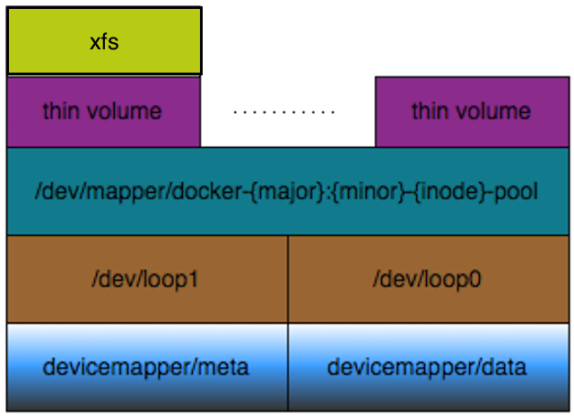

# Docker 1.12存储控制

## Docker 存储方案介绍

Docker目前支持很多存储驱动（graph driver），最开始使用的是AUFS，但AUFS一直没有进入内核主线，并且RHEL/Fedora等发行版本并不支持AUFS。Redhat的Alexander Larsson实现了设备映射（device-mapper）的存储驱动，现在这个驱动由Vincent Batts维护，被作为RHEL/Fedora等发行版的默认Docker 存储驱动。除此之外，还有Btrfs、overlayfs和overlayfs2等方式，btrfs不成熟商业化应用还有很长的路要走，overlayfs在3.18内核前没有进入内核主线（RHEL 7.2 以技术预览的方式支持），overlay2需要4.0以上内核才支持。

#### device mapper

在相当长一段时间，Device-mapper几乎成为生产环境的使用docker的唯一选择，但是在实际应用中，经常会遇到很多问题。比如下面的问题：

``` shell
Driver devicemapper failed to remove root filesystem ... : Device is Busy
```

此外Device-mapper需要udev的支持，而udev没有静态库。Docker希望通过容器之间共享pagecache，而Device-mapper工作在块层，很难实现pagecache的共享。如果一台机器上有几百个容器，如果每个容器都打开一份glibc，这会浪费许多内存。

因此，大多数生产环境不使用Device-mapper方式作为Docker的存储方法。

#### btrfs

Btrfs从开发初期就广受关注，但是一直以来问题不断，balance稳定性问题颇多，和Selinux命相不和。除了在docker build的时候性能较高外，不支持设备间共享存储也是致命伤。

和Device-mapper一样，生产环境下很少有公司使用其作为Docker的存储方法。

#### overlayfs

在内核3.18中，overlayfs终于正式进入主线。相比AUFS而言overlayfs设计简单代码也很少，而且可以实现pagecache共享。RHEL 7.2 也将其作为技术预览添加到系统中。

目前生产环境下，overlayfs是Docker存储应用的第一选择。

#### overlayfs2

在内核4.0中，overlayfs2进入内核主线。docker 1.12 开始支持overlayfs2，但是主流的Linux发行版还可有宣布支持此Docker存储方法。overlay2是overlay的升级，支持在overlay2下多层overlay存储。

overlay2还需要更多的升级才能在企业生产环境下使用。


## Docker Device-mapper存储方案

### 使用本地文件方式作为DeviceMapper基础设备 

Docker 1.12默认在RHEL7.2系统上安装时是使用/var/lib/docker/目录下的数据文件保持镜像和运行容器的，具体可以使用docker info命令查询：

```shell
[root@node2-f0 ~]# docker info
Containers: 0
 Running: 0
 Paused: 0
 Stopped: 0
Images: 0
Server Version: 1.12.0
Storage Driver: devicemapper
 Pool Name: docker-253:0-33935727-pool
 Pool Blocksize: 65.54 kB
 Base Device Size: 10.74 GB
 Backing Filesystem: xfs
 Data file: /dev/loop0
 Metadata file: /dev/loop1
 Data Space Used: 11.8 MB
 Data Space Total: 107.4 GB
 Data Space Available: 8.369 GB
 Metadata Space Used: 581.6 kB
 Metadata Space Total: 2.147 GB
 Metadata Space Available: 2.147 GB
 Thin Pool Minimum Free Space: 10.74 GB
 Udev Sync Supported: true
 Deferred Removal Enabled: false
 Deferred Deletion Enabled: false
 Deferred Deleted Device Count: 0
 Data loop file: /var/lib/docker/devicemapper/devicemapper/data
 WARNING: Usage of loopback devices is strongly discouraged for production use. Use `--storage-opt dm.thinpooldev` to specify a custom block storage device.
 Metadata loop file: /var/lib/docker/devicemapper/devicemapper/metadata
 Library Version: 1.02.107-RHEL7 (2015-10-14)
Logging Driver: json-file
Cgroup Driver: cgroupfs
Plugins:
 Volume: local
 Network: null host bridge overlay
Swarm: inactive
Runtimes: runc
Default Runtime: runc
Security Options: seccomp
Kernel Version: 3.10.0-327.el7.x86_64
Operating System: Red Hat Enterprise Linux Server 7.2 (Maipo)
OSType: linux
Architecture: x86_64
CPUs: 2
Total Memory: 477.3 MiB
Name: node2-f0.example.com
ID: 2TIM:MFU4:A3NU:TN2M:NDS7:YYKM:5VH7:MFPZ:F2QF:6F5A:LCY4:4S6K
Docker Root Dir: /var/lib/docker
Debug Mode (client): false
Debug Mode (server): false
Registry: https://index.docker.io/v1/
WARNING: bridge-nf-call-iptables is disabled
WARNING: bridge-nf-call-ip6tables is disabled
Insecure Registries:
 127.0.0.0/8
```

其中与docker存储相关的重要信息如下：

| 项目                           | 值                          | 说明                         |
| :--------------------------- | :------------------------- | :------------------------- |
| Storage Driver               | devicemapper               | 使用设备映射方式作为存储插件             |
| Pool name                    | docker-253:0-33935727-pool | 映射卷池名称                     |
| Pool Blocksize               | 65.54 KB                   | 映射卷池块大小                    |
| Base Device Size             | 10.74 GB                   | 映射池空间大小                    |
| Backing Filesystem           | xfs                        | 映射池分配瘦卷使用的文件系统             |
| Data File                    | /dev/loop0                 | 映射卷池数据空间挂接loop设备           |
| Metadata File                | /dev/loop1                 | 映射卷池元空间挂接loop设备            |
| Data Space Used              | 11.8 MB                    | 映射卷池数据空间已使用空间              |
| Data Space Total             | 107.4 GB                   | 映射卷池数据空间全局大小(thin-pool预分配) |
| Data Space Available         | 8.369 GB                   | 映射卷池数据空间可用空间               |
| Metadata Space Used          | 581.6 kB                   | 映射卷元空间使用空间                 |
| Metadata Space Total         | 2.147 GB                   | 映射卷元空间全局大小(thin-pool预分配)   |
| Metadata Space Available     | 2.147 GB                   | 映射卷元空间可用空间                 |
| Thin Pool Minimum Free Space | 10.74 GB                   | 映射卷池最小空闲空间                 |
| Data loop file               | devicemapper/data          | 映射卷数据空间文件                  |
| Matadata loop file           | devicemapper/matadata      | 映射卷元空间文件                   |

此时Docker 1.12在RHEL7上的存储结构如下：



当Docker 1.12后台服务（dockerd）启动时，如果没有给定存储设置的相关参数，后台服务（dockerd）将创建两个文件：

* /var/lib/docker/devicemapper/devicemapper/data
* /var/lib/docker/devicemapper/devicemapper/meta

data文件设置为100G，meta文件设置为2G。这些空间都是使用LVM thin-pool的方式预设而非实际占用，实际占用空间根据实际使用增长。但是如果你把文件拷贝出去或者备份这两个文件，这两个文件会真的占用那么大空间的。

data文件中保存docker环境中镜像和容器文件的数据块（block），需要较大的空间，并且随着镜像和容器的增加不断增大；meta文件中保存docker环境中镜像和容器文件的元信息（inode），包括已创建的卷和快照的数据块和池之间的映射关系等信息。

Docker通过loop映射方式将这两个文件对应到系统loop0和loop1设备，然后使用DeviceMapper方式映射为/dev/mapper/docker-{major}:{minor}-{inode}-pool设备。

```shell
[root@node2-f0 ~]# losetup -a
/dev/loop0 [64768]:666815 (/var/lib/docker/devicemapper/devicemapper/data)
/dev/loop1 [64768]:666816 (/var/lib/docker/devicemapper/devicemapper/mate)
```

这个docker-{major}:{minor}-{inode}-pool设备就是Docker系统创建基础设备的初始化LVM thin-pool池，Docker后台服务会自动在这个存储池上创建一个空白的XFS文件系统的 **基础设备** ，所有新下载或创建的镜像层都是基础设备的一个快照，这也意味着每个镜像和容器都有一个属于自己的块设备。 你可以在任意时间点为现有的镜像和容器创建新的快照（实现tag标签）。

当docker运行镜像创建容器的时候，就创建这个快照，具体表现可见如下操作：

* 首先我们下载registry.example.com/busybox测试镜像，然后运行此镜像创建一个最简单的ping容器。

```shell
[root@node2-f0 ~]# docker pull registry.example.com/busybox
Using default tag: latest
latest: Pulling from busybox

a3ed95caeb02: Already exists 
138cfc514ce4: Already exists 
Digest: sha256:5ac5f44ad96c847cf29dbb011279775561cfb192b4a75172735a5acae2cefbf8
Status: Image is up to date for registry.example.com/busybox:latest

[root@node2-f0 ~]# docker run --rm --name ping registry.example.com/busybox ping classroom.example.com
PING classroom.example.com (172.25.254.254): 56 data bytes
64 bytes from 172.25.254.254: seq=0 ttl=63 time=0.312 ms
64 bytes from 172.25.254.254: seq=1 ttl=63 time=0.408 ms
```

* 接下来我们可以在另一个终端上查看映射设备信息，会发现在docker-{major}:{minor}-{inode}-pool设备之上建立了一个新的卷，此卷就是运行的容器根设备。

  ```shell
  [root@node2-f0 devicemapper]# ls -l /dev/mapper/*
  crw-------. 1 root root 10, 236 Aug  8 03:48 /dev/mapper/control
  lrwxrwxrwx. 1 root root       7 Aug  8 07:17 /dev/mapper/docker-253:0-33935727-c53bf4f2c199b79e2bfbbcb4c9f80e2d4eadb2b5f59cbcb35cfb9ed5cfcb0d4c -> ../dm-4
  lrwxrwxrwx. 1 root root       7 Aug  8 03:57 /dev/mapper/docker-253:0-33935727-pool -> ../dm-3
  lrwxrwxrwx. 1 root root       7 Aug  8 03:48 /dev/mapper/rhel-home -> ../dm-2
  lrwxrwxrwx. 1 root root       7 Aug  8 03:48 /dev/mapper/rhel-root -> ../dm-0
  lrwxrwxrwx. 1 root root       7 Aug  8 03:48 /dev/mapper/rhel-swap -> ../dm-1
  ```

  **/dev/mapper/docker-253:0-33935727-c53bf4f2c199b79e2bfbbcb4c9f80e2d4eadb2b5f59cbcb35cfb9ed5cfcb0d4c ** 就是ping容器的根设备。每次新建容器后设备的名称都会改变。

### 使用本地文件方式创建DeviceMapper设备的缺点

* **任何时候不要在生产环境下使用本地文件方式创建DeviceMapper用于Docker存储！**
* 本地文件容易丢失，且不容易扩展空间
* 从性能上而言，本地文件挂接方式让存储结构跟复杂且性能更低
* 本地文件在集群和分布式存储方式中让系统架构更加复杂
* 不能很好的体现data数据和meta数据分离的优越性

### 使用独立硬件设备作为DeviceMapper基础设备

首先建立独立设备PV，并创建VG

```shell
[root@node1-f0 ~]# fdisk /dev/vdb
创建一个主分区/dev/vdb1
[root@node1-f0 ~]# pvcreate /dev/vdb1
创建独立设备PV
[root@node1-f0 ~]# vgcreate docker-storage /dev/vdb1
创建名为docker-storage的VG
```

创建thin-pool设备，thin-pool设备由data设备和meta设备组成，生产环境下建议使用速度较快的设备创建meta设备（比如SSD硬盘）。

```shell
[root@node1-f0 ~]# lvcreate -n docker-pool -L 20G docker-storage
创建一个大小为20G的普通卷作为thin-pool的data设备
[root@node1-f0 ~]# lvcreate -n docker-poolmeta -L 512M docker-storage
创建一个大小为512M的普通卷作为thin-pool的meta设备
[root@node1-f0 ~]# lvconvert --type thin-pool --poolmetadata docker-storage/docker-poolmeta docker-storage/docker-pool
将data设备卷和meta设备卷合并为thin-pool设备卷
```

显示现有设备卷状态

```shell
[root@node1-f0 ~]# lvs
  LV          VG             Attr       LSize   Pool Origin Data%  Meta%  Move Log Cpy%Sync Convert
  docker-pool docker-storage twi-a-tz--  20.00g             0.05   0.03                            
  home        rhel           -wi-ao---- 500.00m                                                    
  root        rhel           -wi-ao----   8.81g                                                    
  swap        rhel           -wi-ao---- 512.00m 
```

修改docker服务启动参数，将默认文件方式改为独立设备方式

``` shell
[root@node1-f0 ~]# vim /usr/lib/systemd/system/docker.service 
[Unit]
Description=Docker Application Container Engine
Documentation=https://docs.docker.com 
After=network.target

[Service]
Type=notify
# the default is not to use systemd for cgroups because the delegate issues still
# exists and systemd currently does not support the cgroup feature set required
# for containers run by docker
# 修改此处ExecStart项目
# -D 为打开Debug模式，在/var/log/messages日志文件中打印更多docker服务信息，为调试使用，生产环境不建议打开
# --storage-drvier= 设置docker存储方式，我们使用DeviceMapper
# --storage-opt 为设置docker存储方式的附加参数, dm.fs设置初始化基础设备文件系统，dm.thinpooldev设置thin-pool设备位置
ExecStart=/usr/bin/dockerd -D --selinux-enabled=true --storage-driver=devicemapper --storage-opt dm.fs=xfs --storage-opt dm.thinpooldev=/dev/mapper/docker--storage-docker--pool
ExecReload=/bin/kill -s HUP $MAINPID
# Having non-zero Limit*s causes performance problems due to accounting overhead
# in the kernel. We recommend using cgroups to do container-local accounting.
LimitNOFILE=infinity
LimitNPROC=infinity
LimitCORE=infinity
# Uncomment TasksMax if your systemd version supports it.
# Only systemd 226 and above support this version.
#TasksMax=infinity
TimeoutStartSec=0
# set delegate yes so that systemd does not reset the cgroups of docker containers
Delegate=yes
# kill only the docker process, not all processes in the cgroup
KillMode=process

[Install]
WantedBy=multi-user.target
```

修改docker.service文件后需要告知systemd重新读取配置文件，然后启动docker服务

```shell
[root@node1-f0 ~]# systemctl daemon-reload 
[root@node1-f0 ~]# systemctl start docker 
```

如果一切正常，可以同docker info命令查看当前docker存储状态

```shell
[root@node1-f0 ~]# docker info
Containers: 0
 Running: 0
 Paused: 0
 Stopped: 0
Images: 1
Server Version: 1.12.0
Storage Driver: devicemapper
 Pool Name: docker--storage-docker--pool
 Pool Blocksize: 65.54 kB
 Base Device Size: 10.74 GB
 Backing Filesystem: xfs
 Data file: 
 Metadata file: 
 Data Space Used: 41.55 MB
 Data Space Total: 21.47 GB
 Data Space Available: 21.43 GB
 Metadata Space Used: 532.5 kB
 Metadata Space Total: 5.369 GB
 Metadata Space Available: 5.368 GB
 Thin Pool Minimum Free Space: 2.147 GB
 Udev Sync Supported: true
 Deferred Removal Enabled: false
 Deferred Deletion Enabled: false
 Deferred Deleted Device Count: 0
 Library Version: 1.02.107-RHEL7 (2015-10-14)
Logging Driver: json-file
Cgroup Driver: cgroupfs
Plugins:
 Volume: local
 Network: host overlay bridge null
Swarm: inactive
Runtimes: runc
Default Runtime: runc
Security Options: seccomp selinux
Kernel Version: 3.10.0-327.el7.x86_64
Operating System: Red Hat Enterprise Linux Server 7.2 (Maipo)
OSType: linux
Architecture: x86_64
CPUs: 2
Total Memory: 489 MiB
Name: node1-f0.example.com
ID: 4KJN:BTR4:KUWE:J423:V5DR:2HDA:4YGD:6V4I:7MRB:K6DO:SPYI:Z4XB
Docker Root Dir: /var/lib/docker
Debug Mode (client): false
Debug Mode (server): true
 File Descriptors: 16
 Goroutines: 22
 System Time: 2016-08-08T03:58:50.592837131+08:00
 EventsListeners: 0
Registry: https://index.docker.io/v1/
WARNING: bridge-nf-call-iptables is disabled
WARNING: bridge-nf-call-ip6tables is disabled
Insecure Registries:
 127.0.0.0/8
```

自此我们就将原有基于文件的存储修改为基于独立设备文件的存储了。值得注意的是，我们演示中是使用两台独立的主机分别设置的存储结构，如果要将现有的环境修改为另外一种存储状态，需要将已经导入的镜像和自定义生成的容器导出保持，删除/var/lib/docker目录，然后重新设置并初始化。因此在第一次启动docker服务之前确认并设置docker服务的存储环境非常重要。


## Docker Overlay 存储方案

Docker 使用 overlayfs 的 lowerdir 指向镜像层（image layer），使用 upperdir 指向容器层（container layer），merged 将 lowerdir 与 upperdir 整合起来提供统一视图给容器，作为根文件系统。


lowerdir与upperdir可以包含相同的文件，upperdir会隐藏lowerdir的文件。

**读文件（read file）**

在容器内读文件时，如果upperdir 容器层（container layer）存在，就从容器层（container layer）读取；如果不存在，就从lowerlay 镜像层（image layer）读取。

**写文件（write file）**

写容器内文件时，如果upperdir 容器层（container layer）不存在，overlay则会发起copy_up操作，从lowerdir 镜像层（image layer）拷贝文件到upperdir。由于拷贝发生文件系统层面而不是块层，会拷贝整个文件，即使只修改文件很小一部分。如果文件很大，会导致效率低下。但好在拷贝只会在第一次打开时发生。另外，由于overlay只有2层，所以性能影响也很小。几个G大的数据库表空间文件就是此列数据。

**删除文件或目录（deleting files and directories）**

删除容器内文件时，upperdir镜像层（image layer）会创建一个whiteout文件，它会隐藏lowerdir 容器层（container layer）的文件（不会删除）。同样，删除目录时，upperdir会创建一个opaque directory，隐藏lowerdir的目录。

### 使用Overlay作为Docker基本存储方法

在RHEL上使用Overlay作为Docker基础存储方法的必要条件如下：

* RHEL 必须是 7.2 或以上版本
* Docker必须是最新版本，并且支持Overlay
* 底层文件系统必须是XFS
* SELinux在宿主机上必须打开设为enforcing模式，但docker服务启动时不能打开支持selinux选项，不能设置"--selinux-enabled"。目前RHEL 7.2系统还不支持overlay下的selinux
* 为了支持yum和rpm工具在以overlay为基础的容器中正常运行，需要安装yum-plugin-ovl软件包。

因此，在配置overlay方式的Docker基础存货环境前，我们需要确认Docker overlay基础存储所需前提是否已经安装配置成功。

``` shell
[root@node3-f0 ~]# rpm -q docker-engine
docker-engine-1.12.0-1.el7.centos.x86_64

[root@node3-f0 ~]# systemctl status docker.service 
docker.service - Docker Application Container Engine
   Loaded: loaded (/usr/lib/systemd/system/docker.service; disabled; vendor preset: disabled)
   Active: inactive (dead)
     Docs: https://docs.docker.com

[root@node3-f0 ~]# getenforce 
Enforcing

[root@node3-f0 ~]# df
Filesystem            1K-blocks    Used Available Use% Mounted on
/dev/mapper/rhel-root   9226240 1041812   8184428  12% /
devtmpfs                 239896       0    239896   0% /dev
tmpfs                    250356       0    250356   0% /dev/shm
tmpfs                    250356    4432    245924   2% /run
tmpfs                    250356       0    250356   0% /sys/fs/cgroup
/dev/mapper/rhel-home    508588   25772    482816   6% /home
/dev/vda1                201388  111828     89560  56% /boot
tmpfs                     50072       0     50072   0% /run/user/0

[root@node3-f0 ~]# mount |grep /dev/mapper/rhel-root 
/dev/mapper/rhel-root on / type xfs (rw,relatime,seclabel,attr2,inode64,noquota)
```

接下来配置docker.service配置文件，添加"--storage-driver=overlay"参数，启动docker服务。

``` shell
打开配置文件，修改启动参数
[root@node3-f0 ~]# vi /usr/lib/systemd/system/docker.service

将ExecStart项添加参数“-D --storage-driver=overlay”
[Unit]
Description=Docker Application Container Engine
Documentation=https://docs.docker.com
After=network.target

[Service]
Type=notify
# the default is not to use systemd for cgroups because the delegate issues still
# exists and systemd currently does not support the cgroup feature set required
# for containers run by docker
ExecStart=/usr/bin/dockerd -D --storage-driver=overlay
ExecReload=/bin/kill -s HUP $MAINPID
# Having non-zero Limit*s causes performance problems due to accounting overhead
# in the kernel. We recommend using cgroups to do container-local accounting.
LimitNOFILE=infinity
LimitNPROC=infinity
LimitCORE=infinity
# Uncomment TasksMax if your systemd version supports it.
# Only systemd 226 and above support this version.
#TasksMax=infinity
TimeoutStartSec=0
# set delegate yes so that systemd does not reset the cgroups of docker containers
Delegate=yes
# kill only the docker process, not all processes in the cgroup
KillMode=process

[Install]
WantedBy=multi-user.target

保持退出后，重读systemd配置，然后启动
[root@node3-f0 ~]# systemctl daemon-reload 
[root@node3-f0 ~]# systemctl enable docker
[root@node3-f0 ~]# systemctl start docker

查看当前docker运行信息
[root@node3-f0 ~]# docker info
Containers: 0
 Running: 0
 Paused: 0
 Stopped: 0
Images: 0
Server Version: 1.12.0
Storage Driver: overlay
 Backing Filesystem: xfs
Logging Driver: json-file
Cgroup Driver: cgroupfs
Plugins:
 Volume: local
 Network: host bridge overlay null
Swarm: inactive
Runtimes: runc
Default Runtime: runc
Security Options: seccomp
Kernel Version: 3.10.0-327.el7.x86_64
Operating System: Red Hat Enterprise Linux Server 7.2 (Maipo)
OSType: linux
Architecture: x86_64
CPUs: 2
Total Memory: 489 MiB
Name: node3-f0.example.com
ID: 4QUI:EM3D:CULN:K7XM:76BQ:I4JC:7PEE:ZSJH:5VYW:5IG3:7DNO:CHCT
Docker Root Dir: /var/lib/docker
Debug Mode (client): false
Debug Mode (server): true
 File Descriptors: 15
 Goroutines: 22
 System Time: 2016-08-15T03:01:27.420279563+08:00
 EventsListeners: 0
Registry: https://index.docker.io/v1/
WARNING: bridge-nf-call-iptables is disabled
WARNING: bridge-nf-call-ip6tables is disabled
Insecure Registries:
 127.0.0.0/8
```

可以看到目前的存储方法改为了overlay方式：

> Storage Driver: overlay

其/var/lib/docker目录与DeviceMapper方式比较如下:

``` shell
[root@node3-f0 ~]# cd /var/lib/docker/
[root@node3-f0 docker]# ls
containers  image  network  overlay  swarm  tmp  trust  volumes

[root@node2-f0 ~]# cd /var/lib/docker/
[root@node2-f0 docker]# ls
containers  devicemapper  image  network  swarm  tmp  trust  volumes
```

可以看出相对DeviceMapper方式的少了一个devicemapper目录，多了overlay目录。

在image目录下，DeviceMapper方式的是devicemapper目录，而Overlay方式的是overlay目录。

### 使用Overlay2作为Docker基本存储方法

Overlay2 是 overlay 的升级，与overlay的结构基本相同，但是使用了从写的函数并且在存储上是不兼容的。由于存储的不相兼容，要从overlay升级为overlay2，需要将所有的镜像和容器导出后删除/var/lib/docker目录，然后带转换存储方案后，在把镜像和容器重新导入。Overlay2解决了overlay inode损耗和提交（commit）性能问题，但是只在Docker 1.11之后的版本才能实现，同时Linux的内核版本必须在4.0以上才支持。

为了在本地环境下尝试使用overlay2，我们需要首先升级RHEL7.2系统的内核。将现有的3.10内核升级为4.0以上的内核。我们可以在服务器上找到可供升级的内核包。

``` shell
[root@node4-f0 ~]# rpm -ivh http://materials.example.com/kernel-ml-4.7.0-1.el7.elrepo.x86_64.rpm
Retrieving http://materials.example.com/kernel-ml-4.7.0-1.el7.elrepo.x86_64.rpm
warning: /var/tmp/rpm-tmp.Znhj8C: Header V4 DSA/SHA1 Signature, key ID baadae52: NOKEY
Preparing...                          ################################# [100%]
Updating / installing...
   1:kernel-ml-4.7.0-1.el7.elrepo     ################################# [100%]
```

安装内核包后，默认Grub2不会修改内核启动顺序，我们修改Grub2的配置，将新内核作为默认启动内核。

``` shell
[root@node4-f0 ~]# grep ^menuentry /boot/grub2/grub.cfg | cut -f 2 -d \' | nl -v 0
     0	Red Hat Enterprise Linux Server (4.7.0-1.el7.elrepo.x86_64) 7.2 (Maipo)
     1	Red Hat Enterprise Linux Server (3.10.0-327.el7.x86_64) 7.2 (Maipo)
     2	Red Hat Enterprise Linux Server (0-rescue-ecd4a28875734de9bf2cb5e40cbf88da) 7.2 (Maipo)
[root@node4-f0 ~]# grub2-set-default 0

```

设置好内核启动顺序后，重启启动系统，检查当前内核版本。

``` shell
[root@node4-f0 ~]# reboot

[kiosk@foundation0 Desktop]$ ssh root@node4-f0
Last login: Mon Aug 15 05:59:20 2016 from 172.25.0.250

[root@node4-f0 ~]# uname -a
Linux node4-f0.example.com 4.7.0-1.el7.elrepo.x86_64 #1 SMP Sun Jul 24 18:15:29 EDT 2016 x86_64 x86_64 x86_64 GNU/Linux
```

设置docker.service配置文件，添加"-D --storage-device=overlay2"参数

``` shell
[root@node4-f0 ~]# vi /usr/lib/systemd/system/docker.service

[Unit]
Description=Docker Application Container Engine
Documentation=https://docs.docker.com
After=network.target

[Service]
Type=notify
# the default is not to use systemd for cgroups because the delegate issues still
# exists and systemd currently does not support the cgroup feature set required
# for containers run by docker
ExecStart=/usr/bin/dockerd -D --storage-driver=overlay2
ExecReload=/bin/kill -s HUP $MAINPID
# Having non-zero Limit*s causes performance problems due to accounting overhead
# in the kernel. We recommend using cgroups to do container-local accounting.
LimitNOFILE=infinity
LimitNPROC=infinity
LimitCORE=infinity
# Uncomment TasksMax if your systemd version supports it.
# Only systemd 226 and above support this version.
#TasksMax=infinity
TimeoutStartSec=0
# set delegate yes so that systemd does not reset the cgroups of docker containers
Delegate=yes
# kill only the docker process, not all processes in the cgroup
KillMode=process

[Install]
WantedBy=multi-user.target

```

启动docker服务，使用docker info命令验证docker存储设置

``` shell
[root@node4-f0 ~]# systemctl daemon-reload 

[root@node4-f0 ~]# systemctl enable docker.service

[root@node4-f0 ~]# systemctl start docker.service 

[root@node4-f0 ~]# docker info
Containers: 0
 Running: 0
 Paused: 0
 Stopped: 0
Images: 0
Server Version: 1.12.0
Storage Driver: overlay2
 Backing Filesystem: xfs
Logging Driver: json-file
Cgroup Driver: cgroupfs
Plugins:
 Volume: local
 Network: host bridge overlay null
Swarm: inactive
Runtimes: runc
Default Runtime: runc
Security Options: seccomp
Kernel Version: 4.7.0-1.el7.elrepo.x86_64
Operating System: Red Hat Enterprise Linux Server 7.2 (Maipo)
OSType: linux
Architecture: x86_64
CPUs: 2
Total Memory: 488 MiB
Name: node4-f0.example.com
ID: UZNY:6PPI:4EMO:ABM7:NOIE:RWJO:O4N7:YI6C:FQWB:2K7R:FNKA:SCK2
Docker Root Dir: /var/lib/docker
Debug Mode (client): false
Debug Mode (server): true
 File Descriptors: 14
 Goroutines: 22
 System Time: 2016-08-15T06:16:05.480581206+08:00
 EventsListeners: 0
Registry: https://index.docker.io/v1/
WARNING: bridge-nf-call-iptables is disabled
WARNING: bridge-nf-call-ip6tables is disabled
Insecure Registries:
 127.0.0.0/8
```

可以看到目前的存储方法改为了overlay2方式：

> Storage Driver: overlay2


其/var/lib/docker目录与overlay方式比较如下:

``` shell
[root@node3-f0 ~]# cd /var/lib/docker/
[root@node3-f0 docker]# ls
containers  image  network  overlay  swarm  tmp  trust  volumes

[root@node4-f0 ~]# cd /var/lib/docker/
[root@node4-f0 docker]# ls
containers  image  network  overlay2  swarm  tmp  trust  volumes
```


