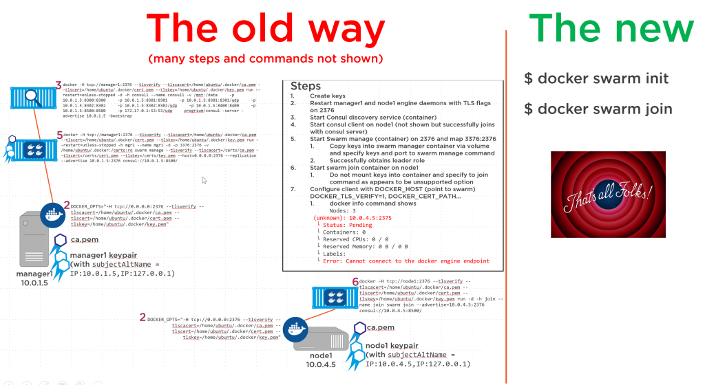
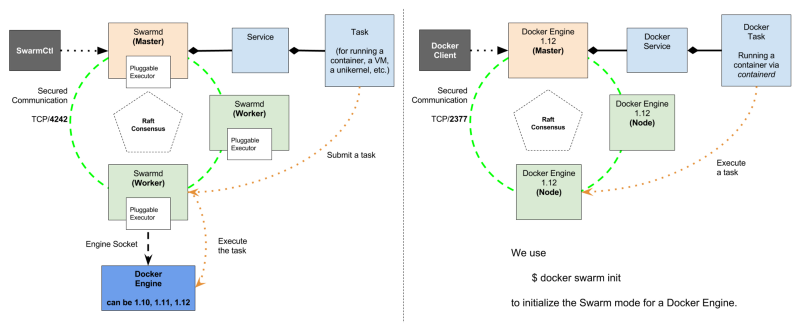
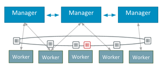
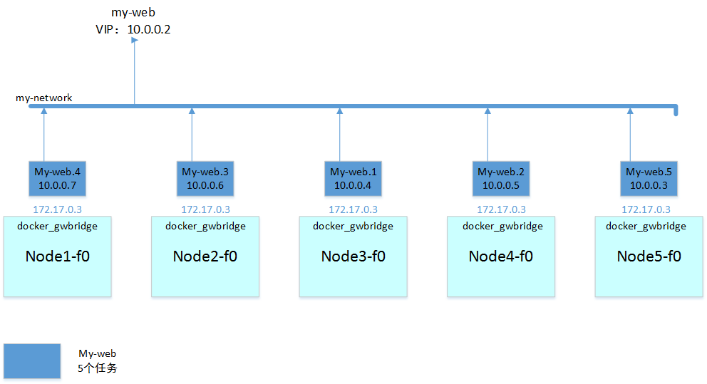

# Docker 1.12 Swarm mode

##### Kevin Zou (kissingwolf@gmail.com)

[TOC]

## Docker Swarm mode 介绍

2016 DockerCon技术大会上发布Docker 1.12产品Docker Engine中最大的新特性就是整合Docker Swarm mode。Docker Swarm mode可以将多台物理主机组成一个更大规模的逻辑单元，完成在多机上部署和运行Docker 容器。

旧的Docker Swarmkit产品是以套件形式提供的，本身没有什么核心功能。在此之前的Docker Swarmkit进程在各个节点上做为容器运行，而且还需要许多其他技术来辅助它，比如用Consul或etcd来做服务发现，用Nginx做负载均衡等。集群实际上要先运行一堆基础设施容器，然后才能运行你自己的应用程序容器。

搭建起一个旧的集群也并非易事，因为在你创建集群之前服务发现组件就要就位，可是之后你又想让它作为集群的一个部分来运行，所以你什么事情都没开始干就要先解决一个“先有鸡还是先有蛋”的问题。

在新的Docker 1.12 Engine Swarm mode集群模式下用一个'init'命令即可创建集群，用'join'命令可以把工作者加入集群。创建和加入集群的命令一般一两秒钟就可以执行完毕。



Docker Swarmkit与Docker 1.12 Engine Swarm mode的模式比较如下图：



Docker 1.12 Engine Swarm mode节点之间的通信安全由传输层安全协议（TLS）来保证。为了安装简便，Docker 1.12 Engine Swarm 会在创建集群时生成自签名证书，当然也可以换成你从自己的证书颁发机构获得的证书。这些证书在节点内部通信时会被用到，但所有对外的服务仍然是和以前一样使用你原来的证书。


Docker Swarm建议在一个三层（L3）子网内运行所有集群节点，但根据你自己的实际情况，也可以把节点划分到不同的子网里，把运行对外服务容器的节点和内部节点隔离开来。默认情况下网络使用overlay方式，并且设置的网络在非swarm方式下不可用。


集群的自我认知能力是最重大的改变，集群中的每个节点都可以连接其他任何一个节点，并且可以把请求路由到它需要去的地方。你再也不必自己运行负载均衡器并把它与动态服务发现代理结合起来了，而在此之前使用的方式通常是Nginx加Interlock。

如果一个节点收到了一条处理不了的请求，它就会找到运行了可以处理这条请求的容器的节点，并把这条请求路由过去。这个过程对用户是透明的，他们最终只能收到一条响应消息，完全不知道在集群内部是否发生过消息转发。Docker Swarm 将其称之为“路由网”，并且其支持外部负载均衡。你可以在集群前面放一个对外的负载均衡器（lvs或nginx proxy），并把它配置成所有服务的唯一入口，它就会把流入的消息在集群内部随意分发，然后收到了消息的节点就会智能的把它处理不了的消息转发到合适的地方去。Docker Swarm的“路由网”使用的就是Linux IPVS技术。

路由网和调度器的组合可以保证即使有节点发生故障也不会造成服务中断。负载均衡器不会把任何请求发送到出故障的节点上。如果因为故障导致服务所需要的最小副本数达不到要求，调度器就会自动在别的节点上运行起新的副本来。



## Docker Swarm mode 基本概念

### 节点（node）

> 节点是Docker Engine 加入Swarm中的一个实例

我们将认为部署到Docker Swarm中，提交部署命令、分派任务执行并且可以监控执行状态的节点叫管理节点（manager），执行任务的节点叫工作节点（worker）。

管理节点（manger）也进行维护Docker Swarm集群理想状态所需的编排和集群管理功能。管理节点选出一个中心节点来进行编排的任务。

工作节点（worker）接收和执行从管理中心节点调度（manager）任务。默认情况下管理节点(manager)也是工作节点，但可以配置管理节点（manager）只有管理任务，代理通知分配给它任务及当前状态的管理器节点，以便管理者可以保持所需的状态。

### 服务及任务（service and task）

> 服务（service）定义工作节点（worker）上执行的任务（task）。它是Docker Swarm集群系统的中心结构，定义用户在集群中交互的主要资源。

当你在Docker Swarm 中创建一个服务，您就指定了使用何种镜像创建什么容器以及容器中运行的命令。

在复制服务模式（**replicated services**）下，该Docker Swarm集群管理节点（manager）根据您在理想状态设置规模的副本任务的具体数目设置运行的容器数目。

对于全局服务模式（**global services**），该Docker Swarm集群管理节点（manager）设置每个可用节点上都均衡的运行一个任务。

任务（task）定义运行的容器和容器内运行的命令。它是Docker Swarm集群的原子调度单元。管理节点（manager）根据业务规模设定副本的数量将任务分配给工作节点（worker）。一旦一任务被分配给一个节点，它不能移动到另一个节点。它只能分配的节点上运行或失败。

### 负载均衡（load balancing）

> Docker Swarm mode 自带负载均衡机制，将用户的请求均衡的转发到容器中去。

Docker Swarm 集群管理节点（manager）使用入口负载均衡（ **ingress load balancing**）提供容器资源的合理应用。Docker Swarm集群群管理节点（manager）可以自动分配服务公共端口（PublishedPort）或者你可以在30000-32767范围内的服务配置公共端口（PublishedPort）。

### 服务端口（port）

| 端口           | 说明                          |
| :----------- | :-------------------------- |
| 2377/tcp     | Docker Swarm mode 集群管理通信端口  |
| 7946/tcp/udp | Docker Swarm mode 集群节点间通信端口 |
| 4789/tcp/udp | Overlay network 网络通信端口      |

如果你出于安全考量，没有关闭firewalld防火墙服务，或是有自定义的防火墙设置项目，请保证所有节点上的以上三个端口为打开且互相访问。

### 初始化（docker swarm init）

> docker swarm init --advertise-addr <MANAGER-IP>

init 为初始化化命令，--advertise-addr为可选的参数，用来定义swarm manager 工作的网络及监听地址MANAGER-IP，初始化后docker info 信息将更新出swarm相关项目，如下：

``` shell
[root@node1-f0 ~]# docker info
.....
Swarm: active
 NodeID: 0ya3amxp506v8kpg6tn2vt05d
 Is Manager: true
 ClusterID: 88ti2ysqtkmmhvivvbbjlsd4l
 Managers: 2
 Nodes: 5
 Orchestration:
  Task History Retention Limit: 5
 Raft:
  Snapshot interval: 10000
  Heartbeat tick: 1
  Election tick: 3
 Dispatcher:
  Heartbeat period: 5 seconds
 CA configuration:
  Expiry duration: 3 months
 Node Address: 172.25.0.12
.....
```

### 加入（docker swarm jion）

> docker swarm jion --token <SWARM-TOKEN>  <MANAGER-IP>

节点加入Docker Swarm 集群有两种状态：manager和worker ，是通过不同的SWARM-TOKEN来区分的。

在docker swarm init 初始化的时候，命令会回显添加node的提示

``` shell
[root@node1-f0 ~]# docker swarm init
Swarm initialized: current node (25b0xuxawe1k7ag7o6kky0voq) is now a manager.

To add a worker to this swarm, run the following command:
    docker swarm join \
    --token SWMTKN-1-1avzol358urqmhoj1envcx60u9a7dxcem27br499gswltls29v-a0xqbybwh33j6yr2zhdryjgbb \
    172.25.0.12:2377

To add a manager to this swarm, run the following command:
    docker swarm join \
    --token SWMTKN-1-1avzol358urqmhoj1envcx60u9a7dxcem27br499gswltls29v-bpiiwfz95u7bjwwp860wk8nsd \
    172.25.0.12:2377
```

如果当时没有保存，也可以通过docker swarm join-token 命令重新获得

``` shell
[root@node1-f0 ~]# docker swarm join-token manager
To add a worker to this swarm, run the following command:
    docker swarm join \
    --token SWMTKN-1-1avzol358urqmhoj1envcx60u9a7dxcem27br499gswltls29v-a0xqbybwh33j6yr2zhdryjgbb \
    172.25.0.12:2377
    
[root@node1-f0 ~]# docker swarm join-token worker
To add a manager to this swarm, run the following command:
    docker swarm join \
    --token SWMTKN-1-1avzol358urqmhoj1envcx60u9a7dxcem27br499gswltls29v-bpiiwfz95u7bjwwp860wk8nsd \
    172.25.0.12:2377
```

一般情况下复制命令在节点服务器上运行就可以了，但是如果运行不成功，多半是因为网络问题，请坚持网络连通性或防火墙配置。

## Docker Swarm mode 搭建

### 环境配置

首先创建运行环境，启动node1-node5虚拟机，其中node1和node2设置为管理节点（manager），node3-node5设置为工作节点（worker）。

``` shell
[kiosk@foundation0 Desktop]$ for i in {1..5} ; do rht-vmctl reset node$i ; done 
```

设置运行环境，并安装Docker 1.12软件包

``` shell
[kiosk@foundation0 Desktop]$ for i in {1..5} ; do ssh root@node$i-f0 "yum install wget -y" ; done

[kiosk@foundation0 Desktop]$ for i in {1..5} ; do ssh root@node$i-f0 "wget http://materials.example.com/docker.repo -O /etc/yum.repos.d/docker.repo" ; done

[kiosk@foundation0 Desktop]$ for i in {1..5} ; do ssh root@node$i-f0 "yum install docker-engine -y" ; done

[kiosk@foundation0 Desktop]$ for i in {1..5} ; do ssh root@node$i-f0 "yum reinstall docker-engine-selinux -y" ; done

[kiosk@foundation0 Desktop]$ for i in {1..5} ; do ssh root@node$i-f0 "systemctl disable firewalld ; systemctl stop firewalld ; systemctl mask firewalld ; systemctl enable docker ; systemctl restart docker" ; done
```

### 初始化 Docker Swarm mode

登录node1-f0主机，初始化docker swarm mode环境。node1-f0自动成为管理节点(manager)

``` shell
[kiosk@foundation0 Desktop]$ ssh root@node1-f0
Last login: Sat Jun  4 14:39:46 2016 from 172.25.0.250

[root@node1-f0 ~]# docker swarm init
Swarm initialized: current node (25b0xuxawe1k7ag7o6kky0voq) is now a manager.

To add a worker to this swarm, run the following command:
    docker swarm join \
    --token SWMTKN-1-1avzol358urqmhoj1envcx60u9a7dxcem27br499gswltls29v-a0xqbybwh33j6yr2zhdryjgbb \
    172.25.0.12:2377

To add a manager to this swarm, run the following command:
    docker swarm join \
    --token SWMTKN-1-1avzol358urqmhoj1envcx60u9a7dxcem27br499gswltls29v-bpiiwfz95u7bjwwp860wk8nsd \
    172.25.0.12:2377
```

登录node2-f0，使用管理节点token加入docker swarm mode。

``` shell

[kiosk@foundation0 Desktop]$ ssh root@node2-f0
Last login: Sat Jun  4 14:39:46 2016 from 172.25.0.250
[root@node2-f0 ~]# docker swarm join \
>     --token SWMTKN-1-1avzol358urqmhoj1envcx60u9a7dxcem27br499gswltls29v-bpiiwfz95u7bjwwp860wk8nsd \
>     172.25.0.12:2377
This node joined a swarm as a manager.
```

登录node3-f0，使用工作节点token加入docker swarm mode。

``` shell
[kiosk@foundation0 Desktop]$ ssh root@node3-f0
Last login: Sat Jun  4 14:39:46 2016 from 172.25.0.250
[root@node3-f0 ~]#     docker swarm join \
>     --token SWMTKN-1-1avzol358urqmhoj1envcx60u9a7dxcem27br499gswltls29v-a0xqbybwh33j6yr2zhdryjgbb \
>     172.25.0.12:2377
This node joined a swarm as a worker.
```

登录node4-f0，使用工作节点token加入docker swarm mode。

``` shell
[kiosk@foundation0 Desktop]$ ssh root@node4-f0
Last login: Sat Jun  4 14:39:46 2016 from 172.25.0.250
[root@node4-f0 ~]#     docker swarm join \
>     --token SWMTKN-1-1avzol358urqmhoj1envcx60u9a7dxcem27br499gswltls29v-a0xqbybwh33j6yr2zhdryjgbb \
>     172.25.0.12:2377
This node joined a swarm as a worker.
```

登录node5-f0，使用工作节点token加入docker swarm mode。

``` shell
[kiosk@foundation0 Desktop]$ ssh root@node5-f0
Last login: Sat Jun  4 14:39:46 2016 from 172.25.0.250
[root@node5-f0 ~]#     docker swarm join \
>     --token SWMTKN-1-1avzol358urqmhoj1envcx60u9a7dxcem27br499gswltls29v-a0xqbybwh33j6yr2zhdryjgbb \
>     172.25.0.12:2377
This node joined a swarm as a worker.
```

在管理节点上可以通过 docker node list 命令查看节点状态

``` shell
[root@node1-f0 ~]# docker node list
ID                           HOSTNAME              STATUS  AVAILABILITY  MANAGER STATUS
25b0xuxawe1k7ag7o6kky0voq *  node1-f0.example.com  Ready   Active        Leader
80ev6sigakltzfu3o53loz84q    node2-f0.example.com  Ready   Active        Reachable
b514x9j1ate655c60np0671ee    node4-f0.example.com  Ready   Active        
bypgsye9l0hrbckete6w5jrag    node3-f0.example.com  Ready   Active        
e52d1qi6do5aeb9zyco2ss9be    node5-f0.example.com  Ready   Active  

[root@node2-f0 ~]# docker node list
ID                           HOSTNAME              STATUS  AVAILABILITY  MANAGER STATUS
25b0xuxawe1k7ag7o6kky0voq    node1-f0.example.com  Ready   Active        Leader
80ev6sigakltzfu3o53loz84q *  node2-f0.example.com  Ready   Active        Reachable
b514x9j1ate655c60np0671ee    node4-f0.example.com  Ready   Active        
bypgsye9l0hrbckete6w5jrag    node3-f0.example.com  Ready   Active        
e52d1qi6do5aeb9zyco2ss9be    node5-f0.example.com  Ready   Active 
```

在工作节点上是无法查看节点状态的

``` shell
[root@node3-f0 ~]# docker node list
Error response from daemon: This node is not a swarm manager. Worker nodes can't be used to view or modify cluster state. Please run this command on a manager node or promote the current node to a manager.
```

docker swarm mode 集群建立起来后，宿主机上会多出两个docker 网络：docker_gwbridge和ingress，管理节点（manager）和工作节点（worker）都有。

``` shell
[root@node1-f0 ~]# docker network list
NETWORK ID          NAME                DRIVER              SCOPE
9196d17ced20        bridge              bridge              local   
ecbd50c4345d        docker_gwbridge     bridge              local               
6ea7ca52d734        host                host                local               
48mashedsve2        ingress             overlay             swarm               
fc8e29ed8eef        none                null                local 

[root@node2-f0 ~]# docker network list
NETWORK ID          NAME                DRIVER              SCOPE
e9afeb4fad42        bridge              bridge              local               
90fd0f39d348        docker_gwbridge     bridge              local               
360047c27a50        host                host                local               
48mashedsve2        ingress             overlay             swarm               
9e7773032beb        none                null                local 

[root@node3-f0 ~]# docker network list
NETWORK ID          NAME                DRIVER              SCOPE
1334ee22453f        bridge              bridge              local               
60655010b5c7        docker_gwbridge     bridge              local               
c354b7f6d616        host                host                local               
48mashedsve2        ingress             overlay             swarm               
155b11749aa5        none                null                local 
```

### 创建Docker Swarm mode 服务

初始化创建Docker Swarm mode 服务，使用docker service 命令

``` shell
[root@node1-f0 ~]# docker service create -h
Flag shorthand -h has been deprecated, please use --help

Usage:	docker service create [OPTIONS] IMAGE [COMMAND] [ARG...]

Create a new service

Options:
      --constraint value               Placement constraints (default [])
      --container-label value          Container labels (default [])
      --endpoint-mode string           Endpoint mode (vip or dnsrr)
  -e, --env value                      Set environment variables (default [])
      --help                           Print usage
  -l, --label value                    Service labels (default [])
      --limit-cpu value                Limit CPUs (default 0.000)
      --limit-memory value             Limit Memory (default 0 B)
      --log-driver string              Logging driver for service
      --log-opt value                  Logging driver options (default [])
      --mode string                    Service mode (replicated or global) (default "replicated")
      --mount value                    Attach a mount to the service
      --name string                    Service name
      --network value                  Network attachments (default [])
  -p, --publish value                  Publish a port as a node port (default [])
      --replicas value                 Number of tasks (default none)
      --reserve-cpu value              Reserve CPUs (default 0.000)
      --reserve-memory value           Reserve Memory (default 0 B)
      --restart-condition string       Restart when condition is met (none, on-failure, or any)
      --restart-delay value            Delay between restart attempts (default none)
      --restart-max-attempts value     Maximum number of restarts before giving up (default none)
      --restart-window value           Window used to evaluate the restart policy (default none)
      --stop-grace-period value        Time to wait before force killing a container (default none)
      --update-delay duration          Delay between updates
      --update-failure-action string   Action on update failure (pause|continue) (default "pause")
      --update-parallelism uint        Maximum number of tasks updated simultaneously (0 to update all at once) (default 1)
  -u, --user string                    Username or UID
      --with-registry-auth             Send registry authentication details to swarm agents
  -w, --workdir string                 Working directory inside the container
```

#### 几个常用且关键的参数

> -e  指定引入的环境变量，设置容器运行环境
>
> --network 指定其使用的overlay网络，默认使用ingress网络
>
> --mode 指定运行为 **复制服务模式（replicated）** 或 **全局服务模式（global）** ，默认为前一种
>
> -p 指定对外暴露的端口，和docker run -p参数的格式一致
>
> --replicase 指定**复制服务模式（replicated）**下任务（task）的数目
>
> --with-registry-auth 指定使用本地docker 用户认证代理访问Registry注册服务器，使用私有注册中心时使用
>
> --mount 挂接外部存储到执行任务的容器内

由于我们本地使用的是自有注册中心registry.example.com，所以为了保证所有节点可以正确的登录和运行容器，我们需要配置所有节点的登录秘钥。

``` shell
[kiosk@foundation0 Desktop]$ for i in {1..5} ; do ssh root@node$i-f0 "mkdir -p  /etc/docker/certs.d/registry.example.com/ " ; done

[kiosk@foundation0 Desktop]$ for i in {1..5} ; do ssh root@node$i-f0 "wget  http://materials.example.com/registry.example.com.crt -O  /etc/docker/certs.d/registry.example.com/registry.example.com.crt " ; done
```

配置好秘钥后，docker login登录私有注册服务器registry.example.com测试

``` shell
[kiosk@foundation0 Desktop]$ for i in {1..5} ; do ssh root@node$i-f0 "docker login -u student0 -p uplooking  registry.example.com" ; done
Login Succeeded
Login Succeeded
Login Succeeded
Login Succeeded
Login Succeeded
```

#### 使用自有注册服务器（Registry）

准备好认证环境后，我们可以创建第一个docker swarm 服务

``` shell
查看node1~node5设备上的docker image镜像环境，目前没有任何本地镜像
[kiosk@foundation0 Desktop]$ for i in {1..5} ; do ssh root@node$i-f0 "hostname ; docker images " ; done
node1-f0.example.com
REPOSITORY          TAG                 IMAGE ID            CREATED             SIZE
node2-f0.example.com
REPOSITORY          TAG                 IMAGE ID            CREATED             SIZE
node3-f0.example.com
REPOSITORY          TAG                 IMAGE ID            CREATED             SIZE
node4-f0.example.com
REPOSITORY          TAG                 IMAGE ID            CREATED             SIZE
node5-f0.example.com
REPOSITORY          TAG                 IMAGE ID            CREATED             SIZE

创建第一个简单swarm 容器环境
[root@node1-f0 ~]# docker service create --name ping_con --with-registry-auth 
registry.example.com/busybox:latest ping classroom.example.com
26y2vaxv70ezkao9p9mv7lkcg

在manager节点上查看service状态
[root@node1-f0 ~]# docker service ls
ID            NAME      REPLICAS  IMAGE                                COMMAND
26y2vaxv70ez  ping_con  1/1       registry.example.com/busybox:latest  ping classroom.example.com

在manager节点上查看task状态
[root@node1-f0 ~]# docker service ps ping_con 
ID                         NAME        IMAGE                                NODE                  DESIRED STATE  CURRENT STATE           ERROR
bdjwlt5lnk2o5fftorcvxxf0d  ping_con.1  registry.example.com/busybox:latest  node2-f0.example.com  Running        Running 15 seconds ago 
```

可以看到默认创建的容器ping_con，有一个task，运行在worker节点node2上。

swarm service 使用的镜像registry.example.com/busybox:latest会自动下载到相应的节点上。

``` shell
[kiosk@foundation0 Desktop]$ for i in {1..5} ; do ssh root@node$i-f0 "hostname ; docker images " ; done
node1-f0.example.com
REPOSITORY          TAG                 IMAGE ID            CREATED             SIZE
node2-f0.example.com
REPOSITORY                     TAG                 IMAGE ID            CREATED             SIZE
registry.example.com/busybox   latest              e7d168d7db45        19 months ago       2.43 MB
node3-f0.example.com
REPOSITORY          TAG                 IMAGE ID            CREATED             SIZE
node4-f0.example.com
REPOSITORY          TAG                 IMAGE ID            CREATED             SIZE
node5-f0.example.com
REPOSITORY          TAG                 IMAGE ID            CREATED             SIZE
```

可以看到，节点node2上已经具有了镜像registry.example.com/busybox:latest。如果你的以上操作不成功，没有正确的运行服务或任务，请检查是否在docker service create命令中添加"**--with-registry-auth**"参数。

#### 创建多任务服务

接下来我们创建一个拥有7个task的服务。

``` shell
[root@node1-f0 ~]# docker service create --name task5_con --with-registry-auth --replicas=7 registry.example.com/busybox:latest ping classroom.example.com
34hxvz35chlbb6gsmpwyw3f2e

在manager节点上查看服务状态，创建task需要时间，可以你要等3~5秒后才能看到task5_con的REPLICAS变为7/7
[root@node1-f0 ~]# docker service ls
ID            NAME       REPLICAS  IMAGE                                COMMAND
26y2vaxv70ez  ping_con   1/1       registry.example.com/busybox:latest  ping classroom.example.com
34hxvz35chlb  task5_con  7/7       registry.example.com/busybox:latest  ping classroom.example.com

在manager节点上查看任务状态，有7个task被创建，并且自动分布到5个节点上。节点node3和node4分别运行了2个task，其他节点上各运行了1个task
[root@node1-f0 ~]# docker service ps task5_con 
ID                         NAME         IMAGE                                NODE                  DESIRED STATE  CURRENT STATE           ERROR
8nbm8c3th4jjxvhroh1tnjghk  task5_con.1  registry.example.com/busybox:latest  node3-f0.example.com  Running        Running 23 seconds ago  
0ij9fqwq4f5u6xexlsj73d7mo  task5_con.2  registry.example.com/busybox:latest  node4-f0.example.com  Running        Running 21 seconds ago  
6s3pr5o8wl8nucurwooae8gt0  task5_con.3  registry.example.com/busybox:latest  node4-f0.example.com  Running        Running 21 seconds ago  
54xkj83oon4xyajqhsgub4zfl  task5_con.4  registry.example.com/busybox:latest  node2-f0.example.com  Running        Running 42 seconds ago  
9yt8atd49obrgn35z70pmgm3k  task5_con.5  registry.example.com/busybox:latest  node3-f0.example.com  Running        Running 25 seconds ago  
dg3s4dcafi2q5q35uadwqr75h  task5_con.6  registry.example.com/busybox:latest  node1-f0.example.com  Running        Running 23 seconds ago  
dn1hf3devazyo4ve5fuh1i1uk  task5_con.7  registry.example.com/busybox:latest  node5-f0.example.com  Running        Running 28 seconds ago  
```

swarm service 使用的镜像registry.example.com/busybox:latest会自动下载到相应的节点上。

``` shell
[kiosk@foundation0 Desktop]$ for i in {1..5} ; do ssh root@node$i-f0 "hostname ; docker images " ; done
node1-f0.example.com
REPOSITORY          TAG                 IMAGE ID            CREATED             SIZE
registry.example.com/busybox   latest              e7d168d7db45        19 months ago       2.43 MB
node2-f0.example.com
REPOSITORY                     TAG                 IMAGE ID            CREATED             SIZE
registry.example.com/busybox   latest              e7d168d7db45        19 months ago       2.43 MB
node3-f0.example.com
REPOSITORY          TAG                 IMAGE ID            CREATED             SIZE
registry.example.com/busybox   latest              e7d168d7db45        19 months ago       2.43 MB
node4-f0.example.com
REPOSITORY          TAG                 IMAGE ID            CREATED             SIZE
registry.example.com/busybox   latest              e7d168d7db45        19 months ago       2.43 MB
node5-f0.example.com
REPOSITORY          TAG                 IMAGE ID            CREATED             SIZE
registry.example.com/busybox   latest              e7d168d7db45        19 months ago       2.43 MB
```

#### 创建全局任务服务

除了指定replicas的个数的方式创建task外，我们还可以选择全局服务模式（Global）来按照节点数自动设置task数量。

``` shell
[root@node1-f0 ~]# docker service create --name global_task_con --with-registry-auth --mode global registry.example.com/busybox:latest ping classroom.example.com
5bsacqs4ccjw5hx4wzmzfp6h0

在manager节点上查看服务状态，发现与复制服务模式不同，REPLICAS处显示为global
[root@node1-f0 ~]# docker service ls
ID            NAME             REPLICAS  IMAGE                                COMMAND
26y2vaxv70ez  ping_con         1/1       registry.example.com/busybox:latest  ping classroom.example.com
34hxvz35chlb  task5_con        7/7       registry.example.com/busybox:latest  ping classroom.example.com
5bsacqs4ccjw  global_task_con  global    registry.example.com/busybox:latest  ping classroom.example.com

在manager节点上查看任务状态，可以看到NAME为统一的global_task_con，并且每一个节点运行唯一的一个任务
[root@node1-f0 ~]# docker service ps global_task_con 
ID                         NAME                 IMAGE                                NODE                  DESIRED STATE  CURRENT STATE            ERROR
94hwebv5fmcvqgrcimbawok1r  global_task_con      registry.example.com/busybox:latest  node5-f0.example.com  Running        Assigned 38 seconds ago  
88rxhb3jpsa003pqxep38egtz   \_ global_task_con  registry.example.com/busybox:latest  node4-f0.example.com  Running        Assigned 38 seconds ago  
3644r97cid0o17elfngw0ut0h   \_ global_task_con  registry.example.com/busybox:latest  node3-f0.example.com  Running        Assigned 38 seconds ago  
ctge6vswhs2hj32cgexxax8h0   \_ global_task_con  registry.example.com/busybox:latest  node2-f0.example.com  Running        Assigned 38 seconds ago  
41ko8wt54zfqnclh8gaf10p8f   \_ global_task_con  registry.example.com/busybox:latest  node1-f0.example.com  Running        Assigned 38 seconds ago 
```

### docker service 其它命令

#### docker service inspect

> Usage:  docker service inspect [OPTIONS] SERVICE [SERVICE...]
> Display detailed information on one or more services
> Options:
>  -f, --format string   Format the output using the given go template
>  --help            Print usage
>  --pretty          Print the information in a human friendly format.

此命令获得服务的相关信息，输出为JSON格式。

``` shell
显示当前docker swarm运行的服务
[root@node1-f0 ~]# docker service list
ID            NAME             REPLICAS  IMAGE                                COMMAND
26y2vaxv70ez  ping_con         1/1       registry.example.com/busybox:latest  ping classroom.example.com
34hxvz35chlb  task5_con        7/7       registry.example.com/busybox:latest  ping classroom.example.com
5bsacqs4ccjw  global_task_con  global    registry.example.com/busybox:latest  ping classroom.example.com

显示服务ping_con的具体信息，输出为JSON格式
[root@node1-f0 ~]# docker service inspect ping_con 
[
    {
        "ID": "26y2vaxv70ezkao9p9mv7lkcg",
        "Version": {
            "Index": 109
        },
        "CreatedAt": "2016-08-16T00:11:33.545965515Z",
        "UpdatedAt": "2016-08-16T00:11:33.545965515Z",
        "Spec": {
            "Name": "ping_con",
            "TaskTemplate": {
                "ContainerSpec": {
                    "Image": "registry.example.com/busybox:latest",
                    "Args": [
                        "ping",
                        "classroom.example.com"
                    ]
                },
                "Resources": {
                    "Limits": {},
                    "Reservations": {}
                },
                "RestartPolicy": {
                    "Condition": "any",
                    "MaxAttempts": 0
                },
                "Placement": {}
            },
            "Mode": {
                "Replicated": {
                    "Replicas": 1
                }
            },
            "UpdateConfig": {
                "Parallelism": 1,
                "FailureAction": "pause"
            },
            "EndpointSpec": {
                "Mode": "vip"
            }
        },
        "Endpoint": {
            "Spec": {}
        },
        "UpdateStatus": {
            "StartedAt": "0001-01-01T00:00:00Z",
            "CompletedAt": "0001-01-01T00:00:00Z"
        }
    }
]

为了更利于人类可读，我们使用“--pretty” 参数格式化输出
[root@node1-f0 ~]# docker service inspect --pretty ping_con 
ID:		26y2vaxv70ezkao9p9mv7lkcg
Name:		ping_con
Mode:		Replicated
 Replicas:	1
Placement:
UpdateConfig:
 Parallelism:	1
 On failure:	pause
ContainerSpec:
 Image:		registry.example.com/busybox:latest
 Args:		ping classroom.example.com
Resources:

如果在脚本中需要获得某个服务的某个信息，我们可以使用“--format”参数格式化信息，如下例子中将获得REPLICAS信息
[root@node1-f0 ~]# docker service inspect --format='{{.Spec.Mode.Replicated.Replicas}}' ping_con
1
```

#### docker service ls

>Usage:	docker service ls [OPTIONS]
>List services
>Aliases:
>  ls, list
>Options:
>  -f, --filter value   Filter output based on conditions provided
>  --help           Print usage
>  -q, --quiet          Only display IDs

此命令用来显示现有swarm服务，可以使用ls，也可以使用list，两个命令相同。

可以使用-f参数指定过滤器，具体过滤器支持id、lable、name。

#### docker service rm

>Usage:	docker service rm [OPTIONS] SERVICE
>Remove a service
>Aliases:
>  rm, remove
>Options:
>  --help   Print usage

此命令用以删除服务，使用方法和docker rm 一样。

#### docker service scale

>Usage:  docker service scale SERVICE=REPLICAS [SERVICE=REPLICAS...]
>Scale one or multiple services
>Options:
>  --help   Print usage

此命令修改服务运行的任务数，还可以使用docker service update --replicas=REPLICAS 命令修改服务运行的任务数，两种方法是一样的。

``` shell
查看当前环境下服务信息
[root@node1-f0 ~]# docker service ls
ID            NAME             REPLICAS  IMAGE                                COMMAND
26y2vaxv70ez  ping_con         1/1       registry.example.com/busybox:latest  ping classroom.example.com
34hxvz35chlb  task5_con        7/7       registry.example.com/busybox:latest  ping classroom.example.com
5bsacqs4ccjw  global_task_con  global    registry.example.com/busybox:latest  ping classroom.example.com

将服务ping_con的任务数从1提升到3
[root@node1-f0 ~]# docker service scale ping_con=3
ping_con scaled to 3

增加任务数需要大概3~5秒
[root@node1-f0 ~]# docker service ls
ID            NAME             REPLICAS  IMAGE                                COMMAND
26y2vaxv70ez  ping_con         1/3       registry.example.com/busybox:latest  ping classroom.example.com
34hxvz35chlb  task5_con        7/7       registry.example.com/busybox:latest  ping classroom.example.com
5bsacqs4ccjw  global_task_con  global    registry.example.com/busybox:latest  ping classroom.example.com
[root@node1-f0 ~]# docker service ls
ID            NAME             REPLICAS  IMAGE                                COMMAND
26y2vaxv70ez  ping_con         3/3       registry.example.com/busybox:latest  ping classroom.example.com
34hxvz35chlb  task5_con        7/7       registry.example.com/busybox:latest  ping classroom.example.com
5bsacqs4ccjw  global_task_con  global    registry.example.com/busybox:latest  ping classroom.example.com

将服务task5_con的任务数从7降为4
[root@node1-f0 ~]# docker service update --replicas=4 task5_con 
task5_con

减少任务数需要大概3~5秒
[root@node1-f0 ~]# docker service ls
ID            NAME             REPLICAS  IMAGE                                COMMAND
26y2vaxv70ez  ping_con         3/3       registry.example.com/busybox:latest  ping classroom.example.com
34hxvz35chlb  task5_con        7/4       registry.example.com/busybox:latest  ping classroom.example.com
5bsacqs4ccjw  global_task_con  global    registry.example.com/busybox:latest  ping classroom.example.com
[root@node1-f0 ~]# docker service ls
ID            NAME             REPLICAS  IMAGE                                COMMAND
26y2vaxv70ez  ping_con         3/3       registry.example.com/busybox:latest  ping classroom.example.com
34hxvz35chlb  task5_con        7/4       registry.example.com/busybox:latest  ping classroom.example.com
5bsacqs4ccjw  global_task_con  global    registry.example.com/busybox:latest  ping classroom.example.com
[root@node1-f0 ~]# docker service ls
ID            NAME             REPLICAS  IMAGE                                COMMAND
26y2vaxv70ez  ping_con         3/3       registry.example.com/busybox:latest  ping classroom.example.com
34hxvz35chlb  task5_con        6/4       registry.example.com/busybox:latest  ping classroom.example.com
5bsacqs4ccjw  global_task_con  global    registry.example.com/busybox:latest  ping classroom.example.com
[root@node1-f0 ~]# docker service ls
ID            NAME             REPLICAS  IMAGE                                COMMAND
26y2vaxv70ez  ping_con         3/3       registry.example.com/busybox:latest  ping classroom.example.com
34hxvz35chlb  task5_con        4/4       registry.example.com/busybox:latest  ping classroom.example.com
5bsacqs4ccjw  global_task_con  global    registry.example.com/busybox:latest  ping classroom.example.com
```

#### docker service ps

>Usage:	docker service ps [OPTIONS] SERVICE
>List the tasks of a service
>Options:
>  -f, --filter value   Filter output based on conditions provided
>  --help           Print usage
>  --no-resolve     Do not map IDs to Names

此命令用来查看服务的任务状态，-f参数用来过滤显示，支持id、name和desired-state三类。desired-state是标记任务执行的状态，包括running、shutdown和accepted。

``` shell
[root@node1-f0 ~]# docker service  ps -f desired-state=running task5_con 
ID                         NAME         IMAGE                                NODE                  DESIRED STATE  CURRENT STATE           ERROR
3s9ez0f2b01gwm7zyqalfauq7  task5_con.3  registry.example.com/busybox:latest  node4-f0.example.com  Running        Running 53 minutes ago  
1yqwb096wcqmbj6io5tngwe1d  task5_con.5  registry.example.com/busybox:latest  node1-f0.example.com  Running        Running 53 minutes ago  
0xioxu89h45fpjrpuvgwm14yj  task5_con.6  registry.example.com/busybox:latest  node5-f0.example.com  Running        Running 53 minutes ago  
33x9v4ryxn78a1wjxuoduu7oa  task5_con.7  registry.example.com/busybox:latest  node3-f0.example.com  Running        Running 53 minutes ago  
[root@node1-f0 ~]# docker service  ps -f desired-state=shutdown task5_con 
ID                         NAME         IMAGE                                NODE                  DESIRED STATE  CURRENT STATE            ERROR
5u0wzteqikqs4l6jusc88h636  task5_con.1  registry.example.com/busybox:latest  node2-f0.example.com  Shutdown       Shutdown 39 minutes ago  
eixvdwtvsuvxqw0u28hpmbqc9  task5_con.2  registry.example.com/busybox:latest  node5-f0.example.com  Shutdown       Shutdown 39 minutes ago  
649jimaf81m3lj07bclkcu8ph  task5_con.4  registry.example.com/busybox:latest  node4-f0.example.com  Shutdown       Shutdown 39 minutes ago  
```

#### docker service update

> Usage:  docker service update [OPTIONS] SERVICE
>
> Update a service
>
> Options:
>   --args string                    Service command args
>   --constraint-add value           Add or update placement constraints (default [])
>   --constraint-rm value            Remove a constraint (default [])
>   --container-label-add value      Add or update container labels (default [])
>   --container-label-rm value       Remove a container label by its key (default [])
>   --endpoint-mode string           Endpoint mode (vip or dnsrr)
>   --env-add value                  Add or update environment variables (default [])
>   --env-rm value                   Remove an environment variable (default [])
>   --help                           Print usage
>   --image string                   Service image tag
>   --label-add value                Add or update service labels (default [])
>   --label-rm value                 Remove a label by its key (default [])
>   --limit-cpu value                Limit CPUs (default 0.000)
>   --limit-memory value             Limit Memory (default 0 B)
>   --log-driver string              Logging driver for service
>   --log-opt value                  Logging driver options (default [])
>   --mount-add value                Add or update a mount on a service
>   --mount-rm value                 Remove a mount by its target path (default [])
>   --name string                    Service name
>   --network-add value              Add or update network attachments (default [])
>   --network-rm value               Remove a network by name (default [])
>    --network-add value              Add or update network attachments (default [])
>   --network-rm value               Remove a network by name (default [])
>   --publish-add value              Add or update a published port (default [])
>   --publish-rm value               Remove a published port by its target port (default [])
>   --replicas value                 Number of tasks (default none)
>   --reserve-cpu value              Reserve CPUs (default 0.000)
>   --reserve-memory value           Reserve Memory (default 0 B)
>   --restart-condition string       Restart when condition is met (none, on-failure, or any)
>   --restart-delay value            Delay between restart attempts (default none)
>   --restart-max-attempts value     Maximum number of restarts before giving up (default none)
>   --restart-window value           Window used to evaluate the restart policy (default none)
>   --stop-grace-period value        Time to wait before force killing a container (default none)
>   --update-delay duration          Delay between updates
>   --update-failure-action string   Action on update failure (pause|continue) (default "pause")
>   --update-parallelism uint        Maximum number of tasks updated simultaneously (0 to update all at once) (default 1)
>   -u, --user string                    Username or UID
>   --with-registry-auth             Send registry authentication details to Swarm agents
>   -w, --workdir string                 Working directory inside the container

此程序用以更新服务状态，参数众多，服务参数修改、资源限制和运行状态调整都使用此命令来完成。其中--update-delay参数是指定更新任务（task）需要等待的时间，可以是Ns（秒）、Nm（分钟）和Nh（小时）。

需要注意的是--image 参数，指定了升级容器的镜像名，具体升级镜像操作如下：

``` shell
升级镜像前的服务ping_con及其任务状态
[root@node1-f0 ~]# docker service  ps ping_con 
ID                         NAME        IMAGE                                NODE                  DESIRED STATE  CURRENT STATE              ERROR
5n02s5dz7k6ru0nsmggnd9mpm  ping_con.1  registry.example.com/busybox:latest  node1-f0.example.com  Running        Running about an hour ago  
9z9xgttqfsv68gaa54ixa4z55  ping_con.2  registry.example.com/busybox:latest  node2-f0.example.com  Running        Running about an hour ago  
3t7lsptzl8oty7a08wrxzx4c6  ping_con.3  registry.example.com/busybox:latest  node3-f0.example.com  Running        Running about an hour ago  

执行升级镜像命令，将原有busybox镜像升级为centos镜像，注册服务器都是registry.example.com
[root@node1-f0 ~]# docker service  update --image registry.example.com/centos:latest ping_con 
ping_con

首先停下一个任务，使用新的镜像启动一个新的任务替代原有且停止的任务
[root@node1-f0 ~]# docker service  ps ping_con 
ID                         NAME            IMAGE                                NODE                  DESIRED STATE  CURRENT STATE                     ERROR
5n02s5dz7k6ru0nsmggnd9mpm  ping_con.1      registry.example.com/busybox:latest  node1-f0.example.com  Running        Running about an hour ago         
9z9xgttqfsv68gaa54ixa4z55  ping_con.2      registry.example.com/busybox:latest  node2-f0.example.com  Running        Running about an hour ago         
6u5n59pfo9clwbuyxmf463x2p  ping_con.3      registry.example.com/centos:latest   node5-f0.example.com  Running        Preparing less than a second ago  
3t7lsptzl8oty7a08wrxzx4c6   \_ ping_con.3  registry.example.com/busybox:latest  node3-f0.example.com  Shutdown       Shutdown less than a second ago  

如果新的镜像启动的任务正常运行（返回RUNNING），则继续使用此方法替换其它的任务。如果新的镜像没有成功的启动任务并替换原有镜像的任务（返回FAILED），则不再继续替换原有镜像的任务，并冻结操作

最后正确的替换原有镜像，并且使用新镜像运行指定replices数目的任务
root@node1-f0 ~]# docker service ps ping_con 
ID                         NAME            IMAGE                                NODE                  DESIRED STATE  CURRENT STATE            ERROR
amc6jnjd6r6f86oggbi0xhjr7  ping_con.1      registry.example.com/centos:latest   node4-f0.example.com  Running        Running 29 seconds ago   
5n02s5dz7k6ru0nsmggnd9mpm   \_ ping_con.1  registry.example.com/busybox:latest  node1-f0.example.com  Shutdown       Shutdown 35 seconds ago  
d5nfg1b8rnkhdwv2pvdq9mtct  ping_con.2      registry.example.com/centos:latest   node2-f0.example.com  Running        Running 18 seconds ago   
9z9xgttqfsv68gaa54ixa4z55   \_ ping_con.2  registry.example.com/busybox:latest  node2-f0.example.com  Shutdown       Shutdown 18 seconds ago  
6u5n59pfo9clwbuyxmf463x2p  ping_con.3      registry.example.com/centos:latest   node5-f0.example.com  Running        Running 46 seconds ago   
3t7lsptzl8oty7a08wrxzx4c6   \_ ping_con.3  registry.example.com/busybox:latest  node3-f0.example.com  Shutdown       Shutdown 50 seconds ago  

[root@node1-f0 ~]# docker service ps -f desired-state=running ping_con 
ID                         NAME        IMAGE                               NODE                  DESIRED STATE  CURRENT STATE               ERROR
amc6jnjd6r6f86oggbi0xhjr7  ping_con.1  registry.example.com/centos:latest  node4-f0.example.com  Running        Running 56 seconds ago      
d5nfg1b8rnkhdwv2pvdq9mtct  ping_con.2  registry.example.com/centos:latest  node2-f0.example.com  Running        Running 45 seconds ago      
6u5n59pfo9clwbuyxmf463x2p  ping_con.3  registry.example.com/centos:latest  node5-f0.example.com  Running        Running about a minute ago  

[root@node1-f0 ~]# docker service ps -f desired-state=shutdown ping_con 
ID                         NAME        IMAGE                                NODE                  DESIRED STATE  CURRENT STATE                ERROR
5n02s5dz7k6ru0nsmggnd9mpm  ping_con.1  registry.example.com/busybox:latest  node1-f0.example.com  Shutdown       Shutdown about a minute ago  
9z9xgttqfsv68gaa54ixa4z55  ping_con.2  registry.example.com/busybox:latest  node2-f0.example.com  Shutdown       Shutdown 55 seconds ago      
3t7lsptzl8oty7a08wrxzx4c6  ping_con.3  registry.example.com/busybox:latest  node3-f0.example.com  Shutdown       Shutdown about a minute ago   
```

### docker node 命令

#### docker node ls

>Usage:  docker node ls [OPTIONS]
>List nodes in the swarm
>Aliases:
>  ls, list
>Options:
>  -f, --filter value   Filter output based on conditions provided
>  --help           Print usage
>  -q, --quiet          Only display IDs

此命令用于查看当前 Docker Swarm mode 中的节点信息，可以使用ls，也可以使用list，两个命令相同。

可以使用-f参数指定过滤器，具体过滤器支持id、lable、name。

``` shell
[root@node1-f0 ~]# docker node ls
ID                           HOSTNAME              STATUS  AVAILABILITY  MANAGER STATUS
0n868kuog8z6vxo0uvmykwnyw *  node1-f0.example.com  Ready   Active        Leader
1n61z4k3t6wmg7jwlx5jh5qsd    node3-f0.example.com  Ready   Active        
29495xn2wfmhx4ij6hp3uj52t    node2-f0.example.com  Ready   Active        Reachable
48kjxkm7oumhd4xgolmsyzi4m    node4-f0.example.com  Ready   Active        
75mnojjcvpig4ri00qg2m0jjh    node5-f0.example.com  Ready   Active 
```

#### docker node demote

>Usage:  docker node demote NODE [NODE...]
>Demote a node from manager in the swarm
>Options:
>  --help   Print usage

此命令用来对 Docker Swarm mode 中的节点降级，使管理节点（manager）节点降级为工作节点（worker）。

#### docker node promote

>Usage:  docker node promote NODE [NODE...]
>Promote a node to a manager in the swarm
>Options:
>  --help   Print usage

此命令用来对 Docker Swarm mode 中的节点升级，使工作节点（worker）升级为管理节点（manager）。

``` shell
首先查看当前Docker Swarm mode中的节点信息
[root@node1-f0 ~]# docker node ls
ID                           HOSTNAME              STATUS  AVAILABILITY  MANAGER STATUS
0n868kuog8z6vxo0uvmykwnyw *  node1-f0.example.com  Ready   Active        Leader
1n61z4k3t6wmg7jwlx5jh5qsd    node3-f0.example.com  Ready   Active        
29495xn2wfmhx4ij6hp3uj52t    node2-f0.example.com  Ready   Active        Reachable
48kjxkm7oumhd4xgolmsyzi4m    node4-f0.example.com  Ready   Active        
75mnojjcvpig4ri00qg2m0jjh    node5-f0.example.com  Ready   Active

目前有两个管理节点（Manager）：node1-f0和node2-f0，其中node1-f0是主管理节点（Leader），node2-f0是备用管理节点（Reachable）。

我们现在将node3-f0升级为管理节点（manager），默认情况下，它将成为备用管理节点（Readchable），我们将在“Docker Swarm mode高可用”一章介绍主管理节点（Leader）和备份管理节点（Reachable）的区别。
[root@node1-f0 ~]# docker node promote node3-f0.example.com 
Node node3-f0.example.com promoted to a manager in the swarm.
[root@node1-f0 ~]# docker node ls
ID                           HOSTNAME              STATUS  AVAILABILITY  MANAGER STATUS
0n868kuog8z6vxo0uvmykwnyw *  node1-f0.example.com  Ready   Active        Leader
1n61z4k3t6wmg7jwlx5jh5qsd    node3-f0.example.com  Ready   Active        Reachable
29495xn2wfmhx4ij6hp3uj52t    node2-f0.example.com  Ready   Active        Reachable
48kjxkm7oumhd4xgolmsyzi4m    node4-f0.example.com  Ready   Active        
75mnojjcvpig4ri00qg2m0jjh    node5-f0.example.com  Ready   Active        
 
我们可以将升级后的管理节点(manager)再降级回工作节点（worker）
[root@node1-f0 ~]# docker node demote node3-f0.example.com 
Manager node3-f0.example.com demoted in the swarm.
[root@node1-f0 ~]# docker node ls
ID                           HOSTNAME              STATUS  AVAILABILITY  MANAGER STATUS
0n868kuog8z6vxo0uvmykwnyw *  node1-f0.example.com  Ready   Active        Leader
1n61z4k3t6wmg7jwlx5jh5qsd    node3-f0.example.com  Ready   Active        
29495xn2wfmhx4ij6hp3uj52t    node2-f0.example.com  Ready   Active        Reachable
48kjxkm7oumhd4xgolmsyzi4m    node4-f0.example.com  Ready   Active        
75mnojjcvpig4ri00qg2m0jjh    node5-f0.example.com  Ready   Active 
```

#### docker node inspect

> Usage:  docker node inspect [OPTIONS] self|NODE [NODE...]
> Display detailed information on one or more nodes
> Options:
>  -f, --format string   Format the output using the given go template
>  --help            Print usage
>  --pretty          Print the information in a human friendly format.

此命令获得节点的相关信息，输出为JSON格式。

``` shell
[root@node1-f0 ~]# docker node inspect node1-f0.example.com 
[
    {
        "ID": "0n868kuog8z6vxo0uvmykwnyw",
        "Version": {
            "Index": 327
        },
        "CreatedAt": "2016-08-16T13:56:34.941987721Z",
        "UpdatedAt": "2016-08-16T16:43:19.979762644Z",
        "Spec": {
            "Role": "manager",
            "Availability": "active"
        },
        "Description": {
            "Hostname": "node1-f0.example.com",
            "Platform": {
                "Architecture": "x86_64",
                "OS": "linux"
            },
            "Resources": {
                "NanoCPUs": 2000000000,
                "MemoryBytes": 512729088
            },
            "Engine": {
                "EngineVersion": "1.12.0",
                "Plugins": [
                    {
                        "Type": "Network",
                        "Name": "bridge"
                    },
                    {
                        "Type": "Network",
                        "Name": "host"
                    },
                    {
                        "Type": "Network",
                        "Name": "null"
                    },
                    {
                        "Type": "Network",
                        "Name": "overlay"
                    },
                    {
                        "Type": "Volume",
                        "Name": "local"
                    }
                ]
            }
        },
        "Status": {
            "State": "ready"
        },
        "ManagerStatus": {
            "Leader": true,
            "Reachability": "reachable",
            "Addr": "172.25.0.12:2377"
        }
    }
]

为了更利于人类可读，我们使用“--pretty” 参数格式化输出
[root@node1-f0 ~]# docker node inspect --pretty node1-f0.example.com
ID:			0n868kuog8z6vxo0uvmykwnyw
Hostname:		node1-f0.example.com
Status:
 State:			Ready
 Availability:		Active
Manager Status:
 Address:		172.25.0.12:2377
 Raft Status:		Reachable
 Leader:		Yes
Platform:
 Operating System:	linux
 Architecture:		x86_64
Resources:
 CPUs:			2
 Memory:		489 MiB
Plugins:
  Network:		bridge, host, null, overlay
  Volume:		local
Engine Version:		1.12.0

```
#### docker node ps

>Usage:	docker node ps [OPTIONS] self|NODE
>List tasks running on a node
>Options:
>  -f, --filter value   Filter output based on conditions provided
>  --help           Print usage
>  --no-resolve     Do not map IDs to Names

此命令用以查看节点上任务的执行情况。-f参数用来过滤显示，支持id、name、label和desired-state四类。desired-state是标记任务执行的状态，包括running、shutdown和accepted。


``` shell
[root@node1-f0 ~]# docker node ps self
ID                         NAME                 IMAGE                                NODE                  DESIRED STATE  CURRENT STATE               ERROR
a0ul7diolv5pucluybhw0rtvl  global_task_con      registry.example.com/busybox:latest  node1-f0.example.com  Running        Running about an hour ago   
21dmanfjpktdxfgofasre6ecx   \_ global_task_con  registry.example.com/busybox:latest  node1-f0.example.com  Shutdown       Complete about an hour ago  
c0r15mcvrknjs68ubs5eqxka2   \_ global_task_con  registry.example.com/busybox:latest  node1-f0.example.com  Shutdown       Complete about an hour ago  
5n02s5dz7k6ru0nsmggnd9mpm  ping_con.1           registry.example.com/busybox:latest  node1-f0.example.com  Shutdown       Shutdown about an hour ago  
2ku7p7d4qsy7zyweesejh2gvp  ping_con.2           registry.example.com/centos:latest   node1-f0.example.com  Shutdown       Shutdown about an hour ago  
bfszf2k8c09fjjx13m7kbee1p  task5_con.3          registry.example.com/busybox:latest  node1-f0.example.com  Shutdown       Shutdown about an hour ago  
7t9m8c8l7hzy5tjgsdeqthhz0  task5_con.5          registry.example.com/busybox:latest  node1-f0.example.com  Shutdown       Complete about an hour ago  
1yqwb096wcqmbj6io5tngwe1d   \_ task5_con.5      registry.example.com/busybox:latest  node1-f0.example.com  Shutdown       Complete about an hour ago  

[root@node1-f0 ~]# docker node ps node2-f0.example.com
ID                         NAME                 IMAGE                                NODE                  DESIRED STATE  CURRENT STATE            ERROR
11at00a2mc72l0syfs9nzkwxx  global_task_con      registry.example.com/busybox:latest  node2-f0.example.com  Running        Running 54 minutes ago   
eg6lqnt9jx29vws1bvwedhx30   \_ global_task_con  registry.example.com/busybox:latest  node2-f0.example.com  Shutdown       Complete 54 minutes ago  
4fe7w87vviinvrhaujla439hr   \_ global_task_con  registry.example.com/busybox:latest  node2-f0.example.com  Shutdown       Complete 54 minutes ago  
8j1alooezybw49g7l0fxyuus3   \_ global_task_con  registry.example.com/busybox:latest  node2-f0.example.com  Shutdown       Shutdown 54 minutes ago  
d7bvul939hazbi4978w7zxzsv  ping_con.1           registry.example.com/centos:latest   node2-f0.example.com  Shutdown       Complete 54 minutes ago  
5u0wzteqikqs4l6jusc88h636  task5_con.1          registry.example.com/busybox:latest  node2-f0.example.com  Shutdown       Shutdown 54 minutes ago  
d5nfg1b8rnkhdwv2pvdq9mtct  ping_con.2           registry.example.com/centos:latest   node2-f0.example.com  Shutdown       Shutdown 54 minutes ago  
9z9xgttqfsv68gaa54ixa4z55   \_ ping_con.2       registry.example.com/busybox:latest  node2-f0.example.com  Shutdown       Shutdown 54 minutes ago  
```
#### docker node rm

>Usage:  docker node rm NODE [NODE...]
>Remove a node from the swarm
>Aliases:
>  rm, remove
>Options:
>  --help   Print usage

此命令用以从Docker Swarm mode中删除节点，使用方法和docker rm 一样。也可以在节点上使用docker swarm leave命令主动离开。

#### docker node update

>Usage:  docker node update [OPTIONS] NODE
>Update a node
>Options:
>  --availability string   Availability of the node (active/pause/drain)
>  --help                  Print usage
>  --label-add value       Add or update a node label (key=value) (default [])
>  --label-rm value        Remove a node label if exists (default [])
>  --role string           Role of the node (worker/manager)

此命令用来更改节点的状态机相关信息。

--avaibleility 参数用来更改节点状态，分别是正常（acitve）、冻结（pause）和离线（drain）

``` shell
[root@node1-f0 ~]# docker node ls
ID                           HOSTNAME              STATUS  AVAILABILITY  MANAGER STATUS
0n868kuog8z6vxo0uvmykwnyw *  node1-f0.example.com  Ready   Active        Leader
1n61z4k3t6wmg7jwlx5jh5qsd    node3-f0.example.com  Ready   Active        
29495xn2wfmhx4ij6hp3uj52t    node2-f0.example.com  Ready   Active        Reachable
48kjxkm7oumhd4xgolmsyzi4m    node4-f0.example.com  Ready   Active        
75mnojjcvpig4ri00qg2m0jjh    node5-f0.example.com  Ready   Active        

[root@node1-f0 ~]# docker node update --availability pause node3-f0.example.com 
node3-f0.example.com
[root@node1-f0 ~]# docker node ls
ID                           HOSTNAME              STATUS  AVAILABILITY  MANAGER STATUS
0n868kuog8z6vxo0uvmykwnyw *  node1-f0.example.com  Ready   Active        Leader
1n61z4k3t6wmg7jwlx5jh5qsd    node3-f0.example.com  Ready   Pause         
29495xn2wfmhx4ij6hp3uj52t    node2-f0.example.com  Ready   Active        Reachable
48kjxkm7oumhd4xgolmsyzi4m    node4-f0.example.com  Ready   Active        
75mnojjcvpig4ri00qg2m0jjh    node5-f0.example.com  Ready   Active        

[root@node1-f0 ~]# docker node update --availability active node3-f0.example.com 
node3-f0.example.com
[root@node1-f0 ~]# docker node ls
ID                           HOSTNAME              STATUS  AVAILABILITY  MANAGER STATUS
0n868kuog8z6vxo0uvmykwnyw *  node1-f0.example.com  Ready   Active        Leader
1n61z4k3t6wmg7jwlx5jh5qsd    node3-f0.example.com  Ready   Active        
29495xn2wfmhx4ij6hp3uj52t    node2-f0.example.com  Ready   Active        Reachable
48kjxkm7oumhd4xgolmsyzi4m    node4-f0.example.com  Ready   Active        
75mnojjcvpig4ri00qg2m0jjh    node5-f0.example.com  Ready   Active        

[root@node1-f0 ~]# docker node update --availability drain node3-f0.example.com 
node3-f0.example.com
[root@node1-f0 ~]# docker node ls
ID                           HOSTNAME              STATUS  AVAILABILITY  MANAGER STATUS
0n868kuog8z6vxo0uvmykwnyw *  node1-f0.example.com  Ready   Active        Leader
1n61z4k3t6wmg7jwlx5jh5qsd    node3-f0.example.com  Ready   Drain         
29495xn2wfmhx4ij6hp3uj52t    node2-f0.example.com  Ready   Active        Reachable
48kjxkm7oumhd4xgolmsyzi4m    node4-f0.example.com  Ready   Active        
75mnojjcvpig4ri00qg2m0jjh    node5-f0.example.com  Ready   Active        

[root@node1-f0 ~]# docker node update --availability active node3-f0.example.com 
node3-f0.example.com
[root@node1-f0 ~]# docker node ls
ID                           HOSTNAME              STATUS  AVAILABILITY  MANAGER STATUS
0n868kuog8z6vxo0uvmykwnyw *  node1-f0.example.com  Ready   Active        Leader
1n61z4k3t6wmg7jwlx5jh5qsd    node3-f0.example.com  Ready   Active        
29495xn2wfmhx4ij6hp3uj52t    node2-f0.example.com  Ready   Active        Reachable
48kjxkm7oumhd4xgolmsyzi4m    node4-f0.example.com  Ready   Active        
75mnojjcvpig4ri00qg2m0jjh    node5-f0.example.com  Ready   Active   
```

当节点处于Pause或Drain状态时，其上运行的任务（task）会试图迁移到其它节点上，区别是Pause状态的代表不接受任何任务同时自身停止服务，但不离开Docker Swarm mode集群；Drain状态下几点将作为Manager-Only节点继续工作，仅仅处理管理相关操作，而不再运行任务。具体内容我们将在"Docker Swarm mode高可用”一章深入介绍。

--label-add和--label-rm两个参数是对节点的标签属性做操作的，可以通过标签来将节点分类。

--role 参数和使用docker node demote 和 docker node promote是一样的，目的是修改节点权限。

## Docker Swarm mode 高可用

### 节点（node）是如何工作的

自Docker Engine 1.12开始，Docker 引入了Swarm mode方式，我们可以创建一个Swarm集群，将单个节点或多个节点加入Swarm集群。节点可以是物理机也可以是虚拟机。

节点分为两种：管理节点（manger）和工作节点（worker）。

#### 管理节点（manager）

管理节点主要处理Swarm集群管理工作，同时也可以执行集群中的服务任务：

* 维护集群状态
* 调度服务
* 维护Swarm模式下HTTP API入口


Docker Swarm mode 使用 Raft 分布式算法使管理节点（manager）维护一个内部状态信息，根据这个内部状态来运行所有服务。出于测试目的，我们可以运行单一管理节点（manger）的Docker Swarm mode 集群，但是这种情况下，集群会由于单一管理节点（manager）的错误或离线，导致整个Docker Swarm mode集群失效，并且你只能重新建立集群来挽救这个错误。

如果要利用Docker Swarm mode集群的高可用性，需要不少于3个节点的奇数个节点组成集群。管理节点（manager）的最少数目也是3个，只有具备3个及3个以上的管理节点（manager）时，Docker Swarm mode集群才能自动的从节点故障中恢复，达到无宕机持续化运行状态。

* 一个具有3个管理节点（manager）的Docker Swarm mode 集群，能容忍的最大管理节点（manager）损坏数目是1。

* 一个具有5个管理节点（manager）的Docker Swarm mode 集群，能容忍的最大管理节点（manager）损坏数目是2。

* 一个具有N个管理节点（manager）的Docker Swarm mode 集群，能容忍的最大管理节点（manager）损坏数目是 (N-1)/2。

* Docker Swarm mode 集群支持最多7个管理节点（manager）

* 增加管理节点（manager）数目并不意味着提高可伸缩性和高可用性，管理节点（manager）之间的通讯相对复杂，更多的管理节点意味着更多的通讯开销和一致性保持开销，集群的整体性能和高可用性可能反而会下降。


#### 工作节点（worker）

Docker Swarm mode 中的工作节点负责启动实例完成集群中指定服务的任务。工作节点不参与协商Raft分布式状态，不参与 调度分配和维护HTTP API入口。

默认情况下每个管理节点（manager）本身就是工作节点（worker），但是如果加入Docker Swarm mode 集群时状态为工作节点（worker），则它不具备管理节点（manager）的管理功能，不能使用docker service create 创建服务和任务。

可以强制设置一个管理节点（manager）不具备工作节点（worker）能力，使管理节点（manager）仅用于调度。这些Manager-Only的节点具备Drain状态，而普通的节点具备的是Active状态。

### 服务（service）是如何工作的

要在Docker Swarm mode 集群下运行应用镜像首先要创建一个服务（service）。此服务是更大环境下应用程序上下文中的一个微服务（microservice）。

当我们创建服务（service）时，可以指定其运行的镜像、程序、任务数等资源信息：

* 服务监听的端口，以及对应到容器内的端口
* 通过覆盖网络（overlay network）使服务间以及和外部服务及网络通讯
* 设置CPU和内存的资源管理
* 可在线滚动的更新策略
* 可动态更新的容器任务副本数

#### 服务、任务和容器的关系

当你在Docker Swarm mode 集群中定义一个服务的时候，你可以指定一个或多个任务，根据现有的资源状态，集群将自动分布这些任务到相对资源空闲的节点上运行。

例如，你想要运行一个由三个HTTP容器实例组成的负载均衡服务，Docker Swarm mode集群将建立一个服务（service），在服务中设置3个任务（task），如果现有三个工作节点，将分别在三个工作节点上运行这三个任务。


容器是一个对立的进程。每一个任务都是运行一个独立的容器完成的。如果容器运行正常则任务处于活跃状态，如果容器运行出错则任务也就同样出错。

#### 任务和调度

任务（task）是Docker Swarm mode集群内调度的基本单位。当你创建或更新服务声明所需的服务状态时，swarm调度（orachestrator）将通过计划任务实现的理想状态。例如，可以定义swarm调度(orachestrator)指定始终保持运行的HTTP监听器为三个实例的服务（service）。在swarm调度将创建三个任务（task）作为响应。每个任务都运行在对应的容器中。该容器就是是任务（task）的实例。如果HTTP侦听任务出现失败、健康检查报错或崩溃，在swarm调度(orachestrator)将产生一个新容器接替原有容器并产生新副本的任务。

Docker Swarm mode的本质逻辑是一个通用的调度和分配，服务（service）和任务（task）本身并不知道其自身实现了容器。Docker Swarm mode也可以实现其他类型的任务，比如虚拟机任务或非容器化任务，调度和分配机制均相同。然而，目前Docker Swarm mode 仅支持Docker容器任务。

下图展示了Docker Swarm mode模式下是如何接受服务创建请求及分配调度任务到工作节点的：


#### 复制模式和全局模式服务

服务（service）有两种运行模式：复制模式（replicated）和全局模式（global）。

对于复制模式（replicated）的服务而言，你可以知道其运行相同任务的数量，前面的“创建多任务服务”章节我有演示给大家。

全局模式（global）是将服务分散到集群中的每个节点，每个节点运行一个任务。后续有新的节点加入集群后，swarm调度将分配新的任务给这个节点。适合以全局模式运行的服务包括杀毒及入侵检查、资源发现和扫描、数据包过滤和日志汇总等你希望在每个节点上都运行的服务。


### 数据（data）是如何共享的

一般情况下Docker 建议我们创建的服务(service)是无状态任务，尽量不要在容器内保存和更改数据，但是我们运行的很多服务是有状态的，并且需要读取外部数据或需要将产生的数据保存在可持续化的介质上。

Docker Swarm mode 共享存储的方法有很多，在服务中共享数据的方法主要分为两种：节点本地存储共享方式（bind）或卷共享方式（volume）。通过docker service create命令的--mount参数指定，在未指定挂接类型时默认使用卷共享方式（volume）。具体内容请参看“Docker 卷管理”章节。

#### 本地存储共享方式（bind）

绑定（bind）挂接是将主机文件系统的路径调度映射到部署任务的容器中。需要注意的是使用此方法前，该路径必须已经存在。要保证多个节点上的任务可以共享存储并保证数据的完整性，可以通过共享存储挂接的方法统一在多个节点上挂接同一共享存储源，或是使用分布式存储挂接方案。

``` shell
# 挂接读写方式的bind设备
$ docker service create \
  --mount type=bind,src=<HOST-PATH>,dst=<CONTAINER-PATH> \
  --name myservice \
  <IMAGE>

# 挂接只读方式的bind设备
$ docker service create \
  --mount type=bind,src=<HOST-PATH>,dst=<CONTAINER-PATH>,readonly \
  --name myservice \
  <IMAGE>
```

我们以共享挂接NFS为例，完成bind方式：

##### 创建nfs导出设备

在registry0.example.com上导出/data目录作为共享存储 

``` shell
关闭registy0.example.com上的防火墙
[root@registry0 ~]# systemctl disable  firewalld.service
[root@registry0 ~]# systemctl stop  firewalld.service

安装nfs服务
[root@registry0 ~]# yum install nfs-utils -y

设置nfs服务导出/data目录
[root@registry0 ~]# systemctl enable rpcbind nfs-server.service

[root@registry0 ~]# vi /etc/exports
/data 172.25.0.0/24(rw,no_root_squash)

[root@registry0 ~]# mkdir /data

[root@registry0 ~]# systemctl start rpcbind nfs-service
```

##### 节点挂接共享目录

在所有节点上挂接/data目录

``` shell
在节点上创建挂节点目录
[kiosk@foundation0 Desktop]$ for i in {1..5} ; do ssh root@node$i-f0 "mkdir /data" ; done

安装nfs客户端
[kiosk@foundation0 Desktop]$ for i in {1..5} ; do ssh root@node$i-f0 "yum install nfs-utils -y" ; done

配置并挂接/data目录
[kiosk@foundation0 Desktop]$ for i in {1..5} ; do ssh root@node$i-f0 "mount registry0.example.com:/data /data" ; done
```

如果需要在生产环境下持续化的挂接，请修改node1-node5的fstab文件。

#####  创建服务设置挂接存储

``` shell
创建服务bind_test_con，挂接节点本地/data目录到容器中
[root@node1-f0 ~]# docker service create --mount type=bind,src=/data,dst=/data --name bind_test_con registry.example.com/busybox ping classroom.example.com
```

##### 测试服务存储环境

查看当前挂接和运行状态：

``` shell
默认服务启动了一个任务bind_test_con.1，此任务运行在node3-f0.example.com节点上
[root@node1-f0 ~]# docker service  ps bind_test_con 
ID                         NAME             IMAGE                         NODE                  DESIRED STATE  CURRENT STATE           ERROR
3g62393dyyylqyyq3y2kmgmoi  bind_test_con.1  registry.example.com/busybox  node3-f0.example.com  Running        Running 26 minutes ago 

我们登录节点node3-f0.example.com，在节点/data目录上创建文件node3-file，然后在容器中查看文件
[root@node3-f0 data]# echo test >/data/node3-file
[root@node3-f0 data]# docker exec bind_test_con.1.3g62393dyyylqyyq3y2kmgmoi ls -l /data/node3-file
-rw-r--r--    1 root     root             5 Aug 17  2016 /data/node3-file
[root@node3-f0 data]# docker exec bind_test_con.1.3g62393dyyylqyyq3y2kmgmoi cat /data/node3-file
test
```

可以看到在节点上创建的文件，在容器中也可以访问到。同样，在容器中创建的文件，在节点上也可以访问。

``` shell
[root@node3-f0 data]# docker exec bind_test_con.1.3g62393dyyylqyyq3y2kmgmoi touch /data/bind_test_con
[root@node3-f0 data]# docker exec bind_test_con.1.3g62393dyyylqyyq3y2kmgmoi ls -l /data/bind_test_con
-rw-r--r--    1 root     root             0 Aug 17  2016 /data/bind_test_con
[root@node3-f0 data]# ls -l /data/bind_test_con 
-rw-r--r--. 1 root root 0 Aug 17  2016 /data/bind_test_con
```

接下来将服务bind_test_con的任务数设置为3

``` shell
[root@node1-f0 ~]# docker service scale bind_test_con=3
bind_test_con scaled to 3

[root@node1-f0 ~]# docker service  ps bind_test_con 
ID                         NAME             IMAGE                         NODE                  DESIRED STATE  CURRENT STATE           ERROR
3g62393dyyylqyyq3y2kmgmoi  bind_test_con.1  registry.example.com/busybox  node3-f0.example.com  Running        Running 45 minutes ago  
c1b1u6q5i7cux29oea5qfkljn  bind_test_con.2  registry.example.com/busybox  node2-f0.example.com  Running        Running 43 minutes ago  
9vxa2qrk55bmotca7cqc3iim8  bind_test_con.3  registry.example.com/busybox  node2-f0.example.com  Running        Running 43 minutes ago  
```

可以看到在服务新开了2个任务，2个任务都运行在节点node2-f0.example.com上。我们登录此节点，测试共享数据。

``` shell
查看节点node2-f0.example.com上运行的bind_test_con服务的任务
[root@node2-f0 ~]# docker ps -f name=bind*
ONTAINER ID        IMAGE                                 COMMAND                  CREATED             STATUS              PORTS               NAMES
382f7c66daad        registry.example.com/busybox:latest   "ping classroom.examp"   49 minutes ago      Up 49 minutes                           bind_test_con.2.c1b1u6q5i7cux29oea5qfkljn
b23da03103b4        registry.example.com/busybox:latest   "ping classroom.examp"   49 minutes ago      Up 49 minutes                           bind_test_con.3.9vxa2qrk55bmotca7cqc3iim8

在容器bind_test_con.2.c1b1u6q5i7cux29oea5qfkljn上查看/data目录中的数据
[root@node2-f0 ~]# docker exec bind_test_con.2.c1b1u6q5i7cux29oea5qfkljn ls -l /data
total 4
-rw-r--r--    1 root     root             0 Aug 17  2016 bind_test_con
-rw-r--r--    1 root     root             5 Aug 17  2016 node3-file

在容器bind_test_con.2.c1b1u6q5i7cux29oea5qfkljn上的/data目录创建新的文件
[root@node2-f0 ~]# docker exec bind_test_con.2.c1b1u6q5i7cux29oea5qfkljn touch /data/node2-file

在节点node3-f0.example.com上验证bind_test_con.1.3g62393dyyylqyyq3y2kmgmoi中数据是同步的
[root@node3-f0 data]# docker exec bind_test_con.1.3g62393dyyylqyyq3y2kmgmoi ls -l /data
total 4
-rw-r--r--    1 root     root             0 Aug 17  2016 bind_test_con
-rw-r--r--    1 root     root             0 Aug 17  2016 node2-file
-rw-r--r--    1 root     root             5 Aug 17  2016 node3-file

```

验证数据成功后做清除操作

``` shell
删除服务bind_test_con
[root@node1-f0 ~]# docker service rm bind_test_con 
bind_test_con

卸载节点node1-node5上的/data挂接
[kiosk@foundation0 Desktop]$ for i in {1..5} ; do ssh root@node$i-f0 "hostname ; umount /data" ; done
```

#### 卷存储共享方式（volume）

Docker Swarm mode 使用卷的方式和Docker Engine使用卷的方式一致，在容器销毁后卷不会随之销毁，同样在服务销毁后卷也依旧存活。

##### 默认本地（local）卷方式

Docker Swarm mode 使用卷的最简单方式就是使用已建立的卷：

``` shell
$ docker service create \
  --mount src=<VOLUME-NAME>,dst=<CONTAINER-PATH> \
  --name myservice \
  <IMAGE>
```

然而，Docker Swarm mode 目前还不支持之间同步个个节点上卷的能力。当我们指定了卷名后，如果节点上没有预先创建这个卷，Swarm 调度器会建立一个新的卷在此节点上。

另外默认建立的卷类型是local，也就是在节点本地存储上建立卷的映射，当我们更新服务的任务个数时，Swarm调度器会在同一节点上扩展容器以增加服务任务数，当然也只有这种发可以让任务获得数据同步的卷共享。

具体演示如下：

``` shell
在管理节点node1-f0.example.com上创建服务volume_testcon，将卷volume_test挂接到任务容器/vol上
[root@node1-f0 ~]# docker service  create --name volume_test_con --mount src=volume_test,dst=/vol registry.example.com/busybox ping classroom.example.com
1i26z3237eq2oswqqwptj2b3f

查看服务volume_test_con状态,发现其唯一任务运行在节点node2-f0.example.com上
[root@node1-f0 ~]# docker service ps volume_test_con 
ID                         NAME               IMAGE                         NODE                  DESIRED STATE  CURRENT STATE               ERROR
9fd8dhe0y2huprgpx3hueg1gr  volume_test_con.1  registry.example.com/busybox  node2-f0.example.com  Running        Running about a minute ago

登录节点node2-f0.example.com，查看其上的docker 卷状态
[root@node2-f0 ~]# docker volume ls
DRIVER              VOLUME NAME
local               volume_test

将服务volume_test_con的任务数设置为3，查看结果发现所有任务均运行在节点node2-f0.exampel.com上。
[root@node1-f0 ~]# docker service scale volume_test_con=3
volume_test_con scaled to 3
[root@node1-f0 ~]# docker service ps volume_test_con 
ID                         NAME               IMAGE                         NODE                  DESIRED STATE  CURRENT STATE          ERROR
9fd8dhe0y2huprgpx3hueg1gr  volume_test_con.1  registry.example.com/busybox  node2-f0.example.com  Running        Running 3 minutes ago  
5im5mxpejekhiqghyj8m55w2k  volume_test_con.2  registry.example.com/busybox  node2-f0.example.com  Running        Running 2 seconds ago  
1iw8ub7355gsznhoxf7urzvjm  volume_test_con.3  registry.example.com/busybox  node2-f0.example.com  Running        Running 2 seconds ago  

登录节点node2-f0.example.com，验证在三个同一服务的任务容器共享卷上数据是同步的
[root@node2-f0 ~]# docker ps -f name=volume*
CONTAINER ID        IMAGE                                 COMMAND                  CREATED             STATUS              PORTS               NAMES
333a36bedb55        registry.example.com/busybox:latest   "ping classroom.examp"   4 minutes ago       Up 4 minutes                            volume_test_con.3.1iw8ub7355gsznhoxf7urzvjm
0e99cc8f121e        registry.example.com/busybox:latest   "ping classroom.examp"   4 minutes ago       Up 4 minutes                            volume_test_con.2.5im5mxpejekhiqghyj8m55w2k
c3b7b90191a2        registry.example.com/busybox:latest   "ping classroom.examp"   8 minutes ago       Up 8 minutes                            volume_test_con.1.9fd8dhe0y2huprgpx3hueg1gr

创建测试文件
[root@node2-f0 ~]# echo "node2-f0" >file.out

将测试文件拷贝到第一个任务容器的共享卷中
[root@node2-f0 ~]# docker cp file.out volume_test_con.1.9fd8dhe0y2huprgpx3hueg1gr:/vol/task1

在第二个任务容器上查看共享卷文件列表
[root@node2-f0 ~]# docker exec volume_test_con.2.5im5mxpejekhiqghyj8m55w2k ls -l /vol
total 4
-rw-r--r--    1 root     root             9 Aug 17 01:30 task1

在第三个任务容器中查看共享卷中的数据
[root@node2-f0 ~]# docker exec volume_test_con.3.1iw8ub7355gsznhoxf7urzvjm cat /vol/task1
node2-f0

测试通过后清除环境
[root@node1-f0 ~]# docker service rm volume_test_con 
volume_test_con

[root@node2-f0 ~]# docker volume rm volume_test 
volume_test
```

##### 扩展驱动卷（driver）方式

在调用--mount时可以定义volume-driver和volume-opt参数，指定卷的驱动和挂接参数。此方法可以扩展更多共享存储的方案，也有利于服务的任务扩展。

``` shell
$ docker service create \
  --mount type=volume,src=<VOLUME-NAME>,dst=<CONTAINER-PATH>,volume-driver=<DRIVER>,volume-opt=<KEY0>=<VALUE0>,volume-opt=<KEY1>=<VALUE1>
  --name myservice \
  <IMAGE>
```

使用分布式存储或对象存储的方法比较复杂，我们会在“Docker 卷管理”章节深入介绍。现在我们以NFS为例给大家演示扩展驱动卷（driver）方式在Docker Swarm mode高可用方案中的应用。

具体演示如下：

``` shell
NFS共享服务在此前已经在registry0.example.com配置好，如果有问题请参看“创建nfs导出设备”部分。
[root@registry0 data]# showmount -e localhost
Export list for localhost:
/data 172.0.0.0/24

创建基于扩展驱动卷（driver）方式的服务volume_driver_con, 挂接参数比较多，请注意检查。addr这里由于docker的限制，只能写ip地址。
[root@node1-f0 ~]# docker service  create --name volume_driver_con --mount type=volume,src=volume_driver_test,dst=/vol,volume-driver=local,volume-opt="type=nfs4",volume-opt="o=addr=172.25.0.11",volume-opt="device=:/data"  --with-registry-auth registry.example.com/busybox ping classroom.example.com 

可以通过docker service ps 命令查看到在节点node3-f0.example.com 上已经运行起来了一个任务（task）
[root@node1-f0 ~]# docker service ps volume_driver_con 
ID                         NAME                 IMAGE                         NODE                  DESIRED STATE  CURRENT STATE               ERROR
ebp3vnqcqgz8foyz1l5sdz712  volume_driver_con.1  registry.example.com/busybox  node3-f0.example.com  Running        Running about a minute ago 

随后，将服务volume_driver_con的任务数设置为3
[root@node1-f0 ~]# docker service scale volume_driver_con=3

查看当前服务volume_driver_con的状态
[root@node1-f0 ~]# docker service ps volume_driver_con 
ID                         NAME                 IMAGE                         NODE                  DESIRED STATE  CURRENT STATE               ERROR
ebp3vnqcqgz8foyz1l5sdz712  volume_driver_con.1  registry.example.com/busybox  node3-f0.example.com  Running        Running about a minute ago  
0i73hgmyuyraz3qq2s9ycn8v2  volume_driver_con.2  registry.example.com/busybox  node2-f0.example.com  Running        Running 39 seconds ago      
6szrnpehlt5t2exdetqr62rsd  volume_driver_con.3  registry.example.com/busybox  node1-f0.example.com  Running        Running 38 seconds ago 

当前服务volume_driver_con的3个任务分别分布在node1-node3这三个节点上，节点的docker 卷自动建立
[kiosk@foundation0 Desktop]$ for i in {1..5} ; do ssh root@node$i-f0 "hostname ; docker volume ls ; echo ---" ; done
node1-f0.example.com
DRIVER              VOLUME NAME
local               volume_driver_test
---
node2-f0.example.com
DRIVER              VOLUME NAME
local               volume_driver_test
---
node3-f0.example.com
DRIVER              VOLUME NAME
local               volume_driver_test
---
node4-f0.example.com
DRIVER              VOLUME NAME
---
node5-f0.example.com
DRIVER              VOLUME NAME
---

我们测试以下共享卷数据是否同步，首先在regsitry0.example.com上清空/data导出目录中的数据
[root@registry0 data]# rm -rf /data/*
[root@registry0 data]# ls /data

登录节点node2-f0.example.com，连接服务volume_driver_con的任务容器，查看并上传文件到共享卷
[root@node2-f0 ~]# docker ps 
CONTAINER ID        IMAGE                                 COMMAND                  CREATED             STATUS              PORTS               NAMES
31cc16a33915        registry.example.com/busybox:latest   "ping classroom.examp"   25 minutes ago      Up 25 minutes                           volume_driver_con.2.0i73hgmyuyraz3qq2s9ycn8v2

[root@node2-f0 ~]# docker exec volume_driver_con.2.0i73hgmyuyraz3qq2s9ycn8v2 ls /vol

[root@node2-f0 ~]# echo node2-f0 >node2.fileout

[root@node2-f0 ~]# docker cp node2.fileout volume_driver_con.2.0i73hgmyuyraz3qq2s9ycn8v2:/vol/

[root@node2-f0 ~]# docker exec volume_driver_con.2.0i73hgmyuyraz3qq2s9ycn8v2 ls /vol
node2.fileout

登录节点node3-f0.example.com，连接服务volume_driver_con的任务容器，查看并上传文件到共享卷
[root@node3-f0 ~]# docker ps
CONTAINER ID        IMAGE                                 COMMAND                  CREATED             STATUS              PORTS               NAMES
34e172968f2a        registry.example.com/busybox:latest   "ping classroom.examp"   28 minutes ago      Up 28 minutes                           volume_driver_con.1.ebp3vnqcqgz8foyz1l5sdz712
[root@node3-f0 ~]# docker exec volume_driver_con.1.ebp3vnqcqgz8foyz1l5sdz712 ls /vol
node2.fileout
[root@node3-f0 ~]# echo node3-f0 >node3.fileout
[root@node3-f0 ~]# docker cp node3.fileout volume_driver_con.1.ebp3vnqcqgz8foyz1l5sdz712:/vol/
[root@node3-f0 ~]# docker exec volume_driver_con.1.ebp3vnqcqgz8foyz1l5sdz712 ls /vol
node2.fileout
node3.fileout

登录节点node1-f0.example.com，连接服务volume_driver_con的任务容器，查看共享卷中的文件
[root@node1-f0 ~]# docker ps
CONTAINER ID        IMAGE                                 COMMAND                  CREATED             STATUS              PORTS               NAMES
1f76bd2a3e5a        registry.example.com/busybox:latest   "ping classroom.examp"   31 minutes ago      Up 31 minutes                           volume_driver_con.3.6szrnpehlt5t2exdetqr62rsd
[root@node1-f0 ~]# docker exec volume_driver_con.3.6szrnpehlt5t2exdetqr62rsd ls /vol
node2.fileout
node3.fileout
[root@node1-f0 ~]# docker exec volume_driver_con.3.6szrnpehlt5t2exdetqr62rsd cat /vol/node2.fileout
node2-f0
[root@node1-f0 ~]# docker exec volume_driver_con.3.6szrnpehlt5t2exdetqr62rsd cat /vol/node3.fileout
node3-f0

测试通过后清除环境
[root@node1-f0 ~]# docker service rm volume_driver_con 
volume_driver_con

[kiosk@foundation0 Desktop]$ for i in {1..5} ; do ssh root@node$i-f0 "hostname ; docker volume rm volume_driver_test ; echo ---" ; done
node1-f0.example.com
volume_driver_test
---
node2-f0.example.com
volume_driver_test
---
node3-f0.example.com
volume_driver_test
---
node4-f0.example.com
Error response from daemon: get volume_driver_test: no such volume
---
node5-f0.example.com
Error response from daemon: get volume_driver_test: no such volume
---

```

### 网络（network）是如何连接的

#### Overlay 网络介绍

在“Docker 基础课程”中，我们的介绍了docker 网络在本地的应用。在Docker Swarm mode环境中，增加了新类型的网络--覆盖网络（Overlay network）。覆盖网络（Overlay network）对于Docker而言不是新技术，早在Docker 1.9发布时它就添加到Docker 网络支持中。覆盖网络（Overlay network）网络是指在不改变现有网络基础设施的前提下，通过某种约定通信协议把二层报文封装在IP报文之上的新的数据格式。

当前环境下Docker Swarm mode的网络状态：

``` shell
[kiosk@foundation0 Desktop]$ for i in {1..5} ; do ssh root@node$i-f0 "hostname ; docker network ls ; echo ---" ; done
node1-f0.example.com
NETWORK ID          NAME                DRIVER              SCOPE
4521dc85f983        bridge              bridge              local               
caeb3a8b5993        docker_gwbridge     bridge              local               
ce6382fbbf0c        host                host                local               
2nzfj2ywqz4g        ingress             overlay             swarm               
5b3696176c5a        none                null                local               
---
node2-f0.example.com
NETWORK ID          NAME                DRIVER              SCOPE
f60033f4e115        bridge              bridge              local               
63c48fc1ba94        docker_gwbridge     bridge              local               
cc5eb4b2560c        host                host                local               
2nzfj2ywqz4g        ingress             overlay             swarm               
358239a45d80        none                null                local               
---
node3-f0.example.com
NETWORK ID          NAME                DRIVER              SCOPE
22b3041c48d3        bridge              bridge              local               
515e71960e1f        docker_gwbridge     bridge              local               
85d240e8f518        host                host                local               
2nzfj2ywqz4g        ingress             overlay             swarm               
24cfe4e87ce1        none                null                local               
---
node4-f0.example.com
NETWORK ID          NAME                DRIVER              SCOPE
e63fd5735f78        bridge              bridge              local               
22e5ed240518        docker_gwbridge     bridge              local               
4b181fa5910f        host                host                local               
2nzfj2ywqz4g        ingress             overlay             swarm               
a32a42892463        none                null                local               
---
node5-f0.example.com
NETWORK ID          NAME                DRIVER              SCOPE
42ee705a3faf        bridge              bridge              local               
548fbe13653e        docker_gwbridge     bridge              local               
586b90f10fc3        host                host                local               
2nzfj2ywqz4g        ingress             overlay             swarm               
2977d6d970b1        none                null                local               
---
```

我们可以通过docker network create 命令创建新的私有overlay网络：

``` shell
创建overlay方式的网络，只能在管理节点（manager）上完成
[root@node3-f0 ~]# docker network create --driver overlay my-network
Error response from daemon: Cannot create a multi-host network from a worker node. Please create the network from a manager node.

我们可以在管理节点（manager）完成overlay网络建立
[root@node1-f0 ~]# docker network create --driver overlay my-network
8uf6tw6alcsnha0c42rbcz0sv

在管理节点（manager）上完成overlay网络建立后，可以在docker Swarm mode 集群中所有管理节点上看到这个overlay网络
[kiosk@foundation0 Desktop]$ for i in {1..5} ; do ssh root@node$i-f0 "hostname ; docker network ls ; echo ---" ; done
node1-f0.example.com
NETWORK ID          NAME                DRIVER              SCOPE
4521dc85f983        bridge              bridge              local               
caeb3a8b5993        docker_gwbridge     bridge              local               
ce6382fbbf0c        host                host                local               
2nzfj2ywqz4g        ingress             overlay             swarm               
8uf6tw6alcsn        my-network          overlay             swarm               
5b3696176c5a        none                null                local               
---
node2-f0.example.com
NETWORK ID          NAME                DRIVER              SCOPE
f60033f4e115        bridge              bridge              local               
63c48fc1ba94        docker_gwbridge     bridge              local               
cc5eb4b2560c        host                host                local               
2nzfj2ywqz4g        ingress             overlay             swarm               
8uf6tw6alcsn        my-network          overlay             swarm               
358239a45d80        none                null                local               
---
node3-f0.example.com
NETWORK ID          NAME                DRIVER              SCOPE
22b3041c48d3        bridge              bridge              local               
515e71960e1f        docker_gwbridge     bridge              local               
85d240e8f518        host                host                local               
2nzfj2ywqz4g        ingress             overlay             swarm               
24cfe4e87ce1        none                null                local               
---
node4-f0.example.com
NETWORK ID          NAME                DRIVER              SCOPE
e63fd5735f78        bridge              bridge              local               
22e5ed240518        docker_gwbridge     bridge              local               
4b181fa5910f        host                host                local               
2nzfj2ywqz4g        ingress             overlay             swarm               
a32a42892463        none                null                local               
---
node5-f0.example.com
NETWORK ID          NAME                DRIVER              SCOPE
42ee705a3faf        bridge              bridge              local               
548fbe13653e        docker_gwbridge     bridge              local               
586b90f10fc3        host                host                local               
2nzfj2ywqz4g        ingress             overlay             swarm               
2977d6d970b1        none                null                local               
---

新建的覆盖网络（overlay network）my-network 仅仅出现在node1-f0和node2-f0两个管理节点（manager）上，node3-f0至node5-f0三个工作节点（worker）上没有自动生成。

```

我们可以通过docker service create --network 命令指定创建的服务工作在指定的覆盖网络（overlay network）上。需要注意的是，覆盖网络（overlay network）只能指定给服务（service），不能直接使用docker run --network 命令分配给本地容器。

``` shell
不能之间分配overlay网络给本地容器
[root@node1-f0 ~]# docker run --name test_overlay_network --rm --network=my-network registry.example.com/busybox ping classroom.example.com
docker: Error response from daemon: network my-network not found.
See 'docker run --help'.
[root@node1-f0 ~]# docker network ls
NETWORK ID          NAME                DRIVER              SCOPE
4521dc85f983        bridge              bridge              local               
caeb3a8b5993        docker_gwbridge     bridge              local               
ce6382fbbf0c        host                host                local               
2nzfj2ywqz4g        ingress             overlay             swarm               
8uf6tw6alcsn        my-network          overlay             swarm               
5b3696176c5a        none                null                local 
```

#### 基于Overlay网络的私有服务环境

在现有环境下，我们创建一个基于网页的2048游戏服务，此服务使用之前我们创建的overlay网络my-network，初始化时我们就设置其任务数为5。

``` shell
[root@node1-f0 ~]# docker service create --name my-web --network my-network --replicas=5 --with-registry-auth registry.example.com/dao-2048
f4wes1iblbq5lxrbyehp8jzca
```

服务创建好后，运行服务任务的节点会自动建立所需overlay网络：

``` shell
[root@node1-f0 ~]# docker service ls
ID            NAME    REPLICAS  IMAGE                          COMMAND
f4wes1iblbq5  my-web  5/5       registry.example.com/dao-2048  

[root@node1-f0 ~]# docker service ps my-web 
ID                         NAME      IMAGE                          NODE                  DESIRED STATE  CURRENT STATE           ERROR
cptowfd4y0kiyne94h44nmbyo  my-web.1  registry.example.com/dao-2048  node3-f0.example.com  Running        Running 10 minutes ago  
82s6u3nsmdx45wvx9ep9ty7sy  my-web.2  registry.example.com/dao-2048  node4-f0.example.com  Running        Running 10 minutes ago  
2cft48ts03vc7ulpr6ioj1cf3  my-web.3  registry.example.com/dao-2048  node2-f0.example.com  Running        Running 10 minutes ago  
ens2so8rdex860aqejrcyafi9  my-web.4  registry.example.com/dao-2048  node1-f0.example.com  Running        Running 10 minutes ago  
30y2eqfok1u5ldmzodeqn0cm8  my-web.5  registry.example.com/dao-2048  node5-f0.example.com  Running        Running 10 minutes ago 

[kiosk@foundation0 Desktop]$ for i in {1..5} ; do ssh root@node$i-f0 "hostname ; docker network ls ; echo ---" ; done
node1-f0.example.com
NETWORK ID          NAME                DRIVER              SCOPE
4521dc85f983        bridge              bridge              local               
caeb3a8b5993        docker_gwbridge     bridge              local               
ce6382fbbf0c        host                host                local               
2nzfj2ywqz4g        ingress             overlay             swarm               
8uf6tw6alcsn        my-network          overlay             swarm               
5b3696176c5a        none                null                local               
---
node2-f0.example.com
NETWORK ID          NAME                DRIVER              SCOPE
f60033f4e115        bridge              bridge              local               
63c48fc1ba94        docker_gwbridge     bridge              local               
cc5eb4b2560c        host                host                local               
2nzfj2ywqz4g        ingress             overlay             swarm               
8uf6tw6alcsn        my-network          overlay             swarm               
358239a45d80        none                null                local               
---
node3-f0.example.com
NETWORK ID          NAME                DRIVER              SCOPE
22b3041c48d3        bridge              bridge              local               
515e71960e1f        docker_gwbridge     bridge              local               
85d240e8f518        host                host                local               
2nzfj2ywqz4g        ingress             overlay             swarm               
8uf6tw6alcsn        my-network          overlay             swarm               
24cfe4e87ce1        none                null                local               
---
node4-f0.example.com
NETWORK ID          NAME                DRIVER              SCOPE
e63fd5735f78        bridge              bridge              local               
22e5ed240518        docker_gwbridge     bridge              local               
4b181fa5910f        host                host                local               
2nzfj2ywqz4g        ingress             overlay             swarm               
8uf6tw6alcsn        my-network          overlay             swarm               
a32a42892463        none                null                local               
---
node5-f0.example.com
NETWORK ID          NAME                DRIVER              SCOPE
42ee705a3faf        bridge              bridge              local               
548fbe13653e        docker_gwbridge     bridge              local               
586b90f10fc3        host                host                local               
2nzfj2ywqz4g        ingress             overlay             swarm               
8uf6tw6alcsn        my-network          overlay             swarm               
2977d6d970b1        none                null                local               
---

```

查看所有节点上的overlay网络信息，可以得到如下回馈，可以看出，地址是随机分配的。

``` shell
[kiosk@foundation0 Desktop]$ for i in {1..5} ; do ssh root@node$i-f0 "hostname ; docker network inspect my-network ; echo ---" ; done
node1-f0.example.com
[
    {
        "Name": "my-network",
        "Id": "8uf6tw6alcsnha0c42rbcz0sv",
        "Scope": "swarm",
        "Driver": "overlay",
        "EnableIPv6": false,
        "IPAM": {
            "Driver": "default",
            "Options": null,
            "Config": [
                {
                    "Subnet": "10.0.0.0/24",
                    "Gateway": "10.0.0.1"
                }
            ]
        },
        "Internal": false,
        "Containers": {
            "dbf5ee717c64ee6943e6537d9e84c60db9075d3e3763a56ef9278f43debafe1f": {
                "Name": "my-web.4.ens2so8rdex860aqejrcyafi9",
                "EndpointID": "d7d2b285df03e5c6d0be950c6ace552dbbea26fd26306bc0ee8fb5d3cd618098",
                "MacAddress": "02:42:0a:00:00:07",
                "IPv4Address": "10.0.0.7/24",
                "IPv6Address": ""
            }
        },
        "Options": {
            "com.docker.network.driver.overlay.vxlanid_list": "257"
        },
        "Labels": {}
    }
]
---
node2-f0.example.com
[
    {
        "Name": "my-network",
        "Id": "8uf6tw6alcsnha0c42rbcz0sv",
        "Scope": "swarm",
        "Driver": "overlay",
        "EnableIPv6": false,
        "IPAM": {
            "Driver": "default",
            "Options": null,
            "Config": [
                {
                    "Subnet": "10.0.0.0/24",
                    "Gateway": "10.0.0.1"
                }
            ]
        },
        "Internal": false,
        "Containers": {
            "8f13408841912601a89b8f6fc222630cfbcb15d7aa16bb33b1ebd7b4902e1c78": {
                "Name": "my-web.3.2cft48ts03vc7ulpr6ioj1cf3",
                "EndpointID": "5964b2f51bfc82928811b86373820b87cd627ed0a3817eb4ed802c87aee70447",
                "MacAddress": "02:42:0a:00:00:06",
                "IPv4Address": "10.0.0.6/24",
                "IPv6Address": ""
            }
        },
        "Options": {
            "com.docker.network.driver.overlay.vxlanid_list": "257"
        },
        "Labels": {}
    }
]
---
node3-f0.example.com
[
    {
        "Name": "my-network",
        "Id": "8uf6tw6alcsnha0c42rbcz0sv",
        "Scope": "swarm",
        "Driver": "overlay",
        "EnableIPv6": false,
        "IPAM": {
            "Driver": "default",
            "Options": null,
            "Config": [
                {
                    "Subnet": "10.0.0.0/24",
                    "Gateway": "10.0.0.1"
                }
            ]
        },
        "Internal": false,
        "Containers": {
            "0ad0ce0debba4b118a98f7ff669d9f71478a2c3a090eb84b0b4120cf7af57b05": {
                "Name": "my-web.1.cptowfd4y0kiyne94h44nmbyo",
                "EndpointID": "3463a6b84d4cc4a3038c762fd907ca37800d9f7283c0fd0c73b4797e018a064c",
                "MacAddress": "02:42:0a:00:00:04",
                "IPv4Address": "10.0.0.4/24",
                "IPv6Address": ""
            }
        },
        "Options": {
            "com.docker.network.driver.overlay.vxlanid_list": "257"
        },
        "Labels": {}
    }
]
---
node4-f0.example.com
[
    {
        "Name": "my-network",
        "Id": "8uf6tw6alcsnha0c42rbcz0sv",
        "Scope": "swarm",
        "Driver": "overlay",
        "EnableIPv6": false,
        "IPAM": {
            "Driver": "default",
            "Options": null,
            "Config": [
                {
                    "Subnet": "10.0.0.0/24",
                    "Gateway": "10.0.0.1"
                }
            ]
        },
        "Internal": false,
        "Containers": {
            "d15f18f493a4aa305fe70ce052afaa2eb1c180188c79a01eec71055f7e9a8014": {
                "Name": "my-web.2.82s6u3nsmdx45wvx9ep9ty7sy",
                "EndpointID": "719569803b61dd8d3844777499cd0ea4cd6d666dff16b098b48ee53ca9bfdd83",
                "MacAddress": "02:42:0a:00:00:05",
                "IPv4Address": "10.0.0.5/24",
                "IPv6Address": ""
            }
        },
        "Options": {
            "com.docker.network.driver.overlay.vxlanid_list": "257"
        },
        "Labels": {}
    }
]
---
node5-f0.example.com
[
    {
        "Name": "my-network",
        "Id": "8uf6tw6alcsnha0c42rbcz0sv",
        "Scope": "swarm",
        "Driver": "overlay",
        "EnableIPv6": false,
        "IPAM": {
            "Driver": "default",
            "Options": null,
            "Config": [
                {
                    "Subnet": "10.0.0.0/24",
                    "Gateway": "10.0.0.1"
                }
            ]
        },
        "Internal": false,
        "Containers": {
            "df8c5d07f774dd3013878ca6f0c896516fb568dd21d8335824f2f1af44f8fa79": {
                "Name": "my-web.5.30y2eqfok1u5ldmzodeqn0cm8",
                "EndpointID": "9b3218fa35e76098010d75355c2b9e088f9c5abfeedb0eb2c9f2c7df2e8ea9d6",
                "MacAddress": "02:42:0a:00:00:03",
                "IPv4Address": "10.0.0.3/24",
                "IPv6Address": ""
            }
        },
        "Options": {
            "com.docker.network.driver.overlay.vxlanid_list": "257"
        },
        "Labels": {}
    }
]
---
```

查看任务容器内部/etc/hosts文件，可以看到如下信息：

``` shell
[kiosk@foundation0 Desktop]$ for i in {1..5} ; do ssh root@node$i-f0 'hostname ; docker exec $( docker ps -q ) cat /etc/hosts ; echo ---' ; done
node1-f0.example.com
127.0.0.1	localhost
::1	localhost ip6-localhost ip6-loopback
fe00::0	ip6-localnet
ff00::0	ip6-mcastprefix
ff02::1	ip6-allnodes
ff02::2	ip6-allrouters
10.0.0.7	dbf5ee717c64
172.18.0.3	dbf5ee717c64
---
node2-f0.example.com
127.0.0.1	localhost
::1	localhost ip6-localhost ip6-loopback
fe00::0	ip6-localnet
ff00::0	ip6-mcastprefix
ff02::1	ip6-allnodes
ff02::2	ip6-allrouters
10.0.0.6	8f1340884191
172.18.0.3	8f1340884191
---
node3-f0.example.com
127.0.0.1	localhost
::1	localhost ip6-localhost ip6-loopback
fe00::0	ip6-localnet
ff00::0	ip6-mcastprefix
ff02::1	ip6-allnodes
ff02::2	ip6-allrouters
10.0.0.4	0ad0ce0debba
172.18.0.3	0ad0ce0debba
---
node4-f0.example.com
127.0.0.1	localhost
::1	localhost ip6-localhost ip6-loopback
fe00::0	ip6-localnet
ff00::0	ip6-mcastprefix
ff02::1	ip6-allnodes
ff02::2	ip6-allrouters
10.0.0.5	d15f18f493a4
172.18.0.3	d15f18f493a4
---
node5-f0.example.com
127.0.0.1	localhost
::1	localhost ip6-localhost ip6-loopback
fe00::0	ip6-localnet
ff00::0	ip6-mcastprefix
ff02::1	ip6-allnodes
ff02::2	ip6-allrouters
10.0.0.3	df8c5d07f774
172.18.0.3	df8c5d07f774
---

```

查看任务容器的设备和地址分配，可以看到如下信息：

``` shell
[kiosk@foundation0 Desktop]$ for i in {1..5} ; do ssh root@node$i-f0 'hostname ; docker exec $( docker ps -q ) ip a ; echo ---' ; donenode1-f0.example.com
1: lo: <LOOPBACK,UP,LOWER_UP> mtu 65536 qdisc noqueue state UNKNOWN 
    link/loopback 00:00:00:00:00:00 brd 00:00:00:00:00:00
    inet 127.0.0.1/8 scope host lo
       valid_lft forever preferred_lft forever
    inet6 ::1/128 scope host 
       valid_lft forever preferred_lft forever
46: eth0@if47: <BROADCAST,MULTICAST,UP,LOWER_UP,M-DOWN> mtu 1450 qdisc noqueue state UP 
    link/ether 02:42:0a:00:00:07 brd ff:ff:ff:ff:ff:ff
    inet 10.0.0.7/24 scope global eth0
       valid_lft forever preferred_lft forever
    inet 10.0.0.2/32 scope global eth0
       valid_lft forever preferred_lft forever
    inet6 fe80::42:aff:fe00:7/64 scope link 
       valid_lft forever preferred_lft forever
48: eth1@if49: <BROADCAST,MULTICAST,UP,LOWER_UP,M-DOWN> mtu 1500 qdisc noqueue state UP 
    link/ether 02:42:ac:12:00:03 brd ff:ff:ff:ff:ff:ff
    inet 172.18.0.3/16 scope global eth1
       valid_lft forever preferred_lft forever
    inet6 fe80::42:acff:fe12:3/64 scope link 
       valid_lft forever preferred_lft forever
---
node2-f0.example.com
1: lo: <LOOPBACK,UP,LOWER_UP> mtu 65536 qdisc noqueue state UNKNOWN 
    link/loopback 00:00:00:00:00:00 brd 00:00:00:00:00:00
    inet 127.0.0.1/8 scope host lo
       valid_lft forever preferred_lft forever
    inet6 ::1/128 scope host 
       valid_lft forever preferred_lft forever
236: eth0@if237: <BROADCAST,MULTICAST,UP,LOWER_UP,M-DOWN> mtu 1450 qdisc noqueue state UP 
    link/ether 02:42:0a:00:00:06 brd ff:ff:ff:ff:ff:ff
    inet 10.0.0.6/24 scope global eth0
       valid_lft forever preferred_lft forever
    inet 10.0.0.2/32 scope global eth0
       valid_lft forever preferred_lft forever
    inet6 fe80::42:aff:fe00:6/64 scope link 
       valid_lft forever preferred_lft forever
238: eth1@if239: <BROADCAST,MULTICAST,UP,LOWER_UP,M-DOWN> mtu 1500 qdisc noqueue state UP 
    link/ether 02:42:ac:12:00:03 brd ff:ff:ff:ff:ff:ff
    inet 172.18.0.3/16 scope global eth1
       valid_lft forever preferred_lft forever
    inet6 fe80::42:acff:fe12:3/64 scope link 
       valid_lft forever preferred_lft forever
---
node3-f0.example.com
1: lo: <LOOPBACK,UP,LOWER_UP> mtu 65536 qdisc noqueue state UNKNOWN 
    link/loopback 00:00:00:00:00:00 brd 00:00:00:00:00:00
    inet 127.0.0.1/8 scope host lo
       valid_lft forever preferred_lft forever
    inet6 ::1/128 scope host 
       valid_lft forever preferred_lft forever
46: eth0@if47: <BROADCAST,MULTICAST,UP,LOWER_UP,M-DOWN> mtu 1450 qdisc noqueue state UP 
    link/ether 02:42:0a:00:00:04 brd ff:ff:ff:ff:ff:ff
    inet 10.0.0.4/24 scope global eth0
       valid_lft forever preferred_lft forever
    inet 10.0.0.2/32 scope global eth0
       valid_lft forever preferred_lft forever
    inet6 fe80::42:aff:fe00:4/64 scope link 
       valid_lft forever preferred_lft forever
48: eth1@if49: <BROADCAST,MULTICAST,UP,LOWER_UP,M-DOWN> mtu 1500 qdisc noqueue state UP 
    link/ether 02:42:ac:12:00:03 brd ff:ff:ff:ff:ff:ff
    inet 172.18.0.3/16 scope global eth1
       valid_lft forever preferred_lft forever
    inet6 fe80::42:acff:fe12:3/64 scope link 
       valid_lft forever preferred_lft forever
---
node4-f0.example.com
1: lo: <LOOPBACK,UP,LOWER_UP> mtu 65536 qdisc noqueue state UNKNOWN 
    link/loopback 00:00:00:00:00:00 brd 00:00:00:00:00:00
    inet 127.0.0.1/8 scope host lo
       valid_lft forever preferred_lft forever
    inet6 ::1/128 scope host 
       valid_lft forever preferred_lft forever
30: eth0@if31: <BROADCAST,MULTICAST,UP,LOWER_UP,M-DOWN> mtu 1450 qdisc noqueue state UP 
    link/ether 02:42:0a:00:00:05 brd ff:ff:ff:ff:ff:ff
    inet 10.0.0.5/24 scope global eth0
       valid_lft forever preferred_lft forever
    inet 10.0.0.2/32 scope global eth0
       valid_lft forever preferred_lft forever
    inet6 fe80::42:aff:fe00:5/64 scope link 
       valid_lft forever preferred_lft forever
32: eth1@if33: <BROADCAST,MULTICAST,UP,LOWER_UP,M-DOWN> mtu 1500 qdisc noqueue state UP 
    link/ether 02:42:ac:12:00:03 brd ff:ff:ff:ff:ff:ff
    inet 172.18.0.3/16 scope global eth1
       valid_lft forever preferred_lft forever
    inet6 fe80::42:acff:fe12:3/64 scope link 
       valid_lft forever preferred_lft forever
---
node5-f0.example.com
1: lo: <LOOPBACK,UP,LOWER_UP> mtu 65536 qdisc noqueue state UNKNOWN 
    link/loopback 00:00:00:00:00:00 brd 00:00:00:00:00:00
    inet 127.0.0.1/8 scope host lo
       valid_lft forever preferred_lft forever
    inet6 ::1/128 scope host 
       valid_lft forever preferred_lft forever
30: eth0@if31: <BROADCAST,MULTICAST,UP,LOWER_UP,M-DOWN> mtu 1450 qdisc noqueue state UP 
    link/ether 02:42:0a:00:00:03 brd ff:ff:ff:ff:ff:ff
    inet 10.0.0.3/24 scope global eth0
       valid_lft forever preferred_lft forever
    inet 10.0.0.2/32 scope global eth0
       valid_lft forever preferred_lft forever
    inet6 fe80::42:aff:fe00:3/64 scope link 
       valid_lft forever preferred_lft forever
32: eth1@if33: <BROADCAST,MULTICAST,UP,LOWER_UP,M-DOWN> mtu 1500 qdisc noqueue state UP 
    link/ether 02:42:ac:12:00:03 brd ff:ff:ff:ff:ff:ff
    inet 172.18.0.3/16 scope global eth1
       valid_lft forever preferred_lft forever
    inet6 fe80::42:acff:fe12:3/64 scope link 
       valid_lft forever preferred_lft forever
---

```

每一个任务容器都具有两块网卡eth0和eth1，eth0设置了其独立的ip（10.0.0.3-10.0.0.7）和一个相同的ip（10.0.0.2），eth1设置了相同的ip（172.18.0.3）。如下图所示：



10.0.0.2为其服务的VIP，也是服务的唯一入口。10.0.0.3至10.0.0.7是每个任务容器的独立ip，通过此ip与其它服务或任务容器完成网络通讯。 172.17.0.3是任务容器连接本地（local）网络docker_gwbridge的接口地址，所有任务容器统一设置相同ip。

### 服务发现（service discovery）是如何工作的

默认情况下，当我们创建服务（service）并将其连接到Overlay网络时，Docker Swarm mode集群将为服务分配一个VIP。VIP映射到基于服务名称的DNS别名上。通过对的服务所在overlay网络共享DNS映射容器的信息，网络上的任何容器可以通过服务名称访问该服务。

不需要暴露特定服务端口提供给同一Overlay网络上的其它服务，Docker Swarm mode集群的内部负载均衡器会自动分配服务VIP以达到通讯的目的。

#### 测试服务发现流程

``` shell
查看现有服务
[root@node1-f0 ~]# docker service  ls
ID            NAME    REPLICAS  IMAGE                          COMMAND
45ilh8mkv891  my-web  5/5       registry.example.com/dao-2048  

创建一个用于测试的新服务test_con, 使用和服务my_web相同的overlay网络mynetwork
[root@node1-f0 ~]# docker service create --name test_con --network my-network registry.example.com/busybox ping classroom.example.com
8ff7idtj9bt3czixkugkhwtfb

查看当前两个服务的状态
[root@node1-f0 ~]# docker service ls
ID            NAME      REPLICAS  IMAGE                          COMMAND
45ilh8mkv891  my-web    5/5       registry.example.com/dao-2048  
8ff7idtj9bt3  test_con  1/1       registry.example.com/busybox   ping classroom.example.com

查看服务test_con的任务运行状态
[root@node1-f0 ~]# docker service ps test_con 
ID                         NAME        IMAGE                         NODE                  DESIRED STATE  CURRENT STATE           ERROR
co55m7pyjhg2oji1ezs9e18qq  test_con.1  registry.example.com/busybox  node1-f0.example.com  Running        Running 43 seconds ago  

服务test_con运行在节点node1-f0上，我们可以登录node1-f0做下面的测试
[kiosk@foundation0 Desktop]$ ssh root@node1-f0
Last login: Wed Aug 17 00:37:47 2016 from 172.25.0.250
[root@node1-f0 ~]# 

在节点node1-f0上，连接服务test_con的任务容器，进入后使用nslookup命令解析服务my-web的名称，可以看到，返回的解析地址就是服务my-web的VIP地址。
[root@node1-f0 ~]# docker exec -it test_con.1.co55m7pyjhg2oji1ezs9e18qq /bin/sh
/ # nslookup my-web
Server:    127.0.0.11
Address 1: 127.0.0.11

Name:      my-web
Address 1: 10.0.0.2

如果使用nslookup命令解析服务test_con的名字，返回的将是服务test_con的VIP地址
/ # nslookup test_con
Server:    127.0.0.11
Address 1: 127.0.0.11

Name:      test_con
Address 1: 10.0.0.8

/ # ip a s dev eth0
55: eth0@if56: <BROADCAST,MULTICAST,UP,LOWER_UP> mtu 1450 qdisc noqueue state UP group default 
    link/ether 02:42:0a:00:00:09 brd ff:ff:ff:ff:ff:ff
    inet 10.0.0.9/24 scope global eth0
       valid_lft forever preferred_lft forever
    inet 10.0.0.8/32 scope global eth0
       valid_lft forever preferred_lft forever
Segmentation fault (core dumped)

还有特殊的域名解析tasks.my-web,可以获得服务下任务容器的地址
/ # nslookup tasks.my-web
Server:    127.0.0.11
Address 1: 127.0.0.11

Name:      tasks.my-web
Address 1: 10.0.0.6 my-web.4.3lt7kh1qj5jk18xfiekvcr0i9.my-network
Address 2: 10.0.0.3 my-web.1.3erznda3o5idtti5ui4vmhkwn.my-network
Address 3: 10.0.0.7 my-web.5.9lfmawdpue5ky5asxfrxdvvjf.my-network
Address 4: 10.0.0.4 my-web.2.0590nni3gw2et39d4y941kyok.my-network
Address 5: 10.0.0.5 my-web.3.bxgjjzfotzh6cmwicidha4u1m.my-network

我们可以通过域名在服务间相互访问
/ # wget -O - my-web
Connecting to my-web (10.0.0.2:80)
<!DOCTYPE html>
<html>
<head>
  <meta charset="utf-8">
  <title>2048</title>
....后面输出太多，忽略.....

```

### 管理节点（manager）的高可用

在Docker Swarm mode 集群环境中，要完成集群的高可用必须满足管理节点（manager）的高可用。管理节点（manager）必须三个以上才能满足高可用，一般我们会保持奇数个管理节点(manager)，比如3、5、7，但不要超过7个管理节点，超过7个管理节点（manager）会影响集群的整体性能。

#### 管理节点（manager）故障演示

之前的集群环境搭建中，我们默认设置了两个管理节点：node1-f0和node2-f0。仅有这两个管理节点（manager）是不能完成高可用状态的，其中任意一个管理节点（manager）离线或损坏，都将导致整个集群损坏。

``` shell
当前集群中的节点状态
[root@node1-f0 ~]# docker node list
ID                           HOSTNAME              STATUS  AVAILABILITY  MANAGER STATUS
0n868kuog8z6vxo0uvmykwnyw *  node1-f0.example.com  Ready   Active        Leader
1n61z4k3t6wmg7jwlx5jh5qsd    node3-f0.example.com  Ready   Active        
29495xn2wfmhx4ij6hp3uj52t    node2-f0.example.com  Ready   Active        Reachable
48kjxkm7oumhd4xgolmsyzi4m    node4-f0.example.com  Ready   Active        
75mnojjcvpig4ri00qg2m0jjh    node5-f0.example.com  Ready   Active 

这时如果管理节点node1-f0停止docker服务，整个集群将损坏
[root@node1-f0 ~]# systemctl  stop docker

[root@node2-f0 ~]# docker node list
Error response from daemon: rpc error: code = 2 desc = raft: no elected cluster leader

[root@node3-f0 ~]# tail  /var/log/messages 
Aug 17 18:01:01 localhost systemd: Starting Session 76 of user root.
Aug 17 18:22:54 localhost dockerd: time="2016-08-17T18:22:54.349274314+08:00" level=error msg="agent: session failed" error="rpc error: code = 13 desc = transport is closing" module=agent
Aug 17 18:23:00 localhost dockerd: time="2016-08-17T18:23:00.134280369+08:00" level=error msg="agent: session failed" error="session initiation timed out" module=agent
Aug 17 18:23:04 localhost kernel: IPVS: __ip_vs_del_service: enter
Aug 17 18:23:04 localhost dockerd: time="2016-08-17T18:23:04+08:00" level=info msg="Firewalld running: false"
Aug 17 18:23:06 localhost dockerd: time="2016-08-17T18:23:06.425410364+08:00" level=error msg="agent: session failed" error="session initiation timed out" module=agent
Aug 17 18:23:06 localhost dockerd: time="2016-08-17T18:23:06.970196324+08:00" level=info msg="2016/08/17 18:23:06 [INFO] memberlist: Suspect node1-f0.example.com has failed, no acks received\n"
Aug 17 18:23:07 localhost dockerd: time="2016-08-17T18:23:07.971301746+08:00" level=info msg="2016/08/17 18:23:07 [INFO] memberlist: Suspect node1-f0.example.com has failed, no acks received\n"
Aug 17 18:23:08 localhost dockerd: time="2016-08-17T18:23:08.972063741+08:00" level=error msg="periodic bulk sync failure for network 8uf6tw6alcsnha0c42rbcz0sv: bulk sync failed on node node1-f0.example.com: failed to send a TCP message during bulk sync: dial tcp 172.25.0.12:7946: getsockopt: connection refused"
Aug 17 18:23:11 localhost dockerd: time="2016-08-17T18:23:11.971022210+08:00" level=info msg="2016/08/17 18:23:11 [INFO] memberlist: Marking node1-f0.example.com as failed, suspect timeout reached\n"
Aug 17 18:23:18 localhost dockerd: time="2016-08-17T18:23:18.135722533+08:00" level=error msg="agent: session failed" error="session initiation timed out" module=agent

重新启动管理node1-f0上的docker服务后，集群才能重新正常，并且切换的了主管理节点。
[root@node1-f0 ~]# systemctl  start docker

[root@node2-f0 ~]# docker node list
ID                           HOSTNAME              STATUS   AVAILABILITY  MANAGER STATUS
0n868kuog8z6vxo0uvmykwnyw    node1-f0.example.com  Ready    Active        Reachable
1n61z4k3t6wmg7jwlx5jh5qsd    node3-f0.example.com  Ready    Active        
29495xn2wfmhx4ij6hp3uj52t *  node2-f0.example.com  Unknown  Active        Leader
48kjxkm7oumhd4xgolmsyzi4m    node4-f0.example.com  Ready    Active        
75mnojjcvpig4ri00qg2m0jjh    node5-f0.example.com  Unknown  Active      

```

#### 管理节点（manager）切换演示

我们需要在现有的基础上使用docker node promote 命令提升一个工作节点（worker）为管理节点（manager），使集群可以在失去一个管理节点的时候继续正常运行。

``` shell
查看当前状态
[root@node2-f0 ~]# docker node list
ID                           HOSTNAME              STATUS  AVAILABILITY  MANAGER STATUS
0n868kuog8z6vxo0uvmykwnyw    node1-f0.example.com  Ready   Active        Reachable
1n61z4k3t6wmg7jwlx5jh5qsd    node3-f0.example.com  Ready   Active        
29495xn2wfmhx4ij6hp3uj52t *  node2-f0.example.com  Ready   Active        Leader
48kjxkm7oumhd4xgolmsyzi4m    node4-f0.example.com  Ready   Active        
75mnojjcvpig4ri00qg2m0jjh    node5-f0.example.com  Ready   Active  

提升工作节点node3-f0为管理节点
[root@node2-f0 ~]# docker node promote node3-f0.example.com 
Node node3-f0.example.com promoted to a manager in the swarm.

这时节点node3-f0提升为管理节点
[root@node2-f0 ~]# docker node list
ID                           HOSTNAME              STATUS  AVAILABILITY  MANAGER STATUS
0n868kuog8z6vxo0uvmykwnyw    node1-f0.example.com  Ready   Active        Reachable
1n61z4k3t6wmg7jwlx5jh5qsd    node3-f0.example.com  Ready   Active        Reachable
29495xn2wfmhx4ij6hp3uj52t *  node2-f0.example.com  Ready   Active        Leader
48kjxkm7oumhd4xgolmsyzi4m    node4-f0.example.com  Ready   Active        
75mnojjcvpig4ri00qg2m0jjh    node5-f0.example.com  Ready   Active 

和之前故障演示步骤一致，将管理节点node2-f0上的docker服务停止，观察发现集群可以继续运行，并且Leader标记转移，其他管理节点接管管理协调工作。
[root@node2-f0 ~]# systemctl  stop docker

在管理节点node1-f0 上查看当前集群节点状态，节点node2-f0处在unreachable状态，node1-f0接管管理协调工作成为Leader。
[root@node1-f0 ~]# docker node list
ID                           HOSTNAME              STATUS  AVAILABILITY  MANAGER STATUS
0n868kuog8z6vxo0uvmykwnyw *  node1-f0.example.com  Ready   Active        Leader
1n61z4k3t6wmg7jwlx5jh5qsd    node3-f0.example.com  Ready   Active        Reachable
29495xn2wfmhx4ij6hp3uj52t    node2-f0.example.com  Ready   Active        Unreachable
48kjxkm7oumhd4xgolmsyzi4m    node4-f0.example.com  Ready   Active        
75mnojjcvpig4ri00qg2m0jjh    node5-f0.example.com  Ready   Active  

如果此时node1-f0节点同时失效，集群就会出错
[root@node1-f0 ~]# systemctl  stop docker

[root@node3-f0 ~]# docker node list
Error response from daemon: rpc error: code = 2 desc = raft: no elected cluster leader

恢复node1-f0和node2-f0节点后，集群恢复正常
[root@node1-f0 ~]# systemctl  start docker

[root@node2-f0 ~]# systemctl  start docker

[root@node3-f0 ~]# docker node list
ID                           HOSTNAME              STATUS   AVAILABILITY  MANAGER STATUS
0n868kuog8z6vxo0uvmykwnyw    node1-f0.example.com  Ready    Active        Reachable
1n61z4k3t6wmg7jwlx5jh5qsd *  node3-f0.example.com  Ready    Active        Leader
29495xn2wfmhx4ij6hp3uj52t    node2-f0.example.com  Down     Active        Reachable
48kjxkm7oumhd4xgolmsyzi4m    node4-f0.example.com  Ready    Active        
75mnojjcvpig4ri00qg2m0jjh    node5-f0.example.com  Unknown  Active 
```

### 工作节点（worker）的高可用

在Docker Swarm mode 集群中，默认每个节点都是工作节点（worker），管理节点（manager）也要分担服务中的任务，除非使用docker node update --availability drain 命令将其设为manager-only状态。当工作节点(worker)出现故障时，其状态（STATUS）将由Ready转换为Down，其上的服务任务将转移到其他正常的工作节点（worker）上。整个迁移过程中，你不需要做任何操作。

#### 工作节点（worker）故障发现及切换演示

我们先将工作节点node4-f0的docker服务停止，此时需要大概3-5秒后，管理节点（manager）将发现node4-f0节点失效。管理节点（manager）发现工作节点（worker）失效后，将迁移其上运行的服务任务。Docker Swarm mode 集群可以保证在管理节点（manager）满足高可用的情况下，整体节点（manager + worker）数为N，存活节点（manager + worker）数为(N-1)/2 时，集群依旧有效运行。 此过程如下：

``` shell
查看当前节点状态
[root@node1-f0 ~]# docker node list
ID                           HOSTNAME              STATUS  AVAILABILITY  MANAGER STATUS
0n868kuog8z6vxo0uvmykwnyw *  node1-f0.example.com  Ready   Active        Reachable
1n61z4k3t6wmg7jwlx5jh5qsd    node3-f0.example.com  Ready   Active        Leader
29495xn2wfmhx4ij6hp3uj52t    node2-f0.example.com  Ready   Active        Reachable
48kjxkm7oumhd4xgolmsyzi4m    node4-f0.example.com  Ready   Active        
75mnojjcvpig4ri00qg2m0jjh    node5-f0.example.com  Ready   Active     

停止node4-f0上的docker服务
[root@node4-f0 ~]# systemctl  stop docker

过3-5秒后查看当前节点状态
[root@node1-f0 ~]# docker node list
ID                           HOSTNAME              STATUS  AVAILABILITY  MANAGER STATUS
0n868kuog8z6vxo0uvmykwnyw *  node1-f0.example.com  Ready   Active        Reachable
1n61z4k3t6wmg7jwlx5jh5qsd    node3-f0.example.com  Ready   Active        Leader
29495xn2wfmhx4ij6hp3uj52t    node2-f0.example.com  Ready   Active        Reachable
48kjxkm7oumhd4xgolmsyzi4m    node4-f0.example.com  Down    Active        
75mnojjcvpig4ri00qg2m0jjh    node5-f0.example.com  Ready   Active   

查看当前服务my-web的任务运行状态，发现node3-f0节点上运行了2个任务容器，而node4-f0上没有运行任何任务服务。
[root@node1-f0 ~]# docker service ps -f desired-state=running my-web 
ID                         NAME      IMAGE                          NODE                  DESIRED STATE  CURRENT STATE           ERROR
2kubcfwqos4y35soq3ugdez40  my-web.1  registry.example.com/dao-2048  node3-f0.example.com  Running        Running 25 minutes ago  
5rsocqbrj2bs5m58veecxua5b  my-web.2  registry.example.com/dao-2048  node2-f0.example.com  Running        Running 25 minutes ago  
7v4fi99fxdylcy3j8xghdxp20  my-web.3  registry.example.com/dao-2048  node5-f0.example.com  Running        Running 10 minutes ago  
3lt7kh1qj5jk18xfiekvcr0i9  my-web.4  registry.example.com/dao-2048  node3-f0.example.com  Running        Running 25 minutes ago  
dppomhrk0nvb70pxpw2wj1fr3  my-web.5  registry.example.com/dao-2048  node1-f0.example.com  Running        Running 25 minutes ago  

此时再停止node5-f0上的docker服务
[root@node5-f0 ~]# systemctl  stop docker

过3-5秒后查看当前节点状态
[root@node1-f0 ~]# docker node list
ID                           HOSTNAME              STATUS  AVAILABILITY  MANAGER STATUS
0n868kuog8z6vxo0uvmykwnyw *  node1-f0.example.com  Ready   Active        Reachable
1n61z4k3t6wmg7jwlx5jh5qsd    node3-f0.example.com  Ready   Active        Leader
29495xn2wfmhx4ij6hp3uj52t    node2-f0.example.com  Ready   Active        Reachable
48kjxkm7oumhd4xgolmsyzi4m    node4-f0.example.com  Down    Active        
75mnojjcvpig4ri00qg2m0jjh    node5-f0.example.com  Down    Active

查看当前服务my-web的任务运行状态，发现node3-f0节点上运行了2个任务容器，node2-f0节点上运行了2个任务容器，而node4-f0和node5-f0上没有运行任何任务服务
[root@node1-f0 ~]# docker service ps -f desired-state=running my-web 
ID                         NAME      IMAGE                          NODE                  DESIRED STATE  CURRENT STATE           ERROR
2kubcfwqos4y35soq3ugdez40  my-web.1  registry.example.com/dao-2048  node3-f0.example.com  Running        Running 29 minutes ago  
5rsocqbrj2bs5m58veecxua5b  my-web.2  registry.example.com/dao-2048  node2-f0.example.com  Running        Running 29 minutes ago  
c6ll3r1k482al5ufvvobcfu04  my-web.3  registry.example.com/dao-2048  node2-f0.example.com  Running        Running 34 seconds ago  
3lt7kh1qj5jk18xfiekvcr0i9  my-web.4  registry.example.com/dao-2048  node3-f0.example.com  Running        Running 29 minutes ago  
dppomhrk0nvb70pxpw2wj1fr3  my-web.5  registry.example.com/dao-2048  node1-f0.example.com  Running        Running 29 minutes ago  

此时，整个集群依旧正常运行，服务依旧正常运行。

此时在停止node3-f0上的docker服务
[root@node3-f0 ~]# systemctl  stop docker

过3-5秒后查看当前节点状态
[root@node1-f0 ~]# docker node list
ID                           HOSTNAME              STATUS  AVAILABILITY  MANAGER STATUS
0n868kuog8z6vxo0uvmykwnyw *  node1-f0.example.com  Ready   Active        Reachable
1n61z4k3t6wmg7jwlx5jh5qsd    node3-f0.example.com  Down    Active        Unreachable
29495xn2wfmhx4ij6hp3uj52t    node2-f0.example.com  Ready   Active        Leader
48kjxkm7oumhd4xgolmsyzi4m    node4-f0.example.com  Down    Active        
75mnojjcvpig4ri00qg2m0jjh    node5-f0.example.com  Down    Active  

查看当前服务my-web的任务运行状态，发现node2-f0节点上运行了4个任务容器，而node3-f0、node4-f0和node5-f0上没有运行任何任务服务
[root@node1-f0 ~]# docker service ps -f desired-state=running my-web 
ID                         NAME      IMAGE                          NODE                  DESIRED STATE  CURRENT STATE               ERROR
2dtl1hrfy9m3wdg5n3wgisaob  my-web.1  registry.example.com/dao-2048  node2-f0.example.com  Running        Running 56 seconds ago      
5rsocqbrj2bs5m58veecxua5b  my-web.2  registry.example.com/dao-2048  node2-f0.example.com  Running        Running about a minute ago  
c6ll3r1k482al5ufvvobcfu04  my-web.3  registry.example.com/dao-2048  node2-f0.example.com  Running        Running about a minute ago  
71ir9ahsx1f1wtbmhylvxa9hh  my-web.4  registry.example.com/dao-2048  node2-f0.example.com  Running        Running 56 seconds ago      
dppomhrk0nvb70pxpw2wj1fr3  my-web.5  registry.example.com/dao-2048  node1-f0.example.com  Running        Running about a minute ago  

可以看出，全部节点数为5，管理节点为3，当损坏节点为3，存活节点为2（[5-1]/2）时，集群依旧可以提供服务。
```

## Docker Swarm mode 备份及恢复

#### 目录结构说明

Docker Swarm mode集群的工作目录在节点的/var/lib/docker/swarm。

管理节点(manager)的目录结构如下：

``` shell
/var/lib/docker/swarm/
├── certificates
│   ├── swarm-node.crt
│   ├── swarm-node.key
│   ├── swarm-root-ca.crt
│   └── swarm-root-ca.key
├── control.sock
├── docker-state.json
├── raft
│   ├── snap
│   └── wal
│       └── 0000000000000000-0000000000000000.wal
├── state.json
└── worker
    └── tasks.db
```

工作节点（worker）的目录结构如下：

``` shell
/var/lib/docker/swarm/
├── certificates
│   ├── swarm-node.crt
│   ├── swarm-node.key
│   └── swarm-root-ca.crt
├── docker-state.json
├── state.json
└── worker
    └── tasks.db
```

Docker Swarm mode 集群的管理节点存储集群状态信息和管理节点日志，保存在/var/lib/docker/swarm/raft目录下。

certificates 目录存放Docker Swarm mode集群的认证密钥对，执行docker swarm init的管理节点（manager）负责创建和同步。

管理节点（manager）上保持control.sock文件，用来和docker service 和docker node命令通讯。

docker-state.json 文件记录了节点加入集群时的信息，包括第一个管理节点地址和端口，以及节点本地服务地址和端口。

``` shell
[kiosk@foundation0 Desktop]$ for i in {1..5} ; do ssh root@node$i-f0 'hostname ; cat /var/lib/docker/swarm/docker-state.json ; echo ---' ; done
node1-f0.example.com
{"LocalAddr":"172.25.0.12","RemoteAddr":"","ListenAddr":"0.0.0.0:2377","AdvertiseAddr":"172.25.0.12:2377"}---
node2-f0.example.com
{"LocalAddr":"","RemoteAddr":"172.25.0.12:2377","ListenAddr":"0.0.0.0:2377","AdvertiseAddr":"172.25.0.13:2377"}---
node3-f0.example.com
{"LocalAddr":"","RemoteAddr":"172.25.0.12:2377","ListenAddr":"0.0.0.0:2377","AdvertiseAddr":"172.25.0.14:2377"}---
node4-f0.example.com
{"LocalAddr":"","RemoteAddr":"172.25.0.12:2377","ListenAddr":"0.0.0.0:2377","AdvertiseAddr":"172.25.0.15:2377"}---
node5-f0.example.com
{"LocalAddr":"","RemoteAddr":"172.25.0.12:2377","ListenAddr":"0.0.0.0:2377","AdvertiseAddr":"172.25.0.16:2377"}---
```

state.json 文件记录当前环境下的管理节点（manager）信息。

``` shell
[kiosk@foundation0 Desktop]$ for i in {1..5} ; do ssh root@node$i-f0 'hostname ; cat /var/lib/docker/swarm/state.json ; echo -e "\n---"' ; done
node1-f0.example.com
[{"node_id":"0n868kuog8z6vxo0uvmykwnyw","addr":"172.25.0.12:2377"},{"node_id":"1n61z4k3t6wmg7jwlx5jh5qsd","addr":"172.25.0.14:2377"},{"node_id":"29495xn2wfmhx4ij6hp3uj52t","addr":"172.25.0.13:2377"}]
---
node2-f0.example.com
[{"node_id":"0n868kuog8z6vxo0uvmykwnyw","addr":"172.25.0.12:2377"},{"node_id":"1n61z4k3t6wmg7jwlx5jh5qsd","addr":"172.25.0.14:2377"},{"node_id":"29495xn2wfmhx4ij6hp3uj52t","addr":"172.25.0.13:2377"}]
---
node3-f0.example.com
[{"node_id":"0n868kuog8z6vxo0uvmykwnyw","addr":"172.25.0.12:2377"},{"node_id":"1n61z4k3t6wmg7jwlx5jh5qsd","addr":"172.25.0.14:2377"},{"node_id":"29495xn2wfmhx4ij6hp3uj52t","addr":"172.25.0.13:2377"}]
---
node4-f0.example.com
[{"node_id":"0n868kuog8z6vxo0uvmykwnyw","addr":"172.25.0.12:2377"},{"node_id":"1n61z4k3t6wmg7jwlx5jh5qsd","addr":"172.25.0.14:2377"},{"node_id":"29495xn2wfmhx4ij6hp3uj52t","addr":"172.25.0.13:2377"}]
---
node5-f0.example.com
[{"node_id":"0n868kuog8z6vxo0uvmykwnyw","addr":"172.25.0.12:2377"},{"node_id":"1n61z4k3t6wmg7jwlx5jh5qsd","addr":"172.25.0.14:2377"},{"node_id":"29495xn2wfmhx4ij6hp3uj52t","addr":"172.25.0.13:2377"}]
---
```

worker目录中的task.db记录当前节点上运行的任务资源信息。

需要注意的是每个节点上的ID都是唯一的，你不能简单的将一个节点上的数据拷贝到另一节点上直接使用。

#### 备份集群信息

备份Docker Swarm mode集群信息主要是备份/var/lib/docker/swarm/raft目录。恢复时将目录复制回备份源管理节点。

恢复集群时，需要在其中一个管理节点上执行：

``` shell
# From the node to recover
docker swarm init --force-new-cluster 
```

此时，集群将降级其他的管理节点（manager）为工作节点（worker），服务会尝试恢复。确认集群正确恢复后，需要提升工作节点（worker）到管理节点（manager），管理节点至少3个才能保证集群的高可用性。

#### Docker Swarm mode 恢复演示

在管理节点node1-f0上执行恢复命令：

``` shell
[root@node1-f0 ~]# docker swarm init --force-new-cluster 
Swarm initialized: current node (0n868kuog8z6vxo0uvmykwnyw) is now a manager.

To add a worker to this swarm, run the following command:
    docker swarm join \
    --token SWMTKN-1-28ghtldc75em3ocefxgrnzgo711pxux05v3mk9h1toyjv9zeei-dfi5kcve3fhydzfpu26fcm6u4 \
    172.25.0.12:2377

To add a manager to this swarm, run the following command:
    docker swarm join \
    --token SWMTKN-1-28ghtldc75em3ocefxgrnzgo711pxux05v3mk9h1toyjv9zeei-eoswdj9czxx0rh06iymjkg97w \
    172.25.0.12:2377
```

检查恢复后集群中节点的工作状态:

``` shell
[root@node1-f0 ~]# docker node list
ID                           HOSTNAME              STATUS  AVAILABILITY  MANAGER STATUS
0n868kuog8z6vxo0uvmykwnyw *  node1-f0.example.com  Ready   Active        Leader
1n61z4k3t6wmg7jwlx5jh5qsd    node3-f0.example.com  Ready   Active        
29495xn2wfmhx4ij6hp3uj52t    node2-f0.example.com  Ready   Active        
48kjxkm7oumhd4xgolmsyzi4m    node4-f0.example.com  Ready   Active        
75mnojjcvpig4ri00qg2m0jjh    node5-f0.example.com  Ready   Active        

```

检查恢复后集群中服务的工作状态:

``` shell
[root@node1-f0 ~]# docker service ls
ID            NAME         REPLICAS  IMAGE                          COMMAND
45ilh8mkv891  my-web       5/5       registry.example.com/dao-2048  
4k4w68kknm8c  dao-service  1/1       registry.example.com/dao-2048  
8ff7idtj9bt3  test_con     1/1       registry.example.com/busybox   ping classroom.example.com
```


