# 企业应用VMware Harbor作为本地Docker Registry服务 

###### Kevin Zou (kissingwolf@gmail.com) ######

[TOC]


## 安装配置环境说明

* 网络环境为172.25.N.0/24，N为主机的Foundation号码，讲师机演示Foundation号码为0
* 提供软件和文档资料下载的服务器为classroom.example.com（172.25.254.254），可以通过浏览器访问到
* 安装目标服务器为registry虚拟机，已经配置好RHEL7.2系统，并由Classroom服务器提供域名解析和路由网络功能，域名解析为registryN.example.com(172.25.N.11)，N为主机的Foundation号码，讲师机演示Foundation号码为0
* 教室环境提供的是Docker 1.12版本和VMware Harbor 0.3.0版本，具体软件包和文件安装和下载位置可以在http://classroom.example.com中找到，随后详细介绍

## 配置Registry基础Docker环境

### 设置并连接registry服务器

首先启动本地的registry服务器
```shell
[kiosk@foundation0 Desktop]$ rht-vmctl start registry
```

随后登录registry服务器
```shell
[kiosk@foundation0 Desktop]$ ssh root@registry0
```

### 配置软件包安装环境

安装下载软件wget，测试yum基础环境是否正常

```shell
[root@registry0 ~]# yum install wget -y
```

随后下载本地docker yum环境配置文件docker.repo
```shell
[root@registry0 ~]# wget http://classroom.example.com/materials/docker.repo \
-O /etc/yum.repos.d/docker.repo
```

### 安装Docker软件包

安装docker-engine软件包
```shell
[root@registry0 ~]# yum install docker-engine -y 
```

由于docker-engine安装中docker-engine-selinux配置先于docker-engine安装，出现文件或目录未找到的问题问题，所以需要在安装docker-engine后重新安装docker-engine-selinux
```shell
[root@registry0 ~]# yum reinstall docker-engine-selinux -y
```

### 配置服务并启动

设置docker服务随机启动
```shell
[root@registry0 ~]# systemctl enable docker
```

启动docker服务
```shell
[root@registry0 ~]# systemctl start docker
```

### 验证服务启动运转正常

获取dockerd运行系统

```shell
[root@registry0 ~]# docker info
```

## 安装VMware Harbor服务

### 配置VMware Harbor安装环境

获取VMware Harbor软件

```shell
[root@registry0 ~]# wget http://classroom.example.com/materials/harbor-0.3.0-all.tgz
```

将软件包在本地解开

```shell
[root@registry0 ~]# tar -zxf harbor-0.3.0-all.tgz
```

查看harbor环境

```shell
[root@registry0 ~]# cd harbor
[root@registry0 ~]# ls 
```

文件及目录说明如下

| 文件或目录名             | 说明                                       |
| :----------------- | :--------------------------------------- |
| config 目录          | 配置文件集合目录，所有Harbor环境运行容器配置文件都在这个目录        |
| db 目录              | harbor_mysql镜像生成目录，docker-enterypoint.sh是容器运行程序，Dockerfile是镜像构造配置文件，registry.sql是数据库生成文件 |
| docker-compose.yml | docker-compose 编配文件，用来完成Harbor环境的创建和运行   |
| harbor.cfg         | Harbor环境初始化配置文件，被prepare程序调用，生成config目录下的配置文件 |
| images 目录          | 保存所有docker-compose根据docker-composle.yml构造的镜像文件，方便迁移和重新部署Harbor |
| jobservice 目录      | harbor_jobservice镜像生成目录，Dockerfile是镜像构造配置文件，jobservice 为Go语言编写的任务程序 |
| load_image.sh      | 从images目录转载镜像文件到本地的脚步                    |
| log 目录             | harbor_log镜像生成目录，Dockerfile是镜像构造配置文件，logrotate_docker.conf为日志轮换配置文件，rsyslog.conf为日志配置文件，rsyslog_docker.conf为接收日志生成格式配置文件 |
| prepare            | Harbor环境配置生成文件，运行后根据harbor.cfg配置文件生成config目录下的容器配置文件 |
| save_image.sh      | Harbor环境镜像保持脚本，将本地生成的镜像导出到images目录中，方便迁移和重新部署Harbor |
| templates 目录       | Harbor环境初始化配置模板目录，config中的配置根据其初始生成      |
| ui 目录              | harbor_ui镜像生成目录，Dockerfile是镜像构造配置文件，favicon.ico为Harbor图标，jsminify.sh为js文件压缩脚本，static和views目录保持ui页面所需js和css文件，ui为Go语言编写的服务程序 |
| uplooking 目录       | 由于我们的网络环境不连接公网，Harbor页面需要的bootstrap和jquery无法直接访问，所有我修改了相关代码，使之可以本地访问。此目录中放置的就是相关文件 |

### 导入VMware Harbor镜像环境

使用load_image.sh脚本导入VMware Harbor镜像
```shell
[root@registry0 ~]# cd harbor
[root@registry0 harbor]# ./load_images.sh
```

查看镜像文件导入情况

```shell
[root@registry0 harbor]# docker images
```

## 配置VMware Harbor服务

### 配置harbor.cfg文件初始化VMware Haorbor

Harbor 初始化文件harbor.cfg文件结构如下：

```shell
## Configuration file of Harbor

#The IP address or hostname to access admin UI and registry service.
#DO NOT use localhost or 127.0.0.1, because Harbor needs to be accessed by external clients.
#此处修改为registryN.example.com，为我们对外提供registry服务的主机域名，请将N改为你的Foundation号
#hostname = reg.mydomain.com
hostname = registry0.example.com

#The protocol for accessing the UI and token/notification service, by default it is http.
#It can be set to https if ssl is enabled on nginx.
#此处修改为https，为我们提供registry v2登录和认证支持
#ui_url_protocol = http
ui_url_protocol = https

#Email account settings for sending out password resetting emails.
#此处可以不用修改，我们并未配置发送邮件的SMTP服务
#在生产环境下，不建议使用公网配置Harbor，内网配置时此处填写本地邮件服务器相关信息
email_server = smtp.mydomain.com
email_server_port = 25
email_username = sample_admin@mydomain.com
email_password = uplooking
email_from = admin <sample_admin@mydomain.com>
email_ssl = false

##The password of Harbor admin, change this before any production use.
#此处修改为uplooking，为Harbor Web登录时初始化管理员账户admin的密码
#需要注意的是Harbor默认的密码策略是需要”至少一个大写字母，一个小写字母，一个数字，组成的
#不少于8位的字符串“
#harbor_admin_password = Harbor12345
harbor_admin_password = uplooking

##By default the auth mode is db_auth, i.e. the credentials are stored in a local database.
#Set it to ldap_auth if you want to verify a user's credentials against an LDAP server.
#此处不用修改，除非你自定义使用LADP方式注册和认证用户
auth_mode = db_auth

#The url for an ldap endpoint.
#此处不用修改，在auth_mode设置为db_auth时没有意义，auth_mode设置为ldap_auth时，其意义为指定LADP服务器协议和位置
ldap_url = ldaps://ldap.mydomain.com

#The basedn template to look up a user in LDAP and verify the user's password.
#For AD server, uses this template:
#ldap_basedn = CN=%s,OU=Dept1,DC=mydomain,DC=com
#此处在auth_mode设置为db_auth时没有意义，auth_mode设置为ldap_auth时，其意义为指定LADP的域结构
ldap_basedn = uid=%s,ou=people,dc=mydomain,dc=com

#The password for the root user of mysql db, change this before any production use.
#此处修改为uplooking，为设置用来认证的mysql数据库的root初始密码
#Harbor服务将使用这个密码来连接Mysql容器进行认证
#db_password = root123
db_password = uplooking

#Turn on or off the self-registration feature
#此处不用修改，self_registration选项为是否允许用户自行在Harbor web ui上注册的开关，
#默认为打开(on)，允许用户自行注册
#生成环境下请关闭此选项
self_registration = on

#Determine whether the UI should use compressed js files. 
#For production, set it to on. For development, set it to off.
#此处不用修改，use_compressed_js选项为是否压缩js文件的开关，建议在开发环境下关闭
#有助于查看js文件
use_compressed_js = on

#Maximum number of job workers in job service
#此处不用修改，max_job_workers设置job service的进程数
#job service主要是用来做多个docker registry复制使用的
max_job_workers = 3 

#Determine whether the job service should verify the ssl cert when it connects to a remote registry.
#Set this flag to off when the remote registry uses a self-signed or untrusted certificate.
#此处不用修改，verify_remote_cert设置job service与远程registry通信是是否使用ssl cert
#方式认证。
verify_remote_cert = on

#Determine whether or not to generate certificate for the registry's token.
#If the value is on, the prepare script creates new root cert and private key 
#for generating token to access the registry. If the value is off, a key/certificate must 
#be supplied for token generation.
#此处不用修改，customize_crt设置是否需要在配置时生成新的registry认证密钥对，设置为on时会
#生成root.crt和private_key。pem分别放置在config/registry和config/ui目录下。
customize_crt = on

#Information of your organization for certificate
#此处不用修改，在auth_mode设置为db_auth时没有意义，auth_mode设置为ldap_auth时，其意义
#为指定LADP认证信息
crt_country = CN
crt_state = State
crt_location = CN
crt_organization = organization
crt_organizationalunit = organizational unit
crt_commonname = example.com
crt_email = example@example.com
#####
```

修改完harbor.cfg配置文件，请使用prepare程序初始化Harbor环境

```shell
[root@registry0 harbor]# ./prepare
```

prepare工具更新了config目录下的环境配置，我们还需要修改一些配置并添加必要的项目和文件，之后Harbor才能运行正常。

```shell
[root@registry0 harbor]# cd config
[root@registry0 harbor]# ls
```

config/db目录为Harbor mysql容器运行配置目录，目前只有一个文件env

```shell
MYSQL_ROOT_PASSWORD=ulooking
```

此处配置Harbor mysql容器中mysqld服务root用户默认的初始化密码，只在Harbor mysql容器第一次创建数据库时有效。如果已经运行docker-compose up命令并创建了/data目录中的数据库数据文件，再修改无效。

config/jobservice目录为 Harbor jobservice容器运行配置目录，目前有两个文件app.conf和env

```shell
[root@registry0 harbor]# cat config/jobservice/app.conf
appname = jobservice
runmode = dev
[dev]
httpport = 80
[root@registry0 harbor]# cat config/jobservice/env
MYSQL_HOST=mysql
MYSQL_PORT=3306
MYSQL_USER=root
MYSQL_PWD=uplooking
UI_SECRET=quArWwVKlXw8oyXv
CONFIG_PATH=/etc/jobservice/app.conf
REGISTRY_URL=http://registry:5000
VERIFY_REMOT_CERT=on
MAX_JOB_WORKERS=3
LOG_LEVEL=debug
LOG_DIR=/var/log/jobs
GODEBUG=netdns=cgo
EXT_ENDPOINT=https://registry0.example.com
TOKEN_URL=http://ui
```

这连个文件都不需要做修改，需要你确认密码和URL地址是否正确。确认registryN.example.com中N为你的Foundation号。

config/nginx目录为Harbor proxy容器运行配置目录，目前默认有两个文件和一个目录，但我给大家的环境中只保留了一个文件nginx.conf，如果你需要查看原始文件可以上[官方网站](https://github.com/vmware/harbor/tree/master/Deploy/config/nginx)查看。

config/nginx/nginx.conf文件配置了Harbor proxy容器nginx代理registry服务，打开80和443端口，并且将80端口重定向到了443端口。

```shell
worker_processes auto;

events {
  worker_connections 1024;
  use epoll;
  multi_accept on;
}

http {
  tcp_nodelay on;

  # this is necessary for us to be able to disable request buffering in all cases
  proxy_http_version 1.1;


  upstream registry {
    server registry:5000;
  }

  upstream ui {
    server ui:80;
  }


  server {
    listen 443 ssl;
    # 此处修改为registryN.example.com，为网络要访问的Harbor web服务的域名
    server_name registry0.example.com;

    # SSL
    # 此处将crt和key文件名设置registryN.example.com开头，后续我们将创建这两个文件
    ssl_certificate /etc/nginx/cert/registry0.example.com.crt;
    ssl_certificate_key /etc/nginx/cert/registry0.example.com.key;
  
    # Recommendations from https://raymii.org/s/tutorials/Strong_SSL_Security_On_nginx.html
    ssl_protocols TLSv1.1 TLSv1.2;
    ssl_ciphers 'EECDH+AESGCM:EDH+AESGCM:AES256+EECDH:AES256+EDH';
    ssl_prefer_server_ciphers on;
    ssl_session_cache shared:SSL:10m;
  
    # disable any limits to avoid HTTP 413 for large image uploads
    client_max_body_size 0;
  
    # required to avoid HTTP 411: see Issue #1486 (https://github.com/docker/docker/issues/1486)
    chunked_transfer_encoding on;

    location / {
      proxy_pass http://ui/;
      proxy_set_header Host $http_host;
      proxy_set_header X-Real-IP $remote_addr;
      proxy_set_header X-Forwarded-For $proxy_add_x_forwarded_for;
      
      # When setting up Harbor behind other proxy, such as an Nginx instance, remove the below line if the proxy already has similar settings.
      proxy_set_header X-Forwarded-Proto $scheme;

      proxy_buffering off;
      proxy_request_buffering off;
    }

    location /v1/ {
      return 404;
    }

    location /v2/ {
      proxy_pass http://registry/v2/;
      proxy_set_header Host $http_host;
      proxy_set_header X-Real-IP $remote_addr;
      proxy_set_header X-Forwarded-For $proxy_add_x_forwarded_for;
      
      # When setting up Harbor behind other proxy, such as an Nginx instance, remove the below line if the proxy already has similar settings.
      proxy_set_header X-Forwarded-Proto $scheme;

      proxy_buffering off;
      proxy_request_buffering off;

    }

    location /service/ {
      proxy_pass http://ui/service/;
      proxy_set_header Host $http_host;
      proxy_set_header X-Real-IP $remote_addr;
      proxy_set_header X-Forwarded-For $proxy_add_x_forwarded_for;
      
      # When setting up Harbor behind other proxy, such as an Nginx instance, remove the below line if the proxy already has similar settings.
      proxy_set_header X-Forwarded-Proto $scheme;

      proxy_buffering off;
      proxy_request_buffering off;
    }
  }
    server {
      listen 80;
      # 此处修改为registryN.example.com，为网络要访问的Harbor web服务的域名
      server_name harbordomain.com;
      rewrite ^/(.*) https://$server_name/$1 permanent;
  } 
}
```

接着进入config/nginx/cert目录

```shell
[root@registry0 harbor]# cd config/nginx/cert
[root@registry0 cert]# ls
```

config/nginx/cert目录为Harbor proxy容器使用SSL方式提供服务时存放密钥对文件，默认目录为空，在我们的环境中，我放入了一个生成密钥对的脚本文件createKeyandCrt.sh和已经生成好的registry0.example.com.crt和registry0.example.com.key文件。请安装你实际的Foundation号生成密钥对。并且保证你的config/nginx/nginx.conf文件中ssl_certificate和ssl_certificate_key配置正确的名称。

```shell
[root@registry0 cert]# cat createKeyandCrt.sh
#!/bin/bash
if [ "$#" -ne 1 ] ; then 
    echo " $0 FoundationNum[FoundationNum=0~99]"
    exit 1
fi
case $1 in
    [0-9]|[0-9][0-9])
            FoundationNum=$1 
            ;;
    *)
            echo "$0 FoundationNum[FoundationNum=0~99]"
            exit 
            ;;
esac
DomainName=registry$FoundationNum.example.com
openssl req -days 3650 -new -x509 -nodes -out $DomainName.crt -keyout $DomainName.key -subj \ "/C=CN/ST=Shanghai/L=Shanghai/O=Uplooking Inc./OU=Web \ Security/CN=$DomainName/emailAddress=kissingwolf@gmail.com"
[root@registry0 cert]# bash createKeyandCrt.sh 0
[root@registry0 cert]# ls
```

请将0转换为你的Foundation号。

config/registry目录为Harbor registry容器运行配置目录，默认有两个文件，config.yml和root.crt，都不需要修改。

config/registry/config.yml为docker registry服务标准配置文件，内容如下

```shell
version: 0.1
log:
  level: debug
  fields:
    service: registry
storage:
    cache:
        layerinfo: inmemory
    filesystem:
        rootdirectory: /storage
    maintenance:
        uploadpurging:
            enabled: false
    delete:
        enabled: true
http:
    addr: :5000
    secret: placeholder
    debug:
        addr: localhost:5001
auth:
  token:
    issuer: registry-token-issuer
    realm: https://registry0.example.com/service/token
    rootcertbundle: /etc/registry/root.crt
    service: token-service

notifications:
  endpoints:
      - name: harbor
        disabled: false
        url: http://ui/service/notifications
        timeout: 3000ms
        threshold: 5
        backoff: 1s
```

确认auth.token.realm设置为 https://rgistryN.example.com/service/token ，N为你的Foundation号。

config/registry/root.crt和conf/ui/private_key.pem为一组密钥对。

config/ui目录为Harbor ui容器运行配置目录，默认有三个文件app.conf、env和private_key.pem。

```shell
[root@registry0 harbor]# cat config/ui/app.conf
appname = registry
runmode = dev

[lang]
types = en-US|zh-CN
names = en-US|zh-CN

[dev]
httpport = 80

[mail]
host = smtp.example.com
port = 25
username = sample_admin@example.com
password = uplooking
from = admin <sample_admin@example.com>
ssl = false
[root@registry0 harbor]# cat config/ui/env
MYSQL_HOST=mysql
MYSQL_PORT=3306
MYSQL_USR=root
MYSQL_PWD=uplooking
REGISTRY_URL=http://registry:5000
UI_URL=http://ui
CONFIG_PATH=/etc/ui/app.conf
HARBOR_REG_URL=registry0.example.com
HARBOR_ADMIN_PASSWORD=uplooking
HARBOR_URL=https://registry0.example.com
AUTH_MODE=db_auth
LDAP_URL=ldaps://ldap.mydomain.com
LDAP_BASE_DN=ui=%s,ou=people,dc=mydomain,dc=com
UI_SECRET=quArWwVKlXw8yXv
SELF_REGISTRATION=on
USE_COMPRESSED_JS=on
LOG_LEVEL=debug
GODEBUG=netdns=cgo
EXT_ENDPOINT=https://registry.example.com
TOKEN_URL=http://ui
VERIFY_REMOTE_CERT=on
```

文件内容无需修改，但请注意env文件中HARBOR_REG_URL、HARBOR_URL和EXT_ENDPOINT配置项是否为正确的Foundation号。

## 运行VMware Harbor服务
### 使用docker-compose工具启动VMware Harbor环境

下载docker-compose软件

```shell
[root@registry0 harbor]# wget http://classroom.example.com/materials/docker-tools/docker-compose-Linux-x86_64 \
-O /usr/local/bin/docker-compose
```

为docker-compose设置可执行权限

```shell
[root@registry0 harbor]# chmod +x /usr/local/bin/docker-compose 
```

启动Harbor环境

```shell
[root@registry0 harbor]# docker-compose up -d
```

### Harbor环境的docker-compose.yml文件结构
由于我们的环境不连接广域网，所以环境中的docker-compose.yml文件和标准VMware Harbor环境略有不同。
```shell
version: '2'
services:
  log:
    build: ./log/
    volumes:
      - /var/log/harbor/:/var/log/docker/
    ports:
      - 1514:514
  registry:
    image: library/registry:2.4.0
    volumes:
      - /data/registry:/storage
      - ./config/registry/:/etc/registry/
    environment:
      - GODEBUG=netdns=cgo
    ports:
      - 5001:5001
    command:
      ["serve", "/etc/registry/config.yml"]
    depends_on:
      - log
    logging:
      driver: "syslog"
      options:  
        syslog-address: "tcp://127.0.0.1:1514"
        tag: "registry"
  mysql:
    build: ./db/
    volumes:
      - /data/database:/var/lib/mysql
    env_file:
      - ./config/db/env
    depends_on:
      - log
    logging:
      driver: "syslog"
      options:  
        syslog-address: "tcp://127.0.0.1:1514"
        tag: "mysql"
  ui:
    build: ./ui/
    env_file:
      - ./config/ui/env
    volumes:
      - ./uplooking/header-include.htm:/go/bin/views/sections/header-include.htm
      - ./uplooking/dist:/go/bin/static/dist
      - ./config/ui/app.conf:/etc/ui/app.conf
      - ./config/ui/private_key.pem:/etc/ui/private_key.pem
    depends_on:
      - log
    logging:
      driver: "syslog"
      options:  
        syslog-address: "tcp://127.0.0.1:1514"
        tag: "ui"
  jobservice:
    build: ./jobservice/
    env_file:
      - ./config/jobservice/env
    volumes:
      - /data/job_logs:/var/log/jobs
      - ./config/jobservice/app.conf:/etc/jobservice/app.conf
    depends_on:
      - ui
    logging:
      driver: "syslog"
      options:  
        syslog-address: "tcp://127.0.0.1:1514"
        tag: "jobservice"
  proxy:
    image: library/nginx:1.9
    volumes:
      - ./config/nginx:/etc/nginx
    ports:
      - 80:80
      - 443:443
    depends_on:
      - mysql
      - registry
      - ui
      - log
    logging:
      driver: "syslog"
      options:  
        syslog-address: "tcp://127.0.0.1:1514"
        tag: "proxy"
```
在services.ui.volumes位置，我添加了新的两行：
```shell
- ./uplooking/header-include.htm:/go/bin/views/sections/header-include.htm
- ./uplooking/dist:/go/bin/static/dist
```
这样就可以不需要连接广域网了。

### 测试Harbor运行状态

使用浏览器访问https://registryN.example.com，N为你的Foundation号。

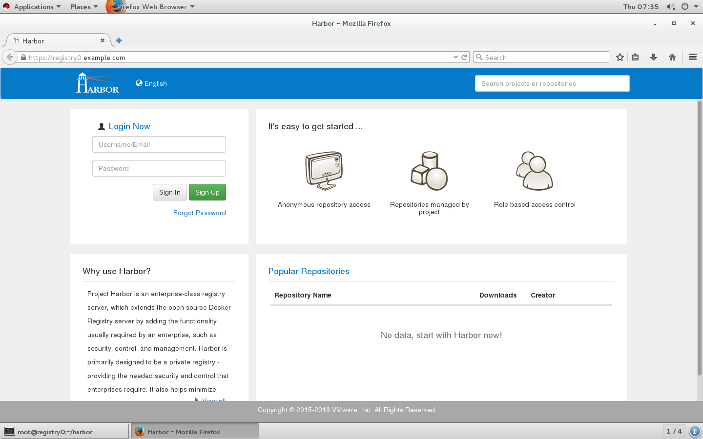

输入用户名admin密码uplooking登录
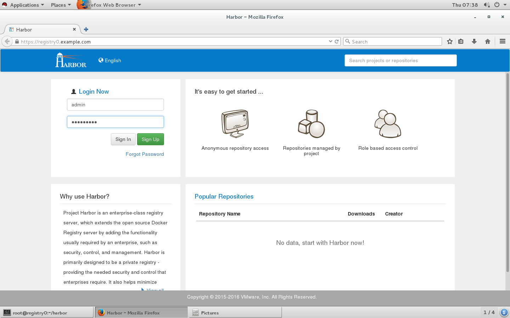

登录后的界面如下：


可以选择中文界面：
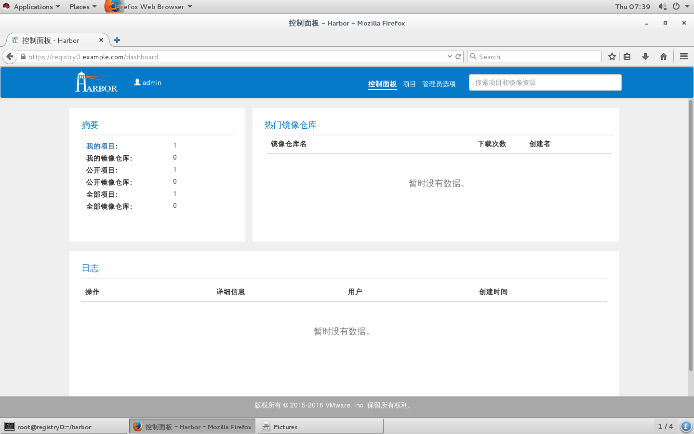

可配置选项包括项目，默认有一个library公开项目
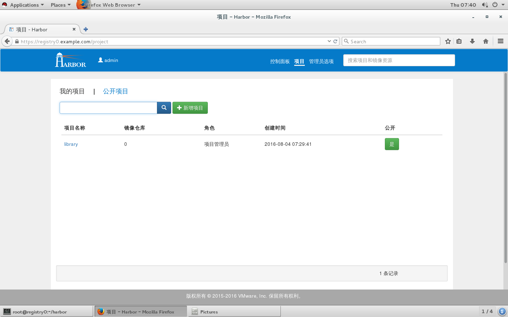

管理员选项可以查看和管理用户
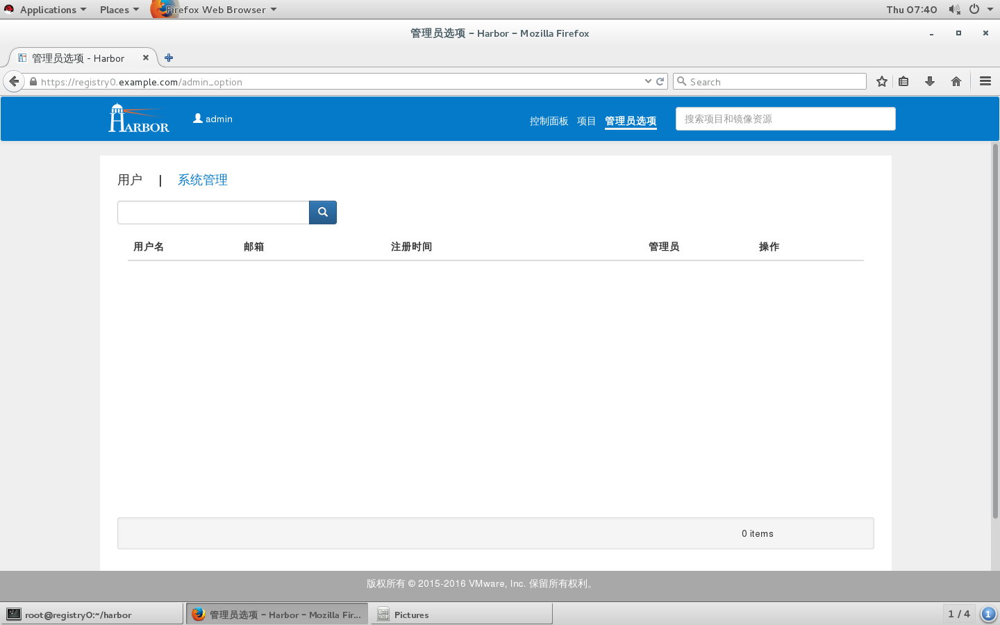

可以很简答的添加用户
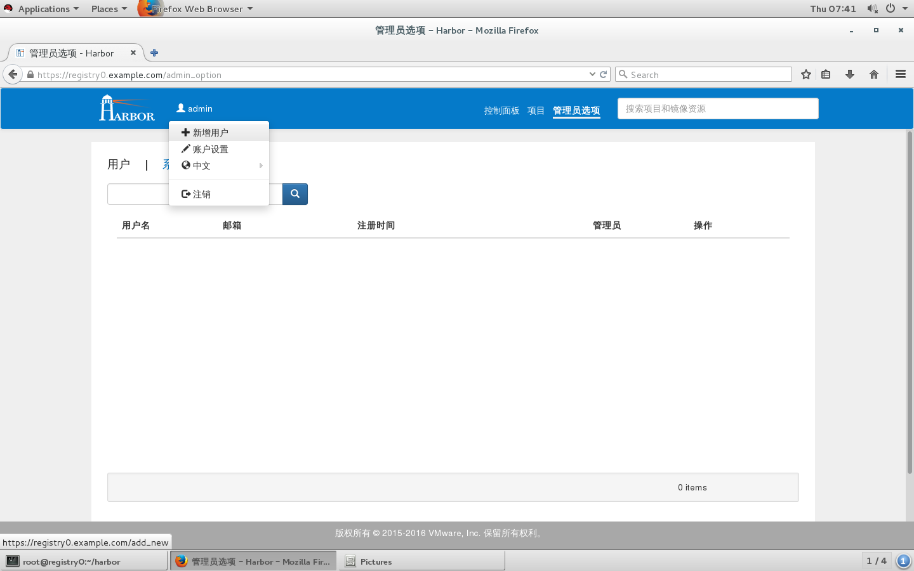

添加用户时需要填入相关项目


用户也可以修改自己的相关信息
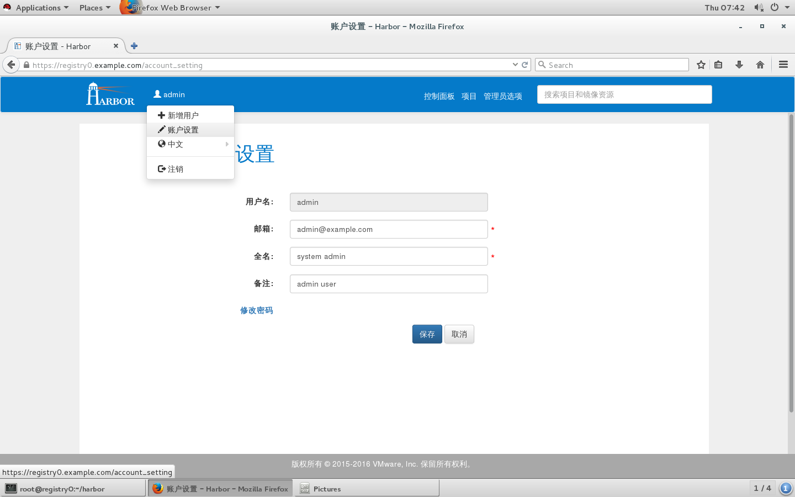

用户可以执行注册
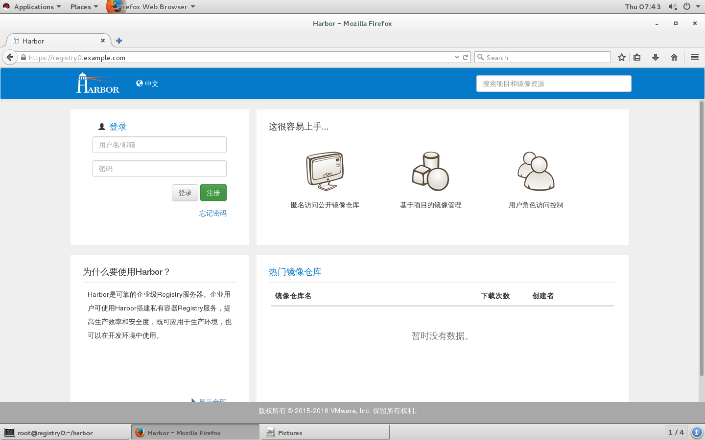

注册时和admin用户添加用户时一样
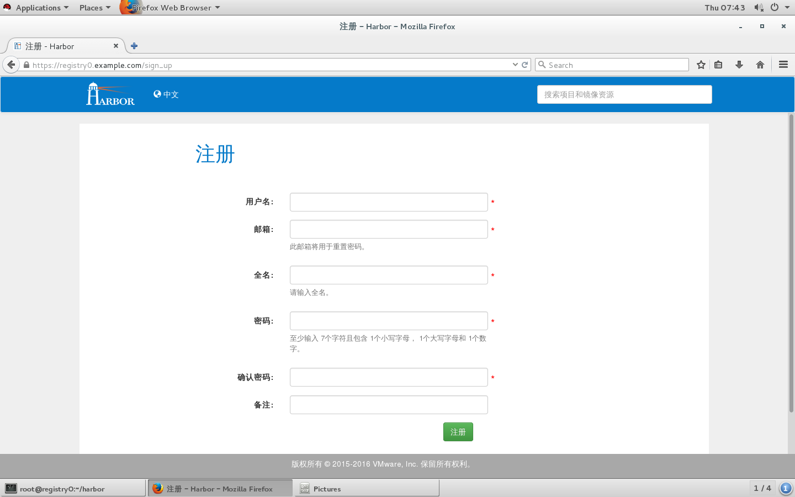

我们先添加一个kevin用户，密码是Uplooking123
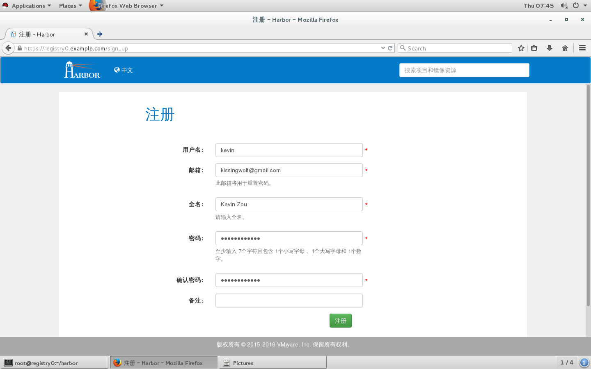

如果注册成功，将返回”注册成功“
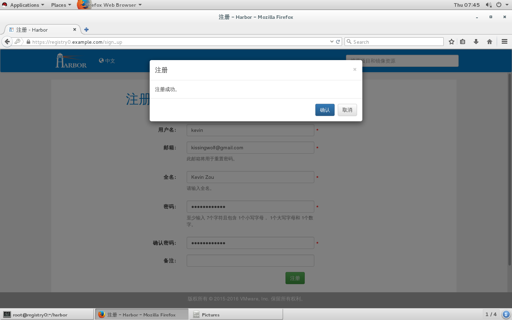

确认注册成功后，我们可以使用kevin用户登录


开放注册的都是普通用户权限，没有”管理员选项“


我们使用kevin用户添加一个私有的项目uplooking，然后测试使用docker命令行工具连接Harbor服务
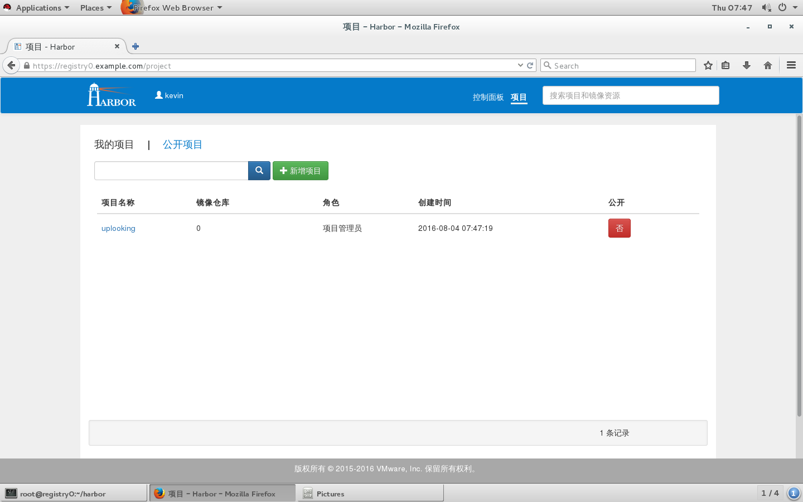

### 测试docker客户端连接Harbor服务

因为我们的Harbor服务使用的是Docker registry V2协议，并且配置了SSL访问方式，所以我们需要在客户端放置相应的认证文件。

先创建docker客户端认证文件保存目录，请使用你自己的Foundation号替换0.

```shell
[root@registry0 harbor]# mkdir /etc/docker/certs.d/registry0.example.com -p
```

将Harbor服务配置中的crt文件拷贝到此目录中

```shell
[root@registry0 harbor]# cp config/nginx/cert/registry0.example.com.crt \ /etc/docker/certs.d/registry0.example.com/
```

无需重启docker服务，直接登录测试

```shell
[root@registry0 harbor]# docker login -u kevin -p Uplooking123 registry0.example.com
Login Succeeded
```

看到"Login Succeeded"说明登录成功

如果登录不成功，可以通过/var/log/harbor/YYYY-MM-DD目录下的日志文件分析原因。

### 测试docker客户端推送镜像到Harbor服务

Harbor服务是用来保存和下载Docker镜像的服务，所以接下我们测试使用docker客户端push和pull镜像

首先从classroom.example.com上下载一个打包的镜像文件busybox.tar

```shell
[root@registry0 harbor]# wget http://classroom.example.com/materials/docker-images/busybox.tar
```

将打包的镜像文件busybox.tar导入本地docker存储

```shell
[root@registry0 harbor]# docker load <busybox.tar
```

为本地镜像文件修改tag，tag为”server/project/image"，比如registry0.example.com/uplooking/busybox，请使用你自己的Foundation号替换0

```shell
[root@registry0 harbor]# docker tag gcr.io/google_containers/busybox \ registry0.example.com/uplooking/busybox
```

上传镜像文件，请使用你自己的Foundation号替换0

```shell
[root@registry0 harbor]# docker push registry0.example.com/uplooking/busybox
```

如果成功，你可以在浏览器中看到镜像上传成功
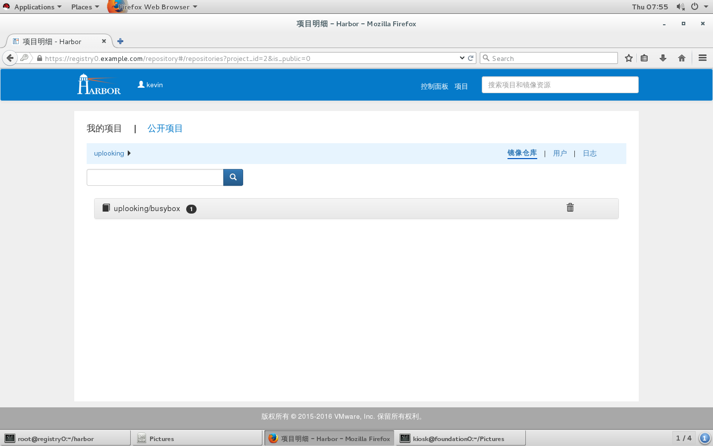